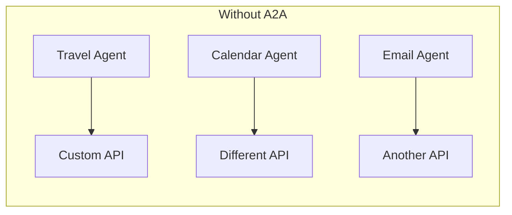
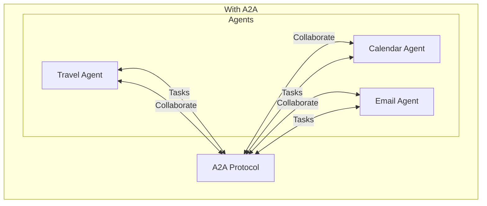
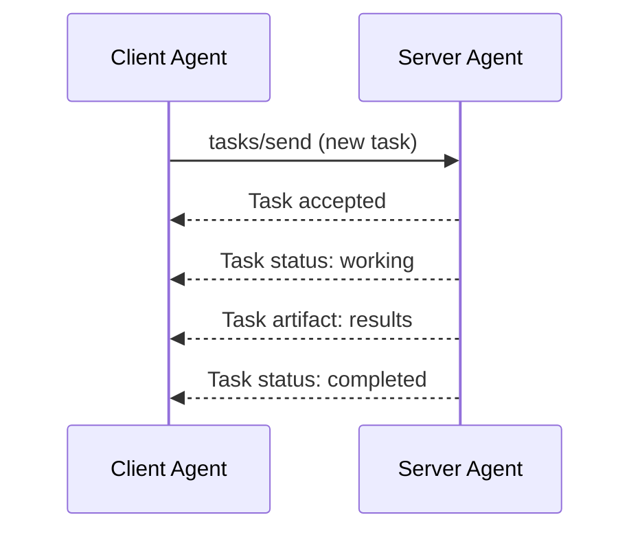
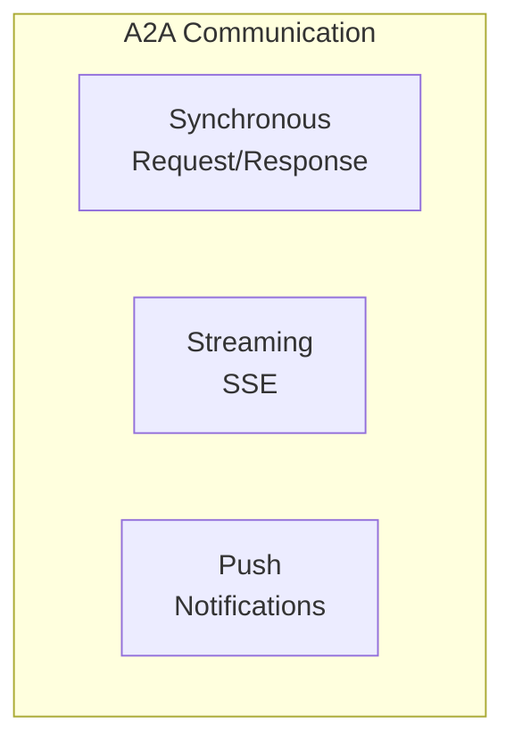
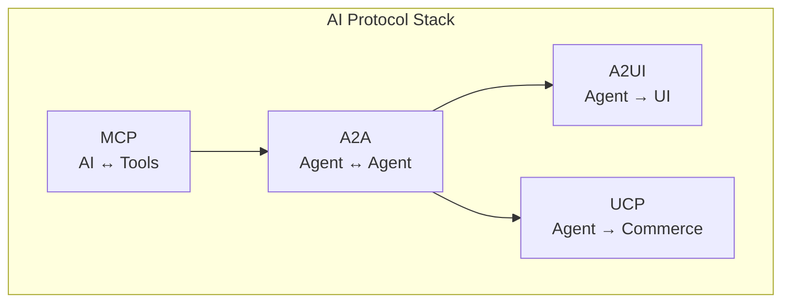

# A2A (Agent-to-Agent Protocol)

A2A is an open protocol enabling **communication and interoperability between AI agents**. It allows agents to collaborate on tasks without sharing internal implementation details.

> [!NOTE]
> **Created by**: Google (a2aproject)  
> **Status**: Active development  
> **SDKs**: Python, Go, JavaScript, Java, .NET

## The Problem

As AI agents proliferate, they need to **work together**:



**Issues:**

- No standard for agent-to-agent communication
- Agents can't discover each other's capabilities
- Complex custom integrations for each pair

## The Solution: A2A

A2A provides a **standardized protocol** for agent communication:



## Key Features

| Feature | Description |
|---------|-------------|
| **Agent Cards** | Standardized capability discovery |
| **Tasks** | Structured work units |
| **JSON-RPC 2.0** | Standard communication protocol |
| **Streaming** | SSE for real-time updates |
| **Push Notifications** | Async task updates |
| **Opacity** | Agents keep internals private |

## Why A2A?

| Goal | How A2A Helps |
|------|---------------|
| **Break Silos** | Connect agents across ecosystems |
| **Enable Collaboration** | Multi-agent task completion |
| **Open Standards** | Community-driven development |
| **Preserve Opacity** | No shared memory or logic |

## Core Concepts

### Agent Cards

Every A2A agent publishes an **Agent Card** describing its capabilities:

```json
{
    "name": "Travel Planning Agent",
    "description": "Book flights, hotels, and create itineraries",
    "url": "https://travel-agent.example.com",
    "capabilities": {
        "streaming": true,
        "pushNotifications": true
    },
    "skills": [
        {
            "id": "book_flight",
            "name": "Book Flight",
            "description": "Search and book flights"
        },
        {
            "id": "create_itinerary",
            "name": "Create Itinerary",
            "description": "Plan a complete trip"
        }
    ]
}
```

### Tasks

Work is organized into **Tasks** that can span multiple messages:



### Messages

Tasks contain **Messages** with rich content:

```json
{
    "role": "user",
    "parts": [
        {
            "type": "text",
            "text": "Find me a flight to Tokyo"
        },
        {
            "type": "file",
            "mimeType": "application/pdf",
            "data": "base64..."
        }
    ]
}
```

## Communication Patterns



| Pattern | Use Case |
|---------|----------|
| **Sync** | Simple queries, quick tasks |
| **Streaming** | Long-running tasks, progress |
| **Push** | Async updates, background work |

## Protocol Relationships



| Protocol | Purpose |
|----------|---------|
| **MCP** | Connect AI to tools |
| **A2A** | Connect agents to agents |
| **A2UI** | Render UI from agents |
| **UCP** | Commerce operations |

## Quick Start

```bash
# Install A2A SDK
pip install a2a-sdk

# Create an agent
from a2a import Agent, AgentCard

agent = Agent(
    card=AgentCard(
        name="My Agent",
        skills=[...]
    )
)
```

## Next Steps

| Document | Description |
|----------|-------------|
| [01_agent_cards.md](./01_agent_cards.md) | Discovery and capabilities |
| [02_tasks.md](./02_tasks.md) | Task lifecycle |
| [03_communication.md](./03_communication.md) | JSON-RPC, streaming |
| [04_security.md](./04_security.md) | Auth and security |
| [05_pros_and_cons.md](./05_pros_and_cons.md) | Analysis |
