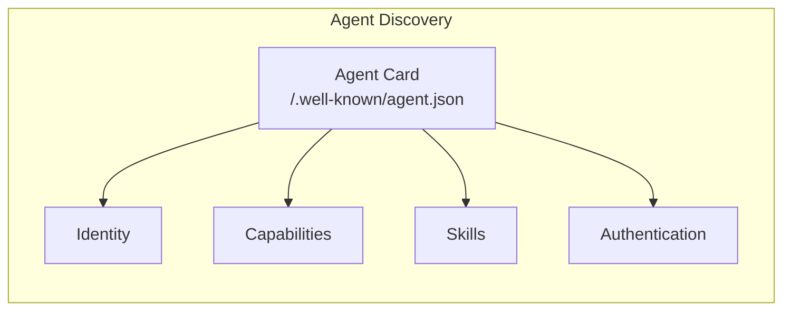
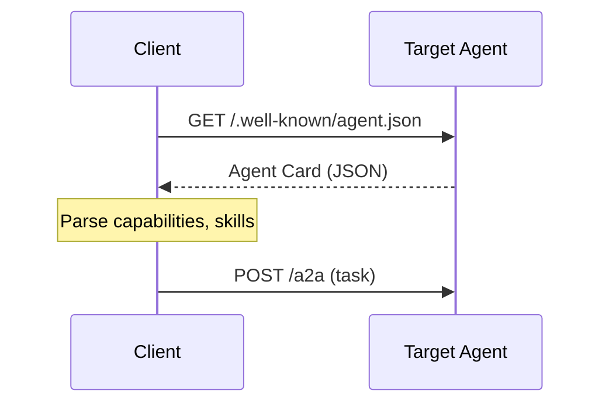

# Agent Cards

**Agent Cards** are the foundation of A2A discovery. They describe what an agent can do and how to communicate with it.

## Overview



Every A2A agent publishes an Agent Card at a well-known URL.

---

## Agent Card Structure

```json
{
    "name": "Travel Planning Agent",
    "description": "Helps users plan and book travel",
    "url": "https://travel.example.com/a2a",
    "version": "1.0.0",
    "capabilities": {
        "streaming": true,
        "pushNotifications": true,
        "stateTransitionHistory": false
    },
    "defaultInputModes": ["text", "file"],
    "defaultOutputModes": ["text", "file", "data"],
    "skills": [
        {
            "id": "book_flight",
            "name": "Book Flight",
            "description": "Search and book flights between cities",
            "tags": ["travel", "booking"],
            "inputModes": ["text"],
            "outputModes": ["text", "data"]
        },
        {
            "id": "create_itinerary",
            "name": "Create Itinerary",
            "description": "Build a complete trip plan",
            "tags": ["travel", "planning"]
        }
    ],
    "authentication": {
        "schemes": ["bearer"]
    }
}
```

---

## Required Fields

| Field | Type | Description |
|-------|------|-------------|
| `name` | string | Agent display name |
| `description` | string | What the agent does |
| `url` | string | A2A endpoint URL |

---

## Capabilities

Capabilities declare what communication patterns the agent supports:

| Capability | Description |
|------------|-------------|
| `streaming` | Supports SSE for real-time updates |
| `pushNotifications` | Can send async updates |
| `stateTransitionHistory` | Tracks task state changes |

### Capability Declaration

```json
{
    "capabilities": {
        "streaming": true,
        "pushNotifications": true,
        "stateTransitionHistory": false
    }
}
```

---

## Skills

**Skills** describe specific things the agent can do:

```json
{
    "skills": [
        {
            "id": "book_flight",
            "name": "Book Flight",
            "description": "Search and book flights",
            "tags": ["travel", "booking"],
            "inputModes": ["text"],
            "outputModes": ["text", "data"],
            "examples": [
                "Book a flight to Tokyo",
                "Find the cheapest flight to Paris"
            ]
        }
    ]
}
```

### Skill Properties

| Property | Required | Description |
|----------|----------|-------------|
| `id` | Yes | Unique identifier |
| `name` | Yes | Display name |
| `description` | Yes | What it does |
| `tags` | No | Categorization |
| `inputModes` | No | Accepted input types |
| `outputModes` | No | Output types produced |
| `examples` | No | Example prompts |

---

## Input/Output Modes

| Mode | Description |
|------|-------------|
| `text` | Plain text |
| `file` | Files (images, PDFs) |
| `data` | Structured JSON |
| `audio` | Audio content |
| `video` | Video content |

---

## Authentication

Agent Cards can specify authentication requirements:

```json
{
    "authentication": {
        "schemes": ["bearer", "oauth2"],
        "oauth2": {
            "authorizationUrl": "https://auth.example.com/authorize",
            "tokenUrl": "https://auth.example.com/token",
            "scopes": ["agent:read", "agent:write"]
        }
    }
}
```

### Supported Schemes

| Scheme | Description |
|--------|-------------|
| `bearer` | Bearer token in header |
| `oauth2` | OAuth 2.0 flow |
| `apiKey` | API key authentication |

---

## Discovery

### Well-Known URL

Agents publish their card at:

```
GET https://agent.example.com/.well-known/agent.json
```

### Discovery Flow



---

## Card Examples

### Simple Agent

```json
{
    "name": "Echo Agent",
    "description": "Echoes back messages",
    "url": "https://echo.example.com/a2a",
    "capabilities": {
        "streaming": false
    },
    "skills": [
        {
            "id": "echo",
            "name": "Echo",
            "description": "Echo back the input"
        }
    ]
}
```

### Full-Featured Agent

```json
{
    "name": "Research Assistant",
    "description": "Helps with research tasks",
    "url": "https://research.example.com/a2a",
    "version": "2.0.0",
    "capabilities": {
        "streaming": true,
        "pushNotifications": true,
        "stateTransitionHistory": true
    },
    "defaultInputModes": ["text", "file"],
    "defaultOutputModes": ["text", "data", "file"],
    "skills": [
        {
            "id": "search",
            "name": "Search",
            "description": "Search academic papers",
            "tags": ["research", "search"]
        },
        {
            "id": "summarize",
            "name": "Summarize",
            "description": "Summarize documents",
            "tags": ["research", "summarization"]
        },
        {
            "id": "cite",
            "name": "Generate Citations",
            "description": "Create citations in various formats",
            "tags": ["research", "writing"]
        }
    ],
    "authentication": {
        "schemes": ["oauth2"],
        "oauth2": {
            "authorizationUrl": "https://auth.research.com/authorize",
            "tokenUrl": "https://auth.research.com/token"
        }
    }
}
```

---

## Summary

| Concept | Purpose |
|---------|---------|
| **Agent Card** | Identity + capabilities |
| **Capabilities** | Communication patterns |
| **Skills** | Specific abilities |
| **Authentication** | Security requirements |
| **Discovery** | /.well-known/agent.json |

> [!TIP]
> Keep Agent Cards focused. List only the skills your agent reliably supports.
