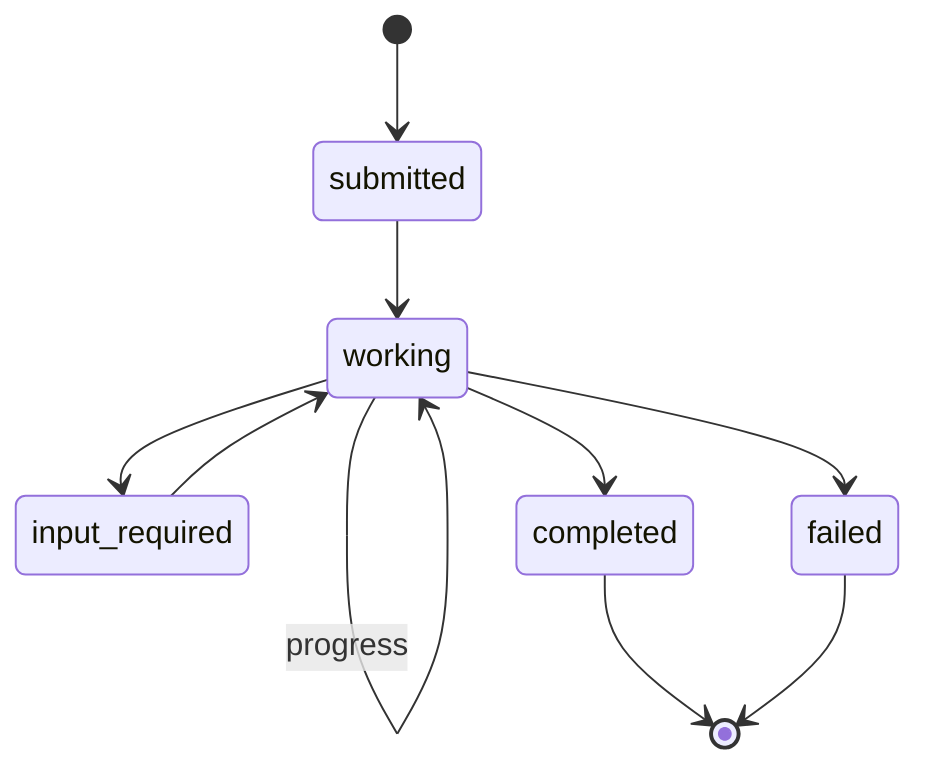
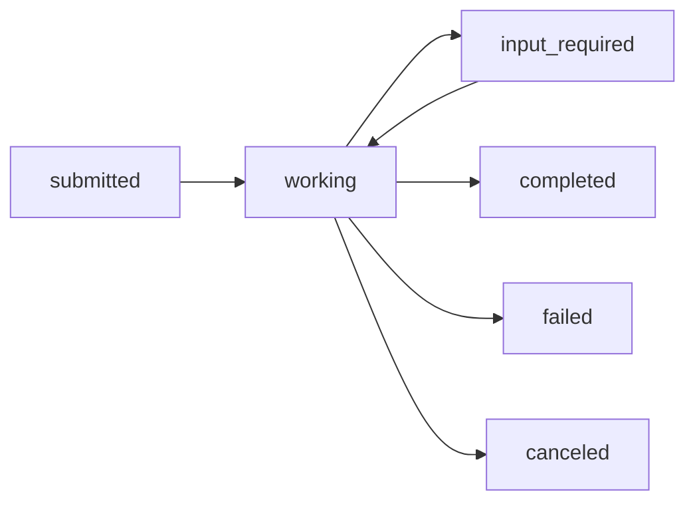
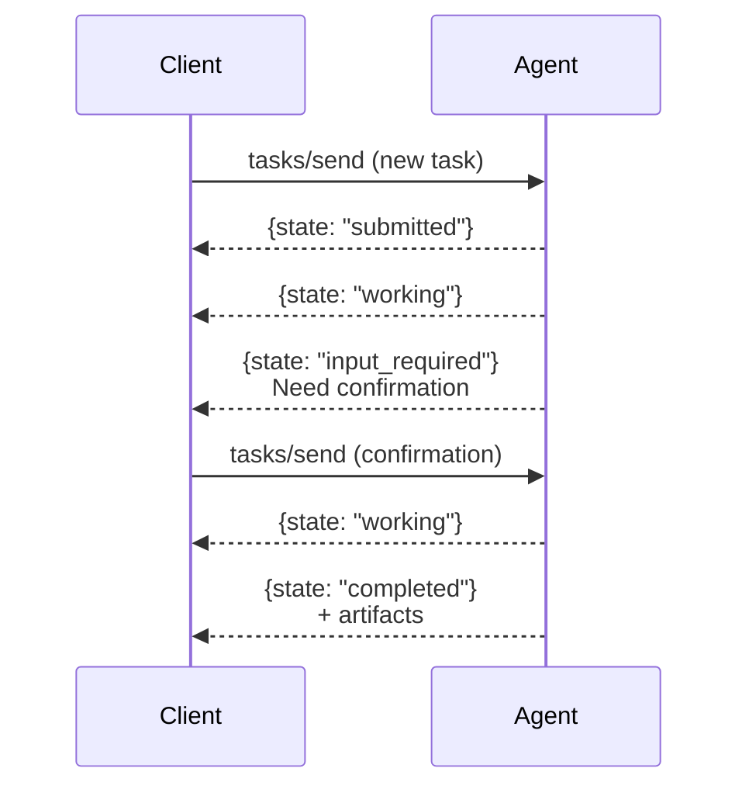

# Tasks

**Tasks** are the core work unit in A2A. They represent a piece of work that an agent performs, potentially across multiple exchanges.

## Overview



---

## Task Structure

```json
{
    "id": "task_abc123",
    "sessionId": "session_xyz",
    "status": {
        "state": "working",
        "message": "Searching for flights..."
    },
    "messages": [...],
    "artifacts": [...]
}
```

### Task Properties

| Property | Type | Description |
|----------|------|-------------|
| `id` | string | Unique task identifier |
| `sessionId` | string | Groups related tasks |
| `status` | object | Current state and message |
| `messages` | array | Conversation history |
| `artifacts` | array | Generated outputs |

---

## Task States

| State | Description |
|-------|-------------|
| `submitted` | Task received, not started |
| `working` | Agent processing |
| `input_required` | Waiting for user input |
| `completed` | Successfully finished |
| `failed` | Error occurred |
| `canceled` | User canceled |

### State Transitions



---

## Messages

Tasks contain **Messages** representing the conversation:

```json
{
    "role": "user",
    "parts": [
        {
            "type": "text",
            "text": "Book a flight to Tokyo for next week"
        }
    ]
}
```

### Message Roles

| Role | Description |
|------|-------------|
| `user` | From the requesting client |
| `agent` | From the processing agent |

### Part Types

| Type | Content |
|------|---------|
| `text` | Plain text |
| `file` | File with mimeType and data |
| `data` | Structured JSON |

### Multi-Part Message

```json
{
    "role": "user",
    "parts": [
        {
            "type": "text",
            "text": "Analyze this document"
        },
        {
            "type": "file",
            "mimeType": "application/pdf",
            "data": "base64..."
        }
    ]
}
```

---

## Artifacts

**Artifacts** are outputs generated by the agent:

```json
{
    "artifacts": [
        {
            "name": "flight_options",
            "parts": [
                {
                    "type": "data",
                    "data": {
                        "flights": [
                            {"airline": "JAL", "price": 850},
                            {"airline": "ANA", "price": 920}
                        ]
                    }
                }
            ]
        }
    ]
}
```

### Artifact Properties

| Property | Description |
|----------|-------------|
| `name` | Identifier for the artifact |
| `parts` | Content parts (like messages) |
| `index` | For streaming (chunk ordering) |
| `append` | Whether to append to existing |

---

## Task Methods

### Create/Send Task

**Request:**

```json
{
    "jsonrpc": "2.0",
    "method": "tasks/send",
    "params": {
        "id": "task_abc123",
        "message": {
            "role": "user",
            "parts": [{"type": "text", "text": "Hello"}]
        }
    },
    "id": 1
}
```

**Response:**

```json
{
    "jsonrpc": "2.0",
    "result": {
        "id": "task_abc123",
        "status": {"state": "working"},
        "artifacts": []
    },
    "id": 1
}
```

### Get Task Status

**Request:**

```json
{
    "jsonrpc": "2.0",
    "method": "tasks/get",
    "params": {
        "id": "task_abc123"
    },
    "id": 2
}
```

**Response:**

```json
{
    "jsonrpc": "2.0",
    "result": {
        "id": "task_abc123",
        "status": {"state": "completed"},
        "artifacts": [...]
    },
    "id": 2
}
```

### Cancel Task

**Request:**

```json
{
    "jsonrpc": "2.0",
    "method": "tasks/cancel",
    "params": {
        "id": "task_abc123"
    },
    "id": 3
}
```

---

## Task Lifecycle Example



---

## Streaming Tasks

For long-running tasks, use streaming:

```json
{
    "jsonrpc": "2.0",
    "method": "tasks/sendSubscribe",
    "params": {
        "id": "task_xyz",
        "message": {...}
    },
    "id": 1
}
```

Server streams updates via SSE:

```
event: task_status
data: {"state": "working", "message": "Processing..."}

event: task_artifact
data: {"name": "result", "parts": [...], "append": true}

event: task_status
data: {"state": "completed"}
```

---

## Input Required Pattern

When an agent needs more information:

```json
{
    "status": {
        "state": "input_required",
        "message": "Please confirm: Book JAL flight for $850?"
    },
    "artifacts": [
        {
            "name": "confirmation_request",
            "parts": [{
                "type": "data",
                "data": {
                    "options": ["confirm", "cancel", "modify"]
                }
            }]
        }
    ]
}
```

Client responds:

```json
{
    "method": "tasks/send",
    "params": {
        "id": "task_abc123",
        "message": {
            "role": "user",
            "parts": [{"type": "text", "text": "confirm"}]
        }
    }
}
```

---

## Summary

| Concept | Purpose |
|---------|---------|
| **Task** | Unit of work |
| **Status** | Current state |
| **Messages** | Conversation |
| **Artifacts** | Outputs |
| **Streaming** | Real-time updates |

> [!TIP]
> Use `sessionId` to group related tasks for multi-turn conversations.
