# Communication

A2A uses **JSON-RPC 2.0** over HTTP(S) with support for streaming and push notifications.

## Overview

```mermaid
graph TD
    subgraph "A2A Communication"
        Sync[Synchronous<br/>POST → Response]
        Stream[Streaming<br/>SSE]
        Push[Push Notifications<br/>Webhooks]
    end
```



---

## Transport

### Base Protocol

| Aspect | Value |
|--------|-------|
| Protocol | JSON-RPC 2.0 |
| Transport | HTTP/1.1 or higher |
| Content-Type | application/json |
| TLS | Required (HTTPS) |

---

## Request/Response (Sync)

### Basic Request

```http
POST /a2a HTTP/1.1
Host: agent.example.com
Content-Type: application/json
Authorization: Bearer <token>

{
    "jsonrpc": "2.0",
    "method": "tasks/send",
    "params": {
        "id": "task_123",
        "message": {
            "role": "user",
            "parts": [{"type": "text", "text": "Hello"}]
        }
    },
    "id": 1
}
```

### Response

```http
HTTP/1.1 200 OK
Content-Type: application/json

{
    "jsonrpc": "2.0",
    "result": {
        "id": "task_123",
        "status": {"state": "completed"},
        "artifacts": [...]
    },
    "id": 1
}
```

---

## Methods

### Task Methods

| Method | Description |
|--------|-------------|
| `tasks/send` | Send task or continue conversation |
| `tasks/sendSubscribe` | Send with streaming response |
| `tasks/get` | Get task status |
| `tasks/cancel` | Cancel a task |

### Discovery Methods

| Method | Description |
|--------|-------------|
| `agent/info` | Get Agent Card (alternative to well-known) |

---

## Streaming (SSE)

For long-running tasks, use Server-Sent Events:

### Subscribe Request

```json
{
    "jsonrpc": "2.0",
    "method": "tasks/sendSubscribe",
    "params": {
        "id": "task_xyz",
        "message": {...}
    },
    "id": 1
}
```

### SSE Stream

```http
HTTP/1.1 200 OK
Content-Type: text/event-stream

event: task_status
data: {"state": "working", "message": "Processing..."}

event: task_artifact
data: {"name": "partial", "parts": [...], "index": 0}

event: task_artifact
data: {"name": "partial", "parts": [...], "index": 1, "append": true}

event: task_status
data: {"state": "completed"}
```

### Event Types

| Event | Description |
|-------|-------------|
| `task_status` | Status update |
| `task_artifact` | Artifact data |
| `error` | Error occurred |

### Streaming Flow


---

## Push Notifications

For truly async tasks, agents can push updates:

### Register Webhook

```json
{
    "jsonrpc": "2.0",
    "method": "tasks/send",
    "params": {
        "id": "task_abc",
        "message": {...},
        "notification": {
            "url": "https://client.example.com/webhooks/a2a",
            "token": "webhook_secret"
        }
    },
    "id": 1
}
```

### Webhook Delivery

```http
POST /webhooks/a2a HTTP/1.1
Host: client.example.com
Content-Type: application/json
X-A2A-Token: webhook_secret

{
    "taskId": "task_abc",
    "status": {"state": "completed"},
    "artifacts": [...]
}
```

### Push Flow


---

## Error Handling

### JSON-RPC Errors

```json
{
    "jsonrpc": "2.0",
    "error": {
        "code": -32600,
        "message": "Invalid Request",
        "data": {"field": "message"}
    },
    "id": 1
}
```

### Error Codes

| Code | Meaning |
|------|---------|
| -32700 | Parse error |
| -32600 | Invalid request |
| -32601 | Method not found |
| -32602 | Invalid params |
| -32603 | Internal error |
| -32000 to -32099 | Server errors |

### Task Errors

```json
{
    "result": {
        "id": "task_123",
        "status": {
            "state": "failed",
            "message": "Unable to process request",
            "error": {
                "code": "RATE_LIMITED",
                "data": {"retryAfter": 60}
            }
        }
    }
}
```

---

## Headers

### Request Headers

| Header | Purpose |
|--------|---------|
| `Authorization` | Auth token |
| `Content-Type` | application/json |
| `Accept` | Response format |
| `X-Request-ID` | Request tracing |

### Response Headers

| Header | Purpose |
|--------|---------|
| `X-Task-ID` | Task identifier |
| `Retry-After` | Rate limit info |

---

## Pattern Comparison

| Pattern | Latency | Use Case |
|---------|---------|----------|
| **Sync** | Low | Quick queries |
| **Streaming** | Real-time | Long tasks, progress |
| **Push** | Async | Background processing |

---

## Summary

| Aspect | Technology |
|--------|------------|
| Protocol | JSON-RPC 2.0 |
| Transport | HTTPS |
| Sync | POST/Response |
| Streaming | SSE |
| Push | Webhooks |
