# A2A: Pros and Cons

A balanced analysis of A2A's strengths, limitations, and when to use it.

## At a Glance

```mermaid
graph LR
    subgraph "Strengths"
        A[🤝 Agent Collaboration]
        B[🔒 Opacity]
        C[📡 Multiple Transports]
        D[🌐 Multi-platform SDKs]
    end
    
    subgraph "Challenges"
        E[🆕 Early Stage]
        F[🔗 Discovery]
        G[📊 No Shared State]
        H[🧩 Integration Work]
    end
```



---

## ✅ Pros (Advantages)

### 🤝 1. Enables Agent Collaboration

A2A is **purpose-built** for multi-agent scenarios.


| Scenario | A2A Enables |
|----------|-------------|
| Trip planning | Travel + Calendar + Email agents |
| Research | Search + Analysis + Writing agents |
| Customer support | Triage + Specialist + Escalation agents |

---

### 🔒 2. Opacity (Privacy)

Agents collaborate **without exposing internals**.

| Protected | Description |
|-----------|-------------|
| Memory | Agent state not shared |
| Logic | Proprietary algorithms hidden |
| Tools | Internal tools not exposed |

**Why it matters**: Competitive agents can collaborate safely.

---

### 📡 3. Flexible Communication

Multiple patterns for different needs:

| Pattern | Use Case |
|---------|----------|
| Sync | Quick queries |
| Streaming | Progress updates |
| Push | Background tasks |

---

### 🌐 4. Multi-Platform SDKs

Official SDKs in major languages:

| Language | Package |
|----------|---------|
| Python | `pip install a2a-sdk` |
| Go | `go get github.com/a2aproject/a2a-go` |
| JavaScript | `npm install @a2a-js/sdk` |
| Java | Maven |
| .NET | `dotnet add package A2A` |

---

### 📋 5. Agent Cards

Standardized discovery makes integration easy:

```
GET /.well-known/agent.json
→ Full capability description
```

No documentation hunting required.

---

### 🔄 6. Task State Machine

Clear, predictable task lifecycle:

```
submitted → working → completed
                   ↘ input_required → working
                   ↘ failed
```

---

## ❌ Cons (Disadvantages)

### 🆕 1. Early Stage

A2A is **actively evolving**.

| Concern | Impact |
|---------|--------|
| Spec changes | May need updates |
| Best practices | Still emerging |
| Tooling | Limited debugging tools |

**Mitigation**: Pin to specific spec version.

---

### 🔗 2. Discovery Challenges

Finding agents is not fully standardized.

| Challenge | Issue |
|-----------|-------|
| No registry | Must know agent URLs |
| No marketplace | Manual discovery |
| Trust | Verify agents yourself |

**Mitigation**: Use curated agent lists for now.

---

### 📊 3. No Shared Memory

A2A is **stateless** between tasks.


**Mitigation**: Use `sessionId` to group related tasks.

---

### 🧩 4. Integration Work

You must implement:

- Agent Card endpoint
- Task handling
- Streaming (if needed)
- Push notifications (if needed)

**Mitigation**: Use official SDKs.

---

### 🔄 5. No Tool Calling

A2A is for **agent-to-agent**, not **agent-to-tool**.

| Need | Use |
|------|-----|
| Call external APIs | MCP |
| Query databases | MCP |
| Agent collaboration | A2A |

**Solution**: Use MCP for tools, A2A for agents.

---

### 📡 6. Network Dependency

A2A requires network for all operations.

| Concern | Impact |
|---------|--------|
| Latency | Each hop adds delay |
| Availability | Agent down = failure |
| Offline | Not supported |

---

## A2A vs MCP

| Aspect | MCP | A2A |
|--------|-----|-----|
| **Purpose** | AI ↔ Tools | Agent ↔ Agent |
| **Model** | Client-Server | Peer-to-peer |
| **Discovery** | Config | Agent Cards |
| **State** | Stateless | Task-based |
| **Opacity** | N/A | Core feature |

**Use together**: MCP for tool access, A2A for collaboration.

---

## Decision Matrix

| Scenario | Use A2A? |
|----------|----------|
| Multi-agent collaboration | ✅ Yes |
| Specialized agent delegation | ✅ Yes |
| AI calling external API | ❌ Use MCP |
| Rendering UI | ❌ Use A2UI |
| Commerce checkout | ❌ Use UCP |
| Single-agent application | ⚠️ Maybe |

---

## Adoption Strategy


| Phase | Effort | Result |
|-------|--------|--------|
| 1 | Low | Agent with tools |
| 2 | Medium | 2-agent collaboration |
| 3 | High | Full agent network |

---

## Summary

| Aspect | Assessment |
|--------|------------|
| **Maturity** | Early but active |
| **Purpose** | Agent collaboration |
| **Security** | Good (OAuth, opacity) |
| **SDKs** | Strong (5 languages) |
| **Complexity** | Medium |
| **Recommendation** | Use for multi-agent scenarios |

> [!TIP]
> A2A shines when you need **specialized agents to work together** while keeping their implementations private.
