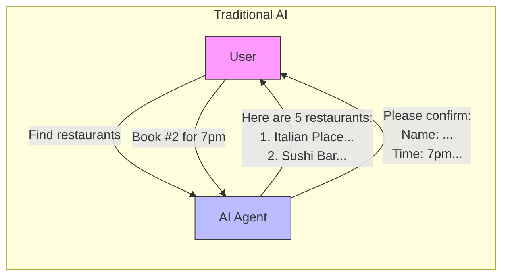
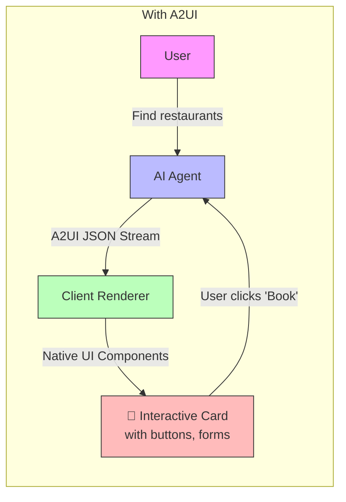
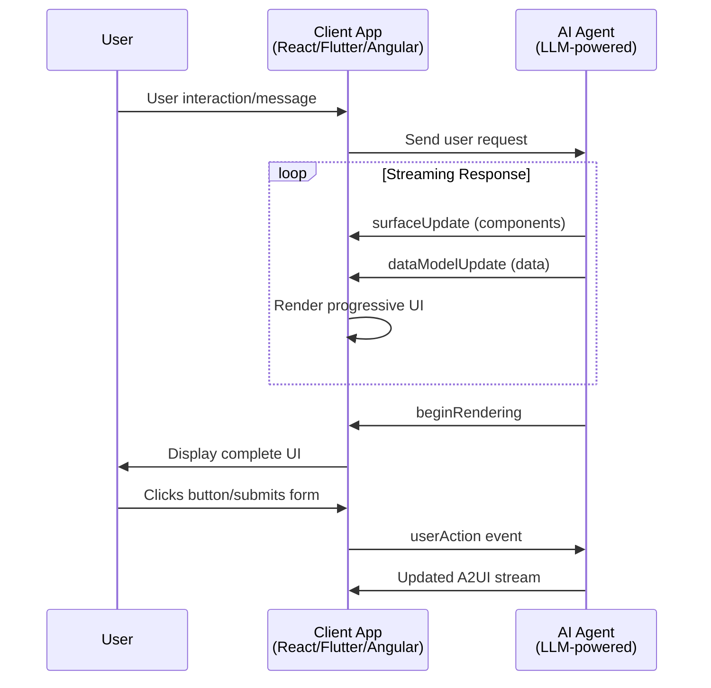

# A2UI (Agent-to-User Interface) Protocol

A2UI enables AI agents to generate **rich, interactive user interfaces** that render natively across web, mobile, and desktop—without executing arbitrary code.

> [!NOTE]
> **Status**: A2UI is currently in v0.8 (Public Preview). Created by Google with contributions from CopilotKit and the open-source community.

## The Problem

Traditional AI interactions are limited to **text-only responses**. When users need structured data like forms, tables, or interactive elements, agents resort to:

1. **Markdown/HTML strings** - Requires custom parsing, limited interactivity
2. **Code execution** - Dangerous, potential security vulnerabilities
3. **Multiple back-and-forth messages** - Poor UX, slow workflows



## The Solution: A2UI

A2UI introduces a **declarative, JSON-based protocol** that allows agents to describe UI components, which clients render using their **native widget libraries**.



## Architecture



## Key Characteristics

| Feature | Description |
|---------|-------------|
| **Declarative** | UI described as data, not executable code |
| **Streaming** | Progressive rendering via JSONL stream |
| **Platform-Agnostic** | Same payload works on any framework |
| **Secure** | Pre-approved component catalog prevents injection |
| **LLM-Friendly** | Flat structure easy for models to generate |

## How It Works: Example

When a user asks "Show me a profile card", the agent generates:

```jsonl
{"surfaceUpdate": {"components": [{"id": "root", "component": {"Column": {"children": {"explicitList": ["profile_card"]}}}}]}}
{"surfaceUpdate": {"components": [{"id": "profile_card", "component": {"Card": {"child": "card_content"}}}]}}
{"surfaceUpdate": {"components": [{"id": "card_content", "component": {"Text": {"text": {"literalString": "John Doe"}}}}]}}
{"dataModelUpdate": {"contents": {}}}
{"beginRendering": {"root": "root"}}
```

The client receives this stream and renders a **native Card component** with the text "John Doe" using its own styling.

## When to Use A2UI

### ✅ Good Use Cases

- **Data-heavy responses**: Tables, lists, search results
- **Form collection**: Multi-field inputs, surveys
- **Workflow UIs**: Step-by-step wizards, booking flows
- **Dashboards**: Real-time data visualization
- **Chat apps**: Rich message bubbles, quick actions

### ❌ Not Ideal For

- Simple text Q&A (overkill)
- Highly custom/artistic UIs (constrained by catalog)
- Offline-first apps (requires agent connection)

## Next Steps

| Document | Description |
|----------|-------------|
| [01_core_concepts.md](./01_core_concepts.md) | Surfaces, Components, Data Binding |
| [02_message_types.md](./02_message_types.md) | Server & Client message formats |
| [03_component_catalog.md](./03_component_catalog.md) | Standard component reference |
| [04_pros_and_cons.md](./04_pros_and_cons.md) | Detailed analysis |
