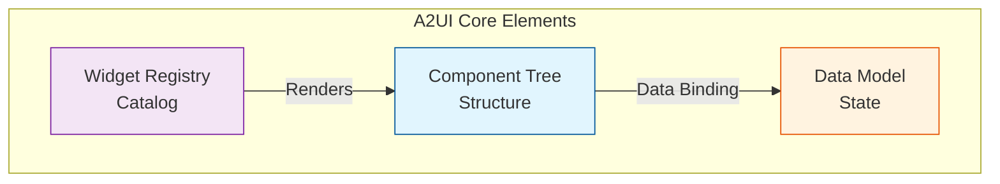
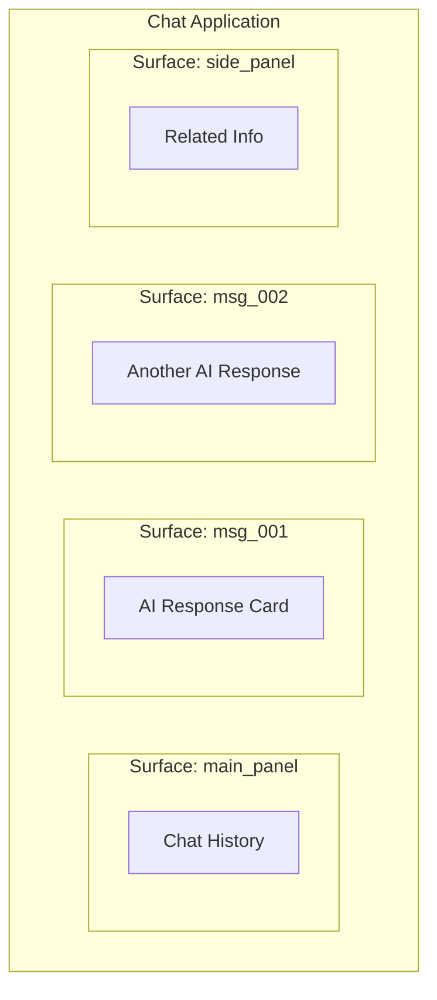
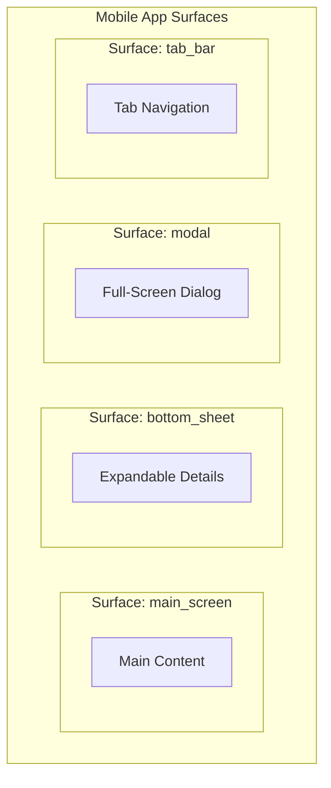
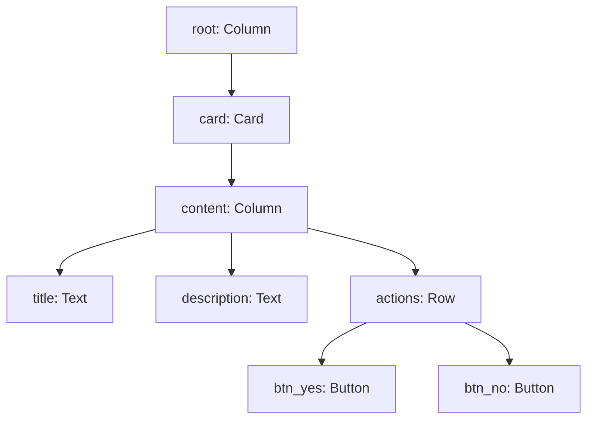
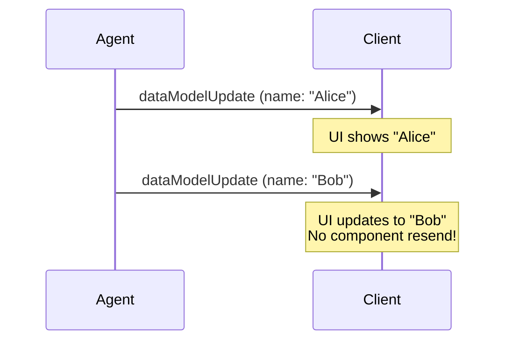
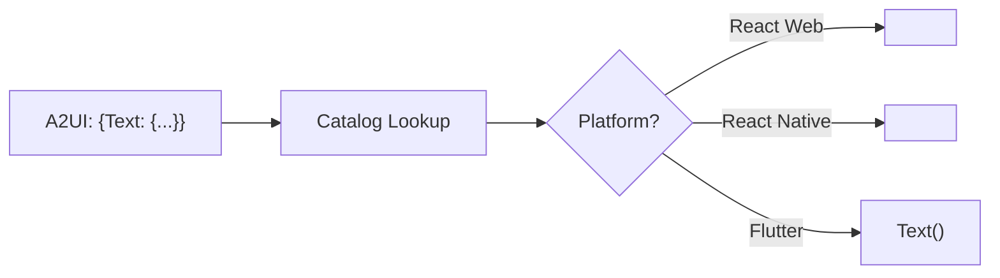
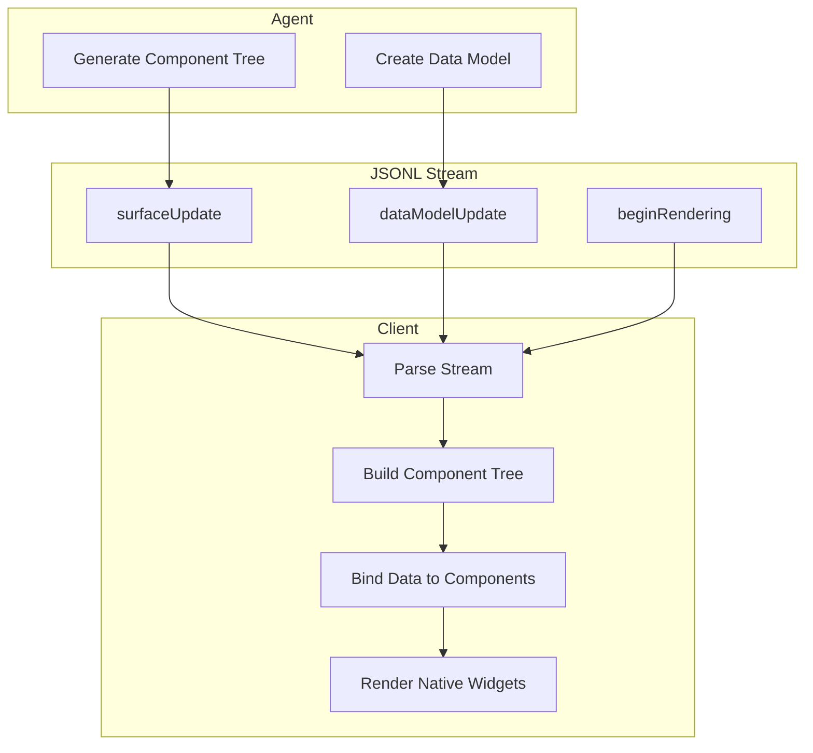

# Core Concepts

A2UI is built on three foundational principles:

1. **Streaming Messages** - UI updates flow as a sequence of JSON messages
2. **Declarative Components** - UIs are described as data, not code
3. **Data Binding** - UI structure is separate from application state



## 1. Surfaces

A **Surface** is a distinct UI region where A2UI components are rendered. Think of it as a container or canvas.

### Use Cases

- Each chat message bubble = separate surface
- Side panel = separate surface
- Modal dialog = separate surface



### Key Properties

| Property | Description |
|----------|-------------|
| `surfaceId` | Unique identifier for the surface |
| `root` | ID of the root component |
| `dataModel` | Independent data state |

Each surface has its **own data model**, preventing key collisions across surfaces.

### 📱 Mobile-Specific Surfaces

On mobile platforms, surfaces map to different navigation contexts:



| Mobile Surface Type | Native Implementation |
|---------------------|----------------------|
| **Screen** | React Native `Screen` / Flutter `Scaffold` |
| **Bottom Sheet** | iOS Sheets / Android BottomSheet |
| **Modal** | `Modal` component with animations |
| **Tab Content** | Per-tab isolated surfaces |

> [!TIP]
> Mobile surfaces often have **gesture-based dismissal** (swipe down to close). The A2UI client sends a `userAction` with `action.name = "dismiss"` when users gesture to close.

---

## 2. Components

Components are the **building blocks** of A2UI interfaces. They're abstract descriptions that clients map to native widgets.

### Component Structure

Every component has:

```python
{
    "id": "unique_component_id",      # Required: unique identifier
    "component": {
        "ComponentType": {            # One of: Text, Button, Row, Column, etc.
            # Component-specific properties
        }
    }
}
```

### Example Components

**Text Component:**

```json
{
    "id": "greeting_text",
    "component": {
        "Text": {
            "text": {"literalString": "Hello, World!"},
            "usageHint": "h2"
        }
    }
}
```

**Button Component:**

```json
{
    "id": "submit_btn",
    "component": {
        "Button": {
            "label": {"literalString": "Submit"},
            "action": {"name": "submit_form"}
        }
    }
}
```

**Container (Column):**

```json
{
    "id": "main_column",
    "component": {
        "Column": {
            "alignment": "center",
            "children": {
                "explicitList": ["greeting_text", "submit_btn"]
            }
        }
    }
}
```

### Component Hierarchy

Components form a tree through parent-child references:



---

## 3. Data Model

The **Data Model** is a separate JSON object that holds dynamic values. Components reference this data through **bindings** rather than hardcoded values.

### Why Separate Data?

1. **Efficient Updates** - Change data without resending component structure
2. **Reactive UI** - Data changes automatically reflect in bound components
3. **Clean Separation** - Structure vs. content

### Data Model Structure

```json
{
    "dataModelUpdate": {
        "contents": {
            "user": {
                "name": "John Doe",
                "email": "john@example.com",
                "avatar": "https://..."
            },
            "restaurants": [
                {"name": "Pasta Place", "rating": 4.5},
                {"name": "Sushi Bar", "rating": 4.8}
            ]
        }
    }
}
```

---

## 4. Data Binding

Data binding connects **components** to the **data model** using `BoundValue` objects.

### Binding Types

| Type | Syntax | Description |
|------|--------|-------------|
| **Literal** | `{"literalString": "Hello"}` | Static, hardcoded value |
| **Bound** | `{"path": "user.name"}` | Dynamic, from data model |

### Example: Bound Text

```json
{
    "id": "user_greeting",
    "component": {
        "Text": {
            "text": {"path": "user.name"}
        }
    }
}
```

When data model contains `{"user": {"name": "Alice"}}`, the text displays "Alice".

### Updating Data

To change the displayed name, send a new `dataModelUpdate`:

```json
{"dataModelUpdate": {"contents": {"user": {"name": "Bob"}}}}
```

The UI automatically updates to show "Bob" — no component resend needed!



---

## 5. Widget Registry (Catalog)

The **Catalog** is a client-side mapping from abstract component types to **native widget implementations**.

### How It Works



### 📱 Mobile Widget Mapping

| A2UI Component | React Native | Flutter |
|----------------|--------------|---------|
| `Text` | `<Text>` | `Text()` |
| `Button` | `<Pressable>` | `ElevatedButton()` |
| `TextField` | `<TextInput>` | `TextField()` |
| `Card` | `<View>` with shadow | `Card()` |
| `Row` | `<View style={flexDirection: 'row'}>` | `Row()` |
| `Column` | `<View style={flexDirection: 'column'}>` | `Column()` |
| `Image` | `<Image>` | `Image.network()` |
| `List` | `<FlatList>` | `ListView.builder()` |

### Catalog Negotiation

1. Client declares supported components in its catalog
2. Agent generates only catalog-supported components
3. Unknown components are gracefully handled

### Standard vs Custom Components

| Type | Examples | Defined By |
|------|----------|------------|
| **Standard** | Text, Button, Row, Column, Card | A2UI Spec |
| **Custom** | MapView, ChartWidget, VideoPlayer | Client App |
| **📱 Mobile-Only** | BottomSheet, SwipeableRow, FloatingActionButton | Mobile Catalog |

---

## 6. Putting It All Together



### Complete Example Flow

1. **Agent receives**: "Show user profile"
2. **Agent generates**:
   - Component tree: Card > Column > [Avatar, Name, Email]
   - Data model: `{user: {name: "...", email: "..."}}`
3. **Client receives**: JSONL stream
4. **Client renders**: Native card widget with bound data
5. **User clicks**: "Edit Profile" button
6. **Client sends**: `userAction` event
7. **Agent responds**: Updated form UI
