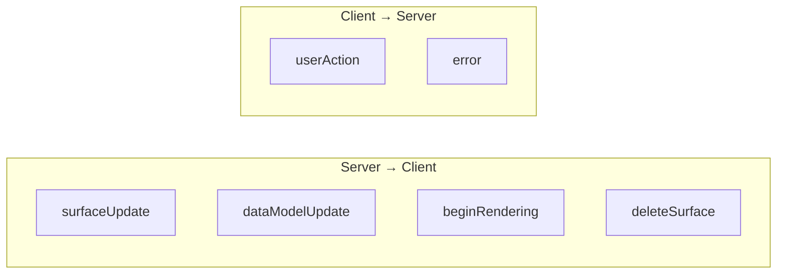
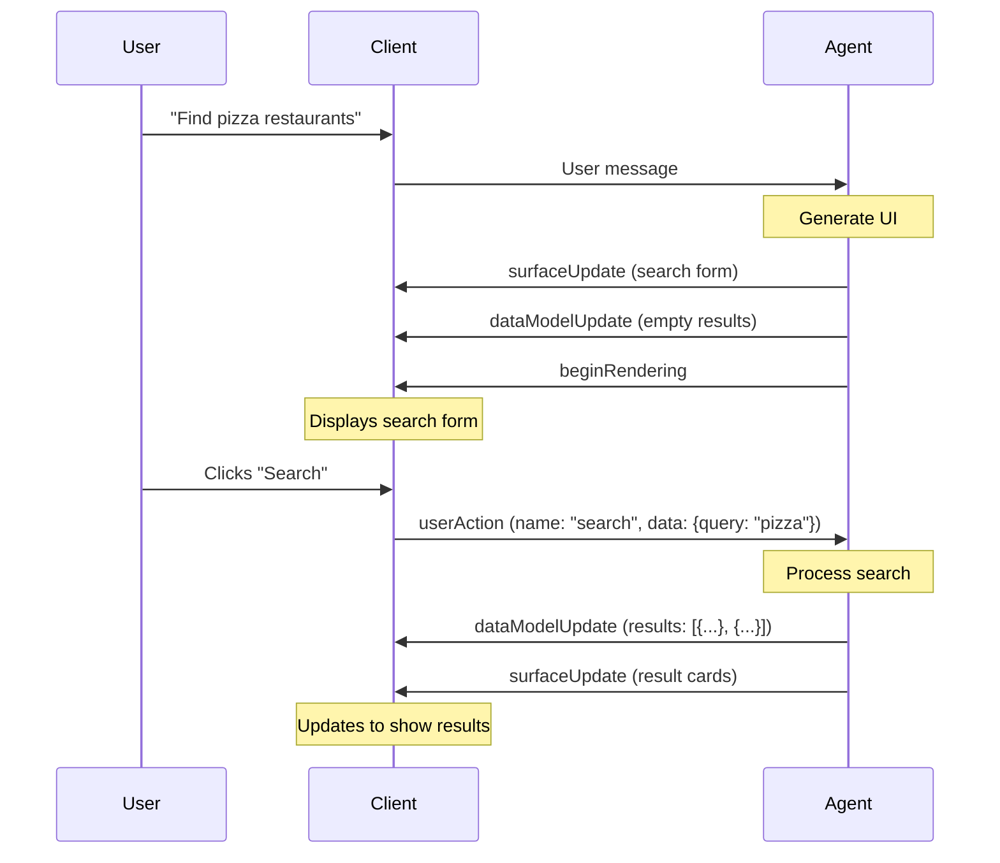

# Message Types

A2UI uses a **JSONL (JSON Lines)** streaming format where each line is a complete JSON message. This enables progressive rendering as clients can parse and process each message immediately.



---

## Server-to-Client Messages

### 1. `surfaceUpdate`

Adds or updates components in a surface.

```json
{
    "surfaceUpdate": {
        "surfaceId": "main_ui",
        "components": [
            {
                "id": "root",
                "component": {
                    "Column": {
                        "children": {
                            "explicitList": ["header", "content"]
                        }
                    }
                }
            },
            {
                "id": "header",
                "component": {
                    "Text": {
                        "text": {"literalString": "Welcome!"},
                        "usageHint": "h1"
                    }
                }
            }
        ]
    }
}
```

**Properties:**

| Property | Type | Description |
|----------|------|-------------|
| `surfaceId` | string | Target surface (optional, defaults to main) |
| `components` | array | Component definitions to add/update |

**Behavior:**

- Components with new IDs are **added**
- Components with existing IDs are **updated** (merged)
- Streaming: Send multiple `surfaceUpdate` messages to build UI incrementally

---

### 2. `dataModelUpdate`

Updates the data model for a surface.

```json
{
    "dataModelUpdate": {
        "surfaceId": "main_ui",
        "contents": {
            "user": {
                "name": "Alice Smith",
                "email": "alice@example.com"
            },
            "notifications": 5
        }
    }
}
```

**Properties:**

| Property | Type | Description |
|----------|------|-------------|
| `surfaceId` | string | Target surface (optional) |
| `contents` | object | Data to merge into model |

**Behavior:**

- New keys are **added**
- Existing keys are **overwritten**
- Components bound to changed paths **re-render automatically**

---

### 3. `beginRendering`

Signals the client to start/complete rendering.

```json
{
    "beginRendering": {
        "surfaceId": "main_ui",
        "root": "root_component_id",
        "catalog": "standard"
    }
}
```

**Properties:**

| Property | Type | Description |
|----------|------|-------------|
| `surfaceId` | string | Target surface |
| `root` | string | ID of root component |
| `catalog` | string | Which component catalog to use |

**Behavior:**

- Marks the initial render as ready
- Client builds component tree from root
- Must be sent after essential components/data

---

### 4. `deleteSurface`

Removes a surface and all its contents.

```json
{
    "deleteSurface": {
        "surfaceId": "temp_modal"
    }
}
```

**Use cases:**

- Closing modals/dialogs
- Removing temporary UI elements
- Cleanup after navigation

---

## Client-to-Server Messages

Sent via A2A (Agent-to-Agent) protocol as the transport layer.

### 5. `userAction`

Reports user interactions with components.

```json
{
    "userAction": {
        "surfaceId": "main_ui",
        "action": {
            "name": "submit_form",
            "componentId": "submit_btn"
        },
        "data": {
            "username": "alice",
            "email": "alice@example.com"
        }
    }
}
```

**Properties:**

| Property | Type | Description |
|----------|------|-------------|
| `surfaceId` | string | Source surface |
| `action.name` | string | Action identifier (defined in component) |
| `action.componentId` | string | Which component triggered |
| `data` | object | Form data or action parameters |

**Common Actions:**

| Action Name | Triggered By | Typical Data |
|-------------|--------------|--------------|
| `click` | Button | None |
| `submit` | Form | Field values |
| `change` | TextField | New value |
| `select` | Dropdown | Selected option |

---

### 6. `error`

Reports client-side errors back to the agent.

```json
{
    "error": {
        "surfaceId": "main_ui",
        "code": "RENDER_FAILED",
        "message": "Unknown component type: CustomChart",
        "details": {
            "componentId": "chart_1"
        }
    }
}
```

**Properties:**

| Property | Type | Description |
|----------|------|-------------|
| `code` | string | Error code |
| `message` | string | Human-readable message |
| `details` | object | Additional context |

---

## Complete Message Flow Example



---

## JSONL Stream Format

Messages are sent as **newline-delimited JSON**:

```jsonl
{"surfaceUpdate": {"components": [{"id": "root", "component": {"Column": {"children": {"explicitList": ["title"]}}}}]}}
{"surfaceUpdate": {"components": [{"id": "title", "component": {"Text": {"text": {"literalString": "Hello"}}}}]}}
{"dataModelUpdate": {"contents": {"count": 0}}}
{"beginRendering": {"root": "root"}}
```

**Benefits:**

- Parse as each line arrives (no waiting for complete JSON)
- Simple to generate by LLMs (no nested JSON tracking)
- Easy to stream over SSE/WebSockets
