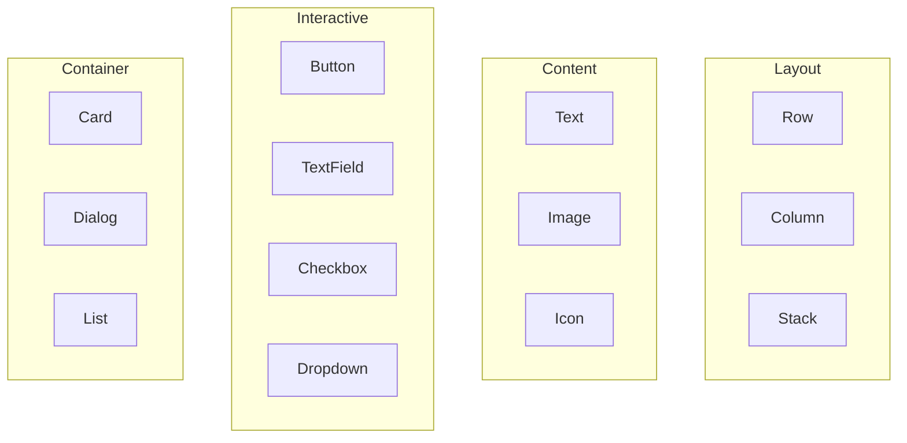

# Component Catalog

The A2UI Component Catalog defines the available UI elements that agents can generate and clients can render. Components are organized into categories based on their purpose.

## Standard Component Categories



---

## Layout Components

### Row

Arranges children horizontally.

```json
{
    "id": "action_row",
    "component": {
        "Row": {
            "alignment": "center",
            "spacing": "medium",
            "children": {
                "explicitList": ["btn_cancel", "btn_confirm"]
            }
        }
    }
}
```

| Property | Type | Description |
|----------|------|-------------|
| `alignment` | string | `start`, `center`, `end`, `spaceBetween` |
| `spacing` | string | `none`, `small`, `medium`, `large` |
| `children` | object | Child component IDs |

---

### Column

Arranges children vertically.

```json
{
    "id": "main_column",
    "component": {
        "Column": {
            "alignment": "start",
            "children": {
                "explicitList": ["header", "body", "footer"]
            }
        }
    }
}
```

---

### Stack

Layers children on top of each other (z-axis).

```json
{
    "id": "overlay_stack",
    "component": {
        "Stack": {
            "children": {
                "explicitList": ["background_image", "text_overlay"]
            }
        }
    }
}
```

---

## Content Components

### Text

Displays text content.

```json
{
    "id": "greeting",
    "component": {
        "Text": {
            "text": {"literalString": "Hello, World!"},
            "usageHint": "h2"
        }
    }
}
```

| Property | Type | Description |
|----------|------|-------------|
| `text` | BoundValue | Text content (literal or bound) |
| `usageHint` | string | `h1`, `h2`, `h3`, `body`, `caption` |

**With Data Binding:**

```json
{
    "id": "user_name",
    "component": {
        "Text": {
            "text": {"path": "user.displayName"}
        }
    }
}
```

---

### Image

Displays an image.

```json
{
    "id": "avatar",
    "component": {
        "Image": {
            "url": {"literalString": "https://example.com/avatar.jpg"},
            "alt": {"literalString": "User avatar"},
            "fit": "cover"
        }
    }
}
```

| Property | Type | Description |
|----------|------|-------------|
| `url` | BoundValue | Image source URL |
| `alt` | BoundValue | Accessibility text |
| `fit` | string | `contain`, `cover`, `fill` |

---

### Icon

Displays an icon from a standard set.

```json
{
    "id": "star_icon",
    "component": {
        "Icon": {
            "name": {"literalString": "star"},
            "size": "medium"
        }
    }
}
```

---

## Interactive Components

### Button

Clickable action trigger.

```json
{
    "id": "submit_btn",
    "component": {
        "Button": {
            "label": {"literalString": "Submit"},
            "action": {
                "name": "submit_form"
            },
            "style": "primary",
            "disabled": {"path": "form.isSubmitting"}
        }
    }
}
```

| Property | Type | Description |
|----------|------|-------------|
| `label` | BoundValue | Button text |
| `action` | Action | Event to fire on click |
| `style` | string | `primary`, `secondary`, `danger` |
| `disabled` | BoundValue | Disable state |

---

### TextField

Text input field.

```json
{
    "id": "email_input",
    "component": {
        "TextField": {
            "label": {"literalString": "Email"},
            "placeholder": {"literalString": "Enter your email"},
            "value": {"path": "form.email"},
            "action": {
                "name": "field_change"
            }
        }
    }
}
```

| Property | Type | Description |
|----------|------|-------------|
| `label` | BoundValue | Field label |
| `placeholder` | BoundValue | Hint text |
| `value` | BoundValue | Current value (bound) |
| `type` | string | `text`, `email`, `password`, `number` |

---

### Checkbox

Boolean toggle.

```json
{
    "id": "terms_checkbox",
    "component": {
        "Checkbox": {
            "label": {"literalString": "I agree to terms"},
            "checked": {"path": "form.acceptedTerms"},
            "action": {"name": "toggle_terms"}
        }
    }
}
```

---

### Dropdown

Selection from options.

```json
{
    "id": "country_select",
    "component": {
        "Dropdown": {
            "label": {"literalString": "Country"},
            "options": {"path": "countries"},
            "selected": {"path": "form.selectedCountry"},
            "action": {"name": "country_changed"}
        }
    }
}
```

---

## Container Components

### Card

Styled container with optional elevation.

```json
{
    "id": "profile_card",
    "component": {
        "Card": {
            "child": "card_content",
            "elevation": "medium"
        }
    }
}
```

| Property | Type | Description |
|----------|------|-------------|
| `child` | string | ID of child component |
| `elevation` | string | `none`, `low`, `medium`, `high` |

---

### Dialog

Modal overlay.

```json
{
    "id": "confirm_dialog",
    "component": {
        "Dialog": {
            "title": {"literalString": "Confirm Action"},
            "child": "dialog_content",
            "actions": {
                "explicitList": ["cancel_btn", "confirm_btn"]
            }
        }
    }
}
```

---

### List

Renders a list of items from data.

```json
{
    "id": "restaurant_list",
    "component": {
        "List": {
            "children": {
                "template": {
                    "source": {"path": "restaurants"},
                    "itemId": "item",
                    "template": "restaurant_card_template"
                }
            }
        }
    }
}
```

**Template-based rendering:**

The `template` approach renders a component for each item in an array from the data model.

---

## Children Types

Components that contain other components use the `children` property with two modes:

### `explicitList`

Directly list child component IDs:

```json
"children": {
    "explicitList": ["child1", "child2", "child3"]
}
```

### `template`

Dynamically generate children from data array:

```json
"children": {
    "template": {
        "source": {"path": "items"},
        "itemId": "item",
        "template": "item_template_component"
    }
}
```

---

## Catalog Negotiation

Clients advertise their supported components to agents:

```json
{
    "catalog": {
        "version": "1.0",
        "components": [
            "Text", "Button", "Row", "Column", 
            "Card", "Image", "TextField"
        ],
        "customComponents": [
            {
                "name": "MapView",
                "properties": ["center", "zoom", "markers"]
            }
        ]
    }
}
```

**Best Practice:** Agents should check the catalog before generating components to ensure compatibility.

---

## 📱 Mobile-Specific Components

Mobile clients can extend the standard catalog with platform-specific components for enhanced native experiences.

### BottomSheet

Modal sheet that slides up from the bottom of the screen.

```json
{
    "id": "details_sheet",
    "component": {
        "BottomSheet": {
            "child": "sheet_content",
            "snapPoints": ["25%", "50%", "90%"],
            "initialSnap": 1,
            "dismissible": true
        }
    }
}
```

| Property | Type | Description |
|----------|------|-------------|
| `child` | string | ID of child component |
| `snapPoints` | array | Height snap positions |
| `initialSnap` | number | Initial snap index |
| `dismissible` | boolean | Can swipe to dismiss |

---

### SwipeableRow

Row that reveals actions when swiped.

```json
{
    "id": "item_row",
    "component": {
        "SwipeableRow": {
            "child": "row_content",
            "leftActions": {
                "explicitList": ["archive_action"]
            },
            "rightActions": {
                "explicitList": ["delete_action"]
            }
        }
    }
}
```

| Property | Type | Description |
|----------|------|-------------|
| `child` | string | Main row content |
| `leftActions` | object | Actions revealed on right swipe |
| `rightActions` | object | Actions revealed on left swipe |

---

### FloatingActionButton

Floating action button with optional speed dial.

```json
{
    "id": "fab",
    "component": {
        "FloatingActionButton": {
            "icon": {"literalString": "add"},
            "action": {"name": "add_item"},
            "position": "bottomRight"
        }
    }
}
```

---

### PullToRefresh

Wrapper that adds pull-to-refresh gesture.

```json
{
    "id": "refresh_wrapper",
    "component": {
        "PullToRefresh": {
            "child": "scrollable_list",
            "action": {"name": "refresh_data"}
        }
    }
}
```

---

### Mobile Catalog Negotiation Example

Mobile clients should declare their extended component support:

```json
{
    "catalog": {
        "version": "1.0",
        "platform": "react-native",
        "components": [
            "Text", "Button", "Row", "Column",
            "Card", "Image", "TextField", "List"
        ],
        "mobileComponents": [
            "BottomSheet", "SwipeableRow", 
            "FloatingActionButton", "PullToRefresh"
        ],
        "capabilities": {
            "haptics": true,
            "gestures": ["swipe", "longPress", "pinch"],
            "offlineCache": true
        }
    }
}
```

> [!TIP]
> When the agent detects a mobile client, it can generate touch-optimized UIs with larger tap targets and gesture-based interactions.
