# A2UI: Pros and Cons

A comprehensive analysis of the A2UI protocol's advantages, disadvantages, and trade-offs.

## At a Glance

```mermaid
graph LR
    subgraph "Strengths"
        A[🔒 Security]
        B[🚀 LLM-Friendly]
        C[🌐 Cross-Platform]
        D[⚡ Progressive]
    end
    
    subgraph "Challenges"
        E[📦 Limited Catalog]
        F[🆕 Early Stage]
        G[🧩 Client Work]
        H[📚 Learning Curve]
    end
```



---

## ✅ Pros (Advantages)

### 🔒 1. Security by Design

**No code execution risk.** A2UI is a declarative data format, not executable code.

| Risk | A2UI Mitigation |
|------|-----------------|
| XSS attacks | Only pre-approved components render |
| Code injection | JSON descriptions, not JavaScript |
| Arbitrary DOM manipulation | Client controls all rendering |

```mermaid
graph LR
    A[Agent] -->|"JSON: {Button: {...}}"| B[Client]
    B -->|"Maps to native widget"| C[Safe UI]
    
    X[Attacker] -.->|"<script>evil()</script>"| B
    B -.->|"Not in catalog = rejected"| Y[❌ Blocked]
```

| Malicious scripts | No `<script>` or eval() possible |



**Why it matters:** AI agents operate with significant trust. A2UI prevents agents from executing harmful code on client devices.

---

### 🚀 2. LLM-Friendly Format

A2UI's flat, streaming JSON structure is **optimized for LLM generation**.

**Traditional nested JSON (problematic):**

```json
{
  "ui": {
    "children": [{
      "type": "card",
      "children": [{
        "type": "text",
        "value": "Hello"
      }]
    }]
  }
}
```

*LLMs struggle with deep nesting, often creating syntax errors.*

**A2UI's flat structure:**

```jsonl
{"surfaceUpdate": {"components": [{"id": "root", "component": {"Column": {}}}]}}
{"surfaceUpdate": {"components": [{"id": "card", "component": {"Card": {}}}]}}
{"surfaceUpdate": {"components": [{"id": "text", "component": {"Text": {}}}]}}
```

| Feature | Benefit |
|---------|---------|
| Flat JSON | No nested bracket tracking |
| JSONL (line-delimited) | Errors isolated to single lines |
| Incremental | Can build UI piece by piece |
| Self-healing | Invalid lines skipped, rest works |

---

### 🌐 3. Cross-Platform Compatibility

**One agent response works everywhere.**


| Platform | Renderer | Native Result |
|----------|----------|---------------|
| Web (React) | `@a2ui/react` | Material UI components |
| Mobile (Flutter) | `flutter_a2ui` | Flutter widgets |
| Enterprise (Angular) | `@a2ui/angular` | Angular Material |

**Business value:** Build agent once, deploy UI everywhere.

---

### ⚡ 4. Progressive Rendering

Stream UI updates as they're generated for **responsive user experience**.


**vs. Traditional approach:** Wait for complete response → render → long perceived latency.

---

### 🔧 5. Framework Agnostic

Separates **UI description** from **implementation**.

- Agent doesn't care if you use React, Vue, or Flutter
- Client doesn't need to know about LLM internals
- Upgrade UI framework without changing agent

---

### 📊 6. Rich Interactions

Move beyond text to **structured interfaces**.

| Text-Only | With A2UI |
|-----------|-----------|
| "Here are 3 restaurants: 1. Italian..." | Interactive cards with images, ratings, "Book" buttons |
| "Please enter your name, email, and..." | Form with validation, submit button |
| "The data shows..." | Tables, charts, visualizations |

---

### 🔄 7. Separation of Concerns

**Clean architecture** with three decoupled layers:

1. **Component Tree** (structure) - from agent
2. **Data Model** (state) - from agent
3. **Widget Registry** (rendering) - client-side

**Benefits:**

- Update data without resending UI
- Change styling without modifying agent
- Reuse components across surfaces

---

## ❌ Cons (Disadvantages)

### 📦 1. Limited Component Set

**Constrained to catalog components.**

| What You Want | A2UI Reality |
|---------------|--------------|
| Highly custom animation | Not supported (yet) |
| Complex data visualization | Needs custom component |
| Brand-specific component | Must extend catalog |
| Canvas/WebGL rendering | Outside scope |

**Mitigation:** Define custom components in your catalog, but requires additional development.

---

### 🆕 2. Early Stage (v0.8)

**Public preview with evolving API.**

| Concern | Risk Level |
|---------|------------|
| Breaking changes | Medium - spec may evolve |
| Limited ecosystem | High - few production deployments |
| Documentation gaps | Medium - improving rapidly |
| Community support | Growing - Google-backed |

**Recommendation:** Suitable for greenfield projects; evaluate carefully for production-critical systems.

---

### 🧩 3. Client Implementation Required

**Every target platform needs a renderer.**

```mermaid
graph TD
    A[A2UI Agent] --> B{Renderers Needed}
    B --> C[React - ✅ Available]
    B --> D[Flutter - ✅ Available]
    B --> E[Angular - ✅ Available]
    B --> F[Vue.js - ⏳ Community]
    B --> G[iOS Native - 🔨 Build]
    B --> H[Android Native - 🔨 Build]
```



**Effort:** Building a new renderer is significant work (weeks to months).

---

### 📚 4. Learning Curve

New concepts to understand:

- Surfaces and surface management
- Adjacency list component model
- JSONL streaming
- Data binding syntax
- Catalog negotiation

**Time to proficiency:** ~1-2 weeks for developers familiar with UI frameworks.

---

### 🔗 5. A2A Protocol Dependency

A2UI relies on **A2A (Agent-to-Agent)** protocol for:

- Event transport (userAction)
- Session management
- Authentication

**Implication:** Must implement A2A alongside A2UI for full functionality.

---

### 🎨 6. Styling Limitations

**Styling controlled by client catalog.**

- Agent cannot specify colors, fonts, sizes
- Limited to `usageHint` ("h1", "primary", etc.)
- Client interprets hints → varies by implementation

**Good:** Consistent brand experience
**Bad:** Fine-grained control impossible

---

### 🤖 7. LLM Reliability for Complex UIs

While A2UI is LLM-friendly, complex UIs may still challenge models:

| Complexity | LLM Success Rate |
|------------|------------------|
| Simple card | High (95%+) |
| Multi-step form | Medium (80%+) |
| Dashboard with charts | Variable (60-80%) |
| Complex nested layouts | Lower (50-70%) |

**Mitigation:**

- Use structured prompts with catalog schema
- Template common patterns
- Validate output before rendering

---

## 📊 Decision Matrix

| Criteria | Weight | A2UI Score | Notes |
|----------|--------|------------|-------|
| Security | High | ⭐⭐⭐⭐⭐ | Excellent by design |
| LLM Integration | High | ⭐⭐⭐⭐⭐ | Purpose-built |
| Cross-Platform | Medium | ⭐⭐⭐⭐ | Good if renderers exist |
| Flexibility | Medium | ⭐⭐⭐ | Catalog-constrained |
| Maturity | High | ⭐⭐ | Still evolving |
| Adoption | Medium | ⭐⭐ | Early stage |

---

## When to Choose A2UI

### ✅ Choose A2UI When

- Building **agent-driven applications** with rich UI needs
- Targeting **multiple platforms** (web + mobile)
- Security is a **top concern**
- You want **streaming/progressive** UI experiences
- Working with **structured data** (forms, lists, dashboards)

### ❌ Avoid A2UI When

- Simple text Q&A is sufficient
- Highly custom, artistic UI requirements
- No resources to implement client renderers
- Need offline-first functionality
- Production-critical with zero tolerance for breaking changes

---

## Summary

| Aspect | Verdict |
|--------|---------|
| **Innovation** | High - novel approach to agent UIs |
| **Security** | Excellent - declarative by design |
| **Developer Experience** | Improving - early but promising |
| **Production-Readiness** | Early adopter stage |
| **Future Potential** | Very high - strong backing |

> [!TIP]
> A2UI is best suited for teams building the next generation of AI-powered applications who can accept some early-adopter risk in exchange for a powerful, secure, and cross-platform UI solution.
