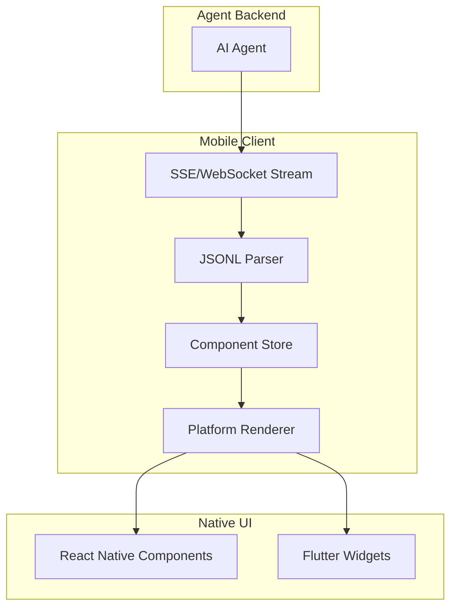
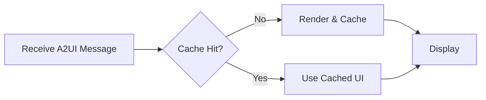

# Mobile Implementation Guide

A comprehensive guide for implementing A2UI renderers on **React Native** and **Flutter** mobile platforms.

## Overview



---

## React Native Implementation

### Architecture

```
┌─────────────────────────────────────────────────┐
│                  A2UIProvider                   │
│  (Context for state management)                 │
├─────────────────────────────────────────────────┤
│               A2UIStreamHandler                 │
│  (SSE/WebSocket connection, JSONL parsing)      │
├─────────────────────────────────────────────────┤
│               A2UIComponentTree                 │
│  (Recursive component rendering)                │
├─────────────────────────────────────────────────┤
│           Native Component Catalog              │
│  (Text, Button, Card, BottomSheet, etc.)        │
└─────────────────────────────────────────────────┘
```

### Core Components

#### A2UIProvider

```typescript
import React, { createContext, useContext, useReducer } from 'react';

interface A2UIState {
  components: Map<string, ComponentDef>;
  dataModel: Record<string, any>;
  rootId: string | null;
}

const A2UIContext = createContext<A2UIState | null>(null);

export function A2UIProvider({ children, streamUrl }: Props) {
  const [state, dispatch] = useReducer(a2uiReducer, initialState);
  
  useEffect(() => {
    const eventSource = new EventSource(streamUrl);
    eventSource.onmessage = (event) => {
      const message = JSON.parse(event.data);
      dispatch({ type: 'PROCESS_MESSAGE', payload: message });
    };
    return () => eventSource.close();
  }, [streamUrl]);

  return (
    <A2UIContext.Provider value={state}>
      {children}
    </A2UIContext.Provider>
  );
}
```

#### A2UIRenderer

```typescript
export function A2UIRenderer({ componentId }: { componentId: string }) {
  const { components, dataModel } = useA2UI();
  const component = components.get(componentId);
  
  if (!component) return null;
  
  const [type, props] = Object.entries(component.component)[0];
  const Component = COMPONENT_CATALOG[type];
  
  return <Component {...props} dataModel={dataModel} />;
}
```

#### Component Catalog

```typescript
const COMPONENT_CATALOG: Record<string, React.FC> = {
  Text: A2UIText,
  Button: A2UIButton,
  Column: A2UIColumn,
  Row: A2UIRow,
  Card: A2UICard,
  TextField: A2UITextField,
  Image: A2UIImage,
  List: A2UIList,
  // Mobile-specific
  BottomSheet: A2UIBottomSheet,
  SwipeableRow: A2UISwipeableRow,
  FloatingActionButton: A2UIFAB,
  PullToRefresh: A2UIPullToRefresh,
};
```

### Mobile-Specific Components

#### BottomSheet

```typescript
import BottomSheet from '@gorhom/bottom-sheet';

export function A2UIBottomSheet({ 
  child, snapPoints, initialSnap, dismissible 
}: Props) {
  const sheetRef = useRef<BottomSheet>(null);
  
  return (
    <BottomSheet
      ref={sheetRef}
      snapPoints={snapPoints || ['25%', '50%', '90%']}
      index={initialSnap || 1}
      enablePanDownToClose={dismissible}
    >
      <A2UIRenderer componentId={child} />
    </BottomSheet>
  );
}
```

#### SwipeableRow

```typescript
import { Swipeable } from 'react-native-gesture-handler';

export function A2UISwipeableRow({ 
  child, leftActions, rightActions 
}: Props) {
  const renderLeftActions = () => (
    <View style={styles.leftActions}>
      {leftActions?.explicitList.map(id => (
        <A2UIRenderer key={id} componentId={id} />
      ))}
    </View>
  );

  return (
    <Swipeable
      renderLeftActions={renderLeftActions}
      renderRightActions={renderRightActions}
    >
      <A2UIRenderer componentId={child} />
    </Swipeable>
  );
}
```

---

## Flutter Implementation

### Architecture

```dart
// Main widget tree
A2UIProvider
  └── A2UIStreamListener
      └── A2UIRootRenderer
          └── Component Tree (recursive)
```

### Core Widgets

#### A2UIProvider

```dart
class A2UIProvider extends InheritedWidget {
  final A2UIState state;
  
  static A2UIState of(BuildContext context) {
    return context.dependOnInheritedWidgetOfExactType<A2UIProvider>()!.state;
  }
  
  // ...
}
```

#### A2UIRenderer

```dart
class A2UIRenderer extends StatelessWidget {
  final String componentId;
  
  @override
  Widget build(BuildContext context) {
    final state = A2UIProvider.of(context);
    final component = state.components[componentId];
    
    if (component == null) return const SizedBox.empty();
    
    return _buildComponent(component, state.dataModel);
  }
  
  Widget _buildComponent(Map<String, dynamic> component, Map dataModel) {
    final entry = component['component'].entries.first;
    final type = entry.key;
    final props = entry.value;
    
    switch (type) {
      case 'Text':
        return _buildText(props, dataModel);
      case 'Button':
        return _buildButton(props, dataModel);
      case 'Column':
        return _buildColumn(props, dataModel);
      case 'BottomSheet':
        return _buildBottomSheet(props, dataModel);
      // ... other components
      default:
        return const SizedBox.empty();
    }
  }
}
```

#### Flutter Component Examples

```dart
Widget _buildButton(Map props, Map dataModel) {
  final label = resolveValue(props['label'], dataModel);
  final style = props['style'] ?? 'primary';
  
  return ElevatedButton(
    onPressed: () => handleAction(props['action']),
    style: _getButtonStyle(style),
    child: Text(label),
  );
}

Widget _buildBottomSheet(Map props, Map dataModel) {
  return DraggableScrollableSheet(
    initialChildSize: 0.5,
    minChildSize: 0.25,
    maxChildSize: 0.9,
    builder: (context, scrollController) {
      return A2UIRenderer(componentId: props['child']);
    },
  );
}
```

---

## Platform Considerations

### iOS vs Android

| Feature | iOS | Android |
|---------|-----|---------|
| **Bottom Sheet** | Native sheet presentation | Material BottomSheet |
| **Haptics** | UIImpactFeedbackGenerator | VibrationEffect |
| **Swipe Actions** | UISwipeActionsConfiguration | ItemTouchHelper |
| **Safe Areas** | SafeAreaInsets | WindowInsets |

### Touch Targets

Mobile A2UI components should respect platform minimum touch targets:

- **iOS**: 44x44 points
- **Android**: 48x48 dp

```typescript
// React Native example
const styles = StyleSheet.create({
  button: {
    minHeight: Platform.select({ ios: 44, android: 48 }),
    minWidth: Platform.select({ ios: 44, android: 48 }),
  },
});
```

---

## Streaming & Performance

### Efficient Re-rendering

```typescript
// Use React.memo for component catalog items
const A2UIText = React.memo(({ text, usageHint, dataModel }) => {
  const resolvedText = resolveValue(text, dataModel);
  return <Text style={getTextStyle(usageHint)}>{resolvedText}</Text>;
});
```

### Lazy Loading for Lists

```typescript
function A2UIList({ children, dataModel }: Props) {
  if (children?.template) {
    const source = resolveValue(children.template.source, dataModel);
    
    return (
      <FlatList
        data={source}
        renderItem={({ item, index }) => (
          <A2UIRenderer componentId={`${children.template.template}_${index}`} />
        )}
        keyExtractor={(_, index) => index.toString()}
      />
    );
  }
  
  return (
    <FlatList
      data={children?.explicitList || []}
      renderItem={({ item }) => <A2UIRenderer componentId={item} />}
    />
  );
}
```

---

## Offline Support

### Caching Strategy



```typescript
// React Native with AsyncStorage
import AsyncStorage from '@react-native-async-storage/async-storage';

async function cacheA2UIState(surfaceId: string, state: A2UIState) {
  await AsyncStorage.setItem(
    `a2ui_cache_${surfaceId}`,
    JSON.stringify(state)
  );
}

async function loadCachedState(surfaceId: string): Promise<A2UIState | null> {
  const cached = await AsyncStorage.getItem(`a2ui_cache_${surfaceId}`);
  return cached ? JSON.parse(cached) : null;
}
```

---

## User Actions

### Sending Events Back to Agent

```typescript
interface UserAction {
  userAction: {
    surfaceId?: string;
    action: {
      name: string;
      componentId: string;
    };
    data?: Record<string, any>;
  };
}

async function sendUserAction(action: UserAction) {
  await fetch('/api/a2ui/action', {
    method: 'POST',
    headers: { 'Content-Type': 'application/json' },
    body: JSON.stringify(action),
  });
}
```

### Gesture Handling

```typescript
// Long press example
<Pressable
  onPress={() => handleAction({ name: 'tap' })}
  onLongPress={() => handleAction({ name: 'longPress' })}
  delayLongPress={500}
>
  {children}
</Pressable>
```

---

## Quick Start

### React Native

```bash
# Install dependencies
npm install @gorhom/bottom-sheet react-native-gesture-handler react-native-reanimated

# Create A2UI provider
npx create-a2ui-renderer react-native
```

### Flutter

```bash
# Add to pubspec.yaml
dependencies:
  flutter_a2ui: ^1.0.0

# Generate boilerplate
flutter pub run flutter_a2ui:generate
```

---

## Summary

| Platform | Key Libraries | Complexity |
|----------|---------------|------------|
| React Native | Gesture Handler, Bottom Sheet, Animated | Medium |
| Flutter | DraggableScrollableSheet, Slidable | Medium |

> [!TIP]
> Start with the core components (Text, Button, Row, Column, Card) and progressively add mobile-specific components as needed.
