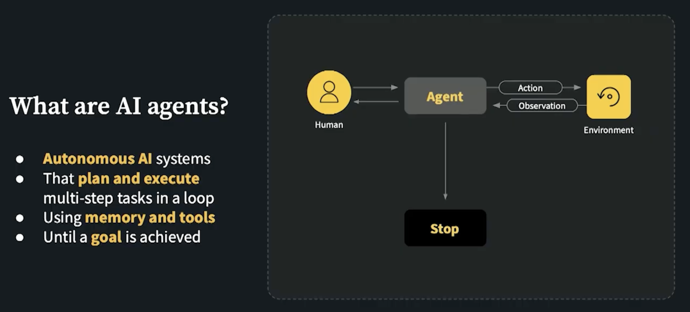
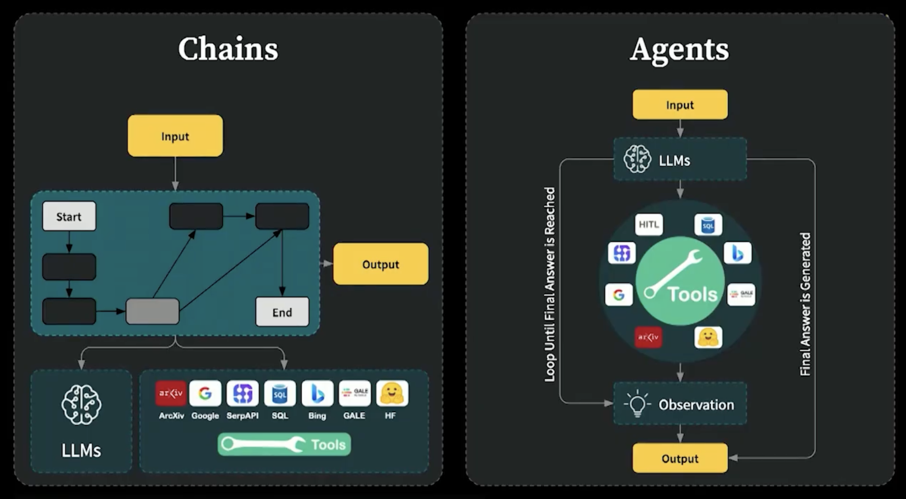
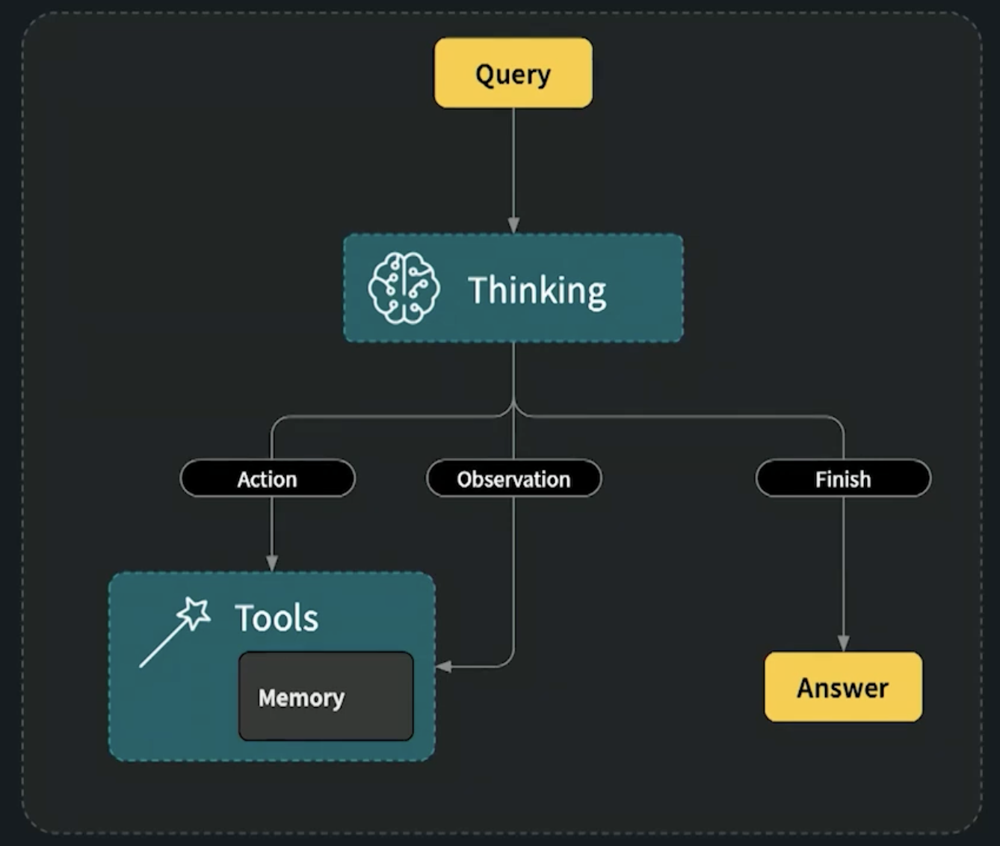
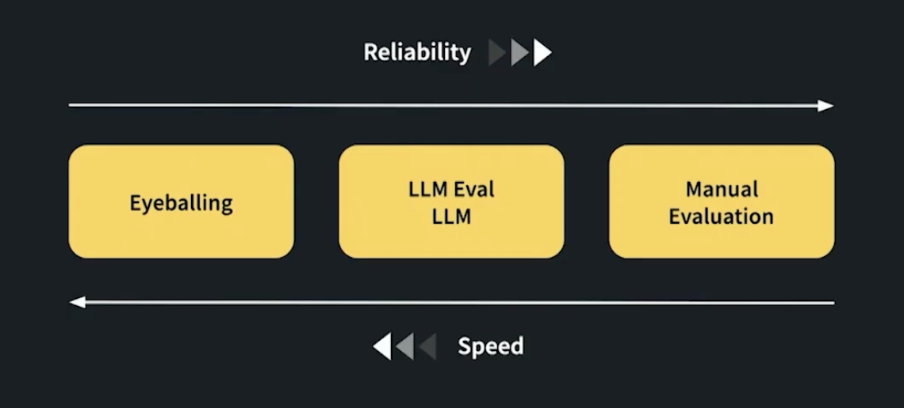

# What is an AI Agent?

An AI agent is a software entity that uses artificial intelligence techniques to perform tasks autonomously. It can perceive its environment, make decisions, and take actions to achieve specific goals. AI agents often leverage large language models (LLMs) and other tools to process information, reason about it, and execute tasks.

A good agent must have a defined purpose or goal.

Areas where AI agents seen success are:

1. Code generation and debugging
2. Customer support and virtual assistants
3. Data analysis and reporting
4. Content creation and summarization
5. Personal productivity and task management
6. Deep research assistance

## Chains vs. Agents

Chains are sequences of operations that process inputs to produce outputs in a linear fashion. They typically involve a series of steps where each step's output becomes the next step's input. Chains are useful for straightforward tasks that require a fixed sequence of operations.

Agents, on the other hand, are more dynamic and flexible. They can make decisions about which actions to take based on the current context and can interact with various tools or resources as needed. Agents can adapt their behavior based on the situation, making them suitable for more complex tasks that require reasoning and decision-making.

## Key Components of AI Agents

1. **Large Language Model (LLM)**: The core component that processes natural language inputs and generates responses. It serves as the agent's "brain," enabling it to understand and reason about tasks.

2. **Tools**: External resources or functionalities that the agent can utilize to perform specific actions. Tools can include APIs, databases, calculators, or any other service that the agent can call upon to assist in completing tasks.

3. **Agent Logic**: The decision-making framework that governs how the agent selects actions, chooses tools, and processes information. This logic can be rule-based, learned from data, or a combination of both.  

4. **Memory**: A component that allows the agent to retain information from previous interactions. Memory can help the agent maintain context, learn from past experiences, and improve its performance over time.

5. **Input/Output Interface**: The means by which the agent receives inputs from users or other systems and delivers outputs. This can include text-based interfaces, voice commands, or integration with other software applications.

6. **Environment**: The external context in which the agent operates. This can include the physical world, virtual environments, or specific domains relevant to the agent's tasks.

7. **Feedback Mechanism**: A system that allows the agent to receive feedback on its actions and performance. This can help the agent learn and adapt its behavior over time.

8. **Execution Engine**: The component responsible for managing the execution of the agent's actions, including invoking tools, processing responses, and coordinating the overall workflow.

9. **Monitoring and Logging**: Systems that track the agent's activities, decisions, and performance metrics. This information can be used for debugging, analysis, and improvement of the agent's capabilities.

10. **Security and Compliance**: Measures to ensure that the agent operates within legal and ethical boundaries, protecting user data and adhering to relevant regulations.

## Characteristics of AI Agents

1. **Autonomy**: AI agents can operate independently without constant human intervention, making decisions and taking actions based on their programming and learned experiences.

2. **Adaptability**: Agents can adjust their behavior based on changes in the environment or new information, allowing them to handle a variety of tasks and situations.

3. **Goal-Oriented**: AI agents are designed to achieve specific objectives, whether it's answering questions, completing tasks, or solving problems.

4. **Interactivity**: Agents can engage in dynamic interactions with users or other systems, responding to inputs and providing outputs in real-time.

5. **Learning Capability**: Many AI agents can learn from their experiences, improving their performance over time through techniques such as reinforcement learning or supervised learning.

6. **Multi-Modal Processing**: Some AI agents can handle various types of data, such as text, images, and audio, enabling them to perform more complex tasks.

7. **Scalability**: AI agents can be designed to handle varying workloads, from simple tasks to complex operations involving large amounts of data.

8. **Collaboration**: Agents can work alongside humans or other AI systems, complementing their capabilities and enhancing overall performance.

9. **Context Awareness**: AI agents can understand and utilize contextual information to make more informed decisions and provide relevant responses.

10. **Transparency**: Some AI agents are designed to provide explanations for their decisions and actions, enhancing trust and understanding among users.

## Agents Patterns

1. **ReAct Pattern**: This pattern combines reasoning and acting in a loop, allowing the agent to think through its actions step-by-step while interacting with tools as needed.

2.**Multi-Agent Patterns**: These patterns involve multiple agents working together to achieve a common goal, often leveraging their individual strengths and capabilities.

- **Orchestration Pattern**: A central agent coordinates the actions of multiple subordinate agents. Centralized control helps manage complex tasks. Clear Task Allocation: Each agent has a defined role or responsibility. Easier to monitor and manage performance.

- **Peer-to-Peer Pattern**: Agents communicate and collaborate directly with each other without a central coordinator. Each agent can initiate interactions and share information as needed. Simple, debuggable and predicatable workflow. Scalability: New agents can be added without modifying a central controller.

- **Hierarchical Pattern**: Agents are organized in a hierarchy, with higher-level agents overseeing lower-level agents. Higher-level agents make strategic decisions, while lower-level agents handle specific tasks. Clear Command Structure: Responsibilities are well-defined at each level. Efficient Resource Management: Higher-level agents can allocate resources based on overall priorities.

- **Parallel Pattern**: Multiple agents work simultaneously on different aspects of a task, sharing information as needed. This pattern is useful for tasks that can be decomposed into independent subtasks. Speed: Tasks can be completed faster through concurrent processing. Flexibility: Agents can adapt to changes in their specific areas without affecting the entire system.

## Variability in Agent Behavior

When working with AI agents, it's important to understand that their behavior can vary across different executions. This variability can arise from several factors:

- LLM is non-deterministic, so the same input may yield different outputs on different runs.
- Agents may take different actions based on slight variations in input or context.
- The sequence of tool calls and reasoning steps may vary between executions.
- External tool outputs may change over time, affecting agent behavior.
- Randomness in tool selection or action choice can lead to different outcomes.
- Updates to the underlying models or tools can alter agent responses.
- Variations in system load or latency can impact response times and behavior.
- User interactions or feedback during execution can influence agent decisions.
- Environmental factors, such as network conditions, may affect tool accessibility and performance.

To manage and understand this variability, consider the following strategies:

- Use consistent prompts and inputs to minimize variability.
- Log agent interactions and outputs for analysis.
- Implement version control for models and tools to track changes.
- Test agents under different conditions to observe behavior patterns.
- Set random seeds where applicable to reduce randomness in outputs.
- Monitor external tool performance and outputs regularly.
- Provide clear guidelines for user interactions to ensure consistency.
- Document changes to models, tools, and environments that may impact agent behavior.
By being aware of these factors and implementing strategies to manage them, you can better understand and control the variability in AI agent behavior.

## How to measure success of an AI Agent

Measuring the success of an AI agent involves evaluating its performance based on various criteria that align with its intended goals and functionalities. Here are some key aspects to consider when measuring the success of an AI agent:

### Libraries and tools to measure agent success

- Evaluation metrics (automated)

  - BLEU, ROUGE, SacreBLEU, METEOR — classical text similarity metrics.
  - BERTScore, BLEURT, COMET — learned metrics for semantic quality.
  - Accuracy / F1 / Precision / Recall / AUC — standard classification metrics.

- Evaluation frameworks

  - OpenAI Evals — configurable human + automated evaluation harness.
  - Hugging Face Evaluate & Datasets — standardized metrics and datasets.
  - EleutherAI lm-eval-harness — language model benchmarking suite.
  - LangChain evaluation module — agent-focused evaluation helpers.

- Code & task-specific suites

  - HumanEval, MBPP — for code generation correctness and unit-test-based scoring.
  - Seqeval — sequence labeling evaluation.

- Experiment tracking and observability

  - Weights & Biases, MLflow — metric logging, experiments, and visualizations.
  - TensorBoard — training and metric visualization.
  - Prometheus + Grafana — production metric collection and dashboards.

- Monitoring, logging & error tracking

  - ELK stack (Elasticsearch, Logstash, Kibana) or OpenSearch — logs and analytics.
  - Sentry — runtime error tracking and alerting.

- User analytics & A/B testing

  - Amplitude, Mixpanel — product usage and engagement metrics.
  - Optimizely, LaunchDarkly — feature flagging and A/B testing platforms.

- Interpretability, safety & debugging

  - TruLens, Captum — model interpretability and attribution tools.
  - Adversarial/safety evaluation toolkits (custom suites, fuzzers) for robustness tests.

Guidance: combine automated metrics, human evaluation, and production telemetry. Pick tools that match your metric types (semantic quality, task completion, latency, resource use, user satisfaction).

## Evaluation and Optimization Strategies

1. Monitored Experimentatoin: Continuously monitor agent performance using dashboards and alerts to identify issues and opportunities for improvement.

- Traces, logs, and metrics should be collected and analyzed in real-time.
- Set up alerts for performance degradation or failures.
- Prompting Playgrounds: Use interactive environments to test and refine agent prompts and behaviors.

2. Systematic Evaluation: Regularly evaluate the agent using established benchmarks and user feedback to ensure it meets performance goals.

- Evals
- Reference Datasets
- Custom Scores

