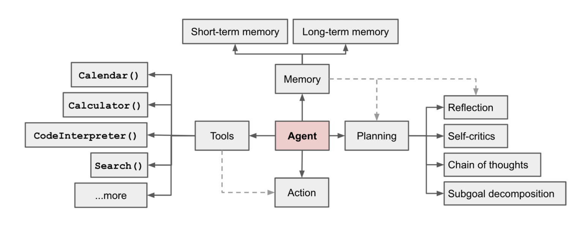
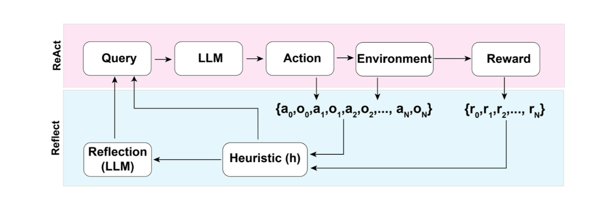

# What is an AI Agent?

An AI agent is a software entity that uses artificial intelligence techniques to perform tasks autonomously. It can perceive its environment, make decisions, and take actions to achieve specific goals. AI agents often leverage large language models (LLMs) and other tools to process information, reason about it, and execute tasks.

A good agent must have a defined purpose or goal.


Areas where AI agents seen success are:

1. Code generation and debugging
2. Customer support and virtual assistants
3. Data analysis and reporting
4. Content creation and summarization
5. Personal productivity and task management
6. Deep research assistance

## Chains vs. Agents

Chains are sequences of operations that process inputs to produce outputs in a linear fashion. They typically involve a series of steps where each step's output becomes the next step's input. Chains are useful for straightforward tasks that require a fixed sequence of operations.

Agents, on the other hand, are more dynamic and flexible. They can make decisions about which actions to take based on the current context and can interact with various tools or resources as needed. Agents can adapt their behavior based on the situation, making them suitable for more complex tasks that require reasoning and decision-making.


## Key Components of AI Agents

1. **Large Language Model (LLM)**: The core component that processes natural language inputs and generates responses. It serves as the agent's "brain," enabling it to understand and reason about tasks.

2. **Tools**: External resources or functionalities that the agent can utilize to perform specific actions. Tools can include APIs, databases, calculators, or any other service that the agent can call upon to assist in completing tasks.

3. **Agent Logic**: The decision-making framework that governs how the agent selects actions, chooses tools, and processes information. This logic can be rule-based, learned from data, or a combination of both.  

4. **Memory**: A component that allows the agent to retain information from previous interactions. Memory can help the agent maintain context, learn from past experiences, and improve its performance over time.

5. **Input/Output Interface**: The means by which the agent receives inputs from users or other systems and delivers outputs. This can include text-based interfaces, voice commands, or integration with other software applications.

6. **Environment**: The external context in which the agent operates. This can include the physical world, virtual environments, or specific domains relevant to the agent's tasks.

7. **Feedback Mechanism**: A system that allows the agent to receive feedback on its actions and performance. This can help the agent learn and adapt its behavior over time.

8. **Execution Engine**: The component responsible for managing the execution of the agent's actions, including invoking tools, processing responses, and coordinating the overall workflow.

9. **Monitoring and Logging**: Systems that track the agent's activities, decisions, and performance metrics. This information can be used for debugging, analysis, and improvement of the agent's capabilities.

10. **Security and Compliance**: Measures to ensure that the agent operates within legal and ethical boundaries, protecting user data and adhering to relevant regulations.

## Characteristics of AI Agents

1. **Autonomy**: AI agents can operate independently without constant human intervention, making decisions and taking actions based on their programming and learned experiences.

2. **Adaptability**: Agents can adjust their behavior based on changes in the environment or new information, allowing them to handle a variety of tasks and situations.

3. **Goal-Oriented**: AI agents are designed to achieve specific objectives, whether it's answering questions, completing tasks, or solving problems.

4. **Interactivity**: Agents can engage in dynamic interactions with users or other systems, responding to inputs and providing outputs in real-time.

5. **Learning Capability**: Many AI agents can learn from their experiences, improving their performance over time through techniques such as reinforcement learning or supervised learning.

6. **Multi-Modal Processing**: Some AI agents can handle various types of data, such as text, images, and audio, enabling them to perform more complex tasks.

7. **Scalability**: AI agents can be designed to handle varying workloads, from simple tasks to complex operations involving large amounts of data.

8. **Collaboration**: Agents can work alongside humans or other AI systems, complementing their capabilities and enhancing overall performance.

9. **Context Awareness**: AI agents can understand and utilize contextual information to make more informed decisions and provide relevant responses.

10. **Transparency**: Some AI agents are designed to provide explanations for their decisions and actions, enhancing trust and understanding among users.

## Agents Patterns

1. **ReAct Pattern**: This pattern combines reasoning and acting in a loop, allowing the agent to think through its actions step-by-step while interacting with tools as needed.


2.**Multi-Agent Patterns**: These patterns involve multiple agents working together to achieve a common goal, often leveraging their individual strengths and capabilities.

- **Orchestration Pattern**: A central agent coordinates the actions of multiple subordinate agents. Centralized control helps manage complex tasks. Clear Task Allocation: Each agent has a defined role or responsibility. Easier to monitor and manage performance.

- **Peer-to-Peer Pattern**: Agents communicate and collaborate directly with each other without a central coordinator. Each agent can initiate interactions and share information as needed. Simple, debuggable and predicatable workflow. Scalability: New agents can be added without modifying a central controller.

- **Hierarchical Pattern**: Agents are organized in a hierarchy, with higher-level agents overseeing lower-level agents. Higher-level agents make strategic decisions, while lower-level agents handle specific tasks. Clear Command Structure: Responsibilities are well-defined at each level. Efficient Resource Management: Higher-level agents can allocate resources based on overall priorities.

- **Parallel Pattern**: Multiple agents work simultaneously on different aspects of a task, sharing information as needed. This pattern is useful for tasks that can be decomposed into independent subtasks. Speed: Tasks can be completed faster through concurrent processing. Flexibility: Agents can adapt to changes in their specific areas without affecting the entire system.

## Variability in Agent Behavior

When working with AI agents, it's important to understand that their behavior can vary across different executions. This variability can arise from several factors:

- LLM is non-deterministic, so the same input may yield different outputs on different runs.
- Agents may take different actions based on slight variations in input or context.
- The sequence of tool calls and reasoning steps may vary between executions.
- External tool outputs may change over time, affecting agent behavior.
- Randomness in tool selection or action choice can lead to different outcomes.
- Updates to the underlying models or tools can alter agent responses.
- Variations in system load or latency can impact response times and behavior.
- User interactions or feedback during execution can influence agent decisions.
- Environmental factors, such as network conditions, may affect tool accessibility and performance.

To manage and understand this variability, consider the following strategies:

- Use consistent prompts and inputs to minimize variability.
- Log agent interactions and outputs for analysis.
- Implement version control for models and tools to track changes.
- Test agents under different conditions to observe behavior patterns.
- Set random seeds where applicable to reduce randomness in outputs.
- Monitor external tool performance and outputs regularly.
- Provide clear guidelines for user interactions to ensure consistency.
- Document changes to models, tools, and environments that may impact agent behavior.
By being aware of these factors and implementing strategies to manage them, you can better understand and control the variability in AI agent behavior.

## How to measure success of an AI Agent

Measuring the success of an AI agent involves evaluating its performance based on various criteria that align with its intended goals and functionalities. Here are some key aspects to consider when measuring the success of an AI agent:

### Libraries and tools to measure agent success

- Evaluation metrics (automated)

  - BLEU, ROUGE, SacreBLEU, METEOR — classical text similarity metrics.
  - BERTScore, BLEURT, COMET — learned metrics for semantic quality.
  - Accuracy / F1 / Precision / Recall / AUC — standard classification metrics.

- Evaluation frameworks

  - OpenAI Evals — configurable human + automated evaluation harness.
  - Hugging Face Evaluate & Datasets — standardized metrics and datasets.
  - EleutherAI lm-eval-harness — language model benchmarking suite.
  - LangChain evaluation module — agent-focused evaluation helpers.

- Code & task-specific suites

  - HumanEval, MBPP — for code generation correctness and unit-test-based scoring.
  - Seqeval — sequence labeling evaluation.

- Experiment tracking and observability

  - Weights & Biases, MLflow — metric logging, experiments, and visualizations.
  - TensorBoard — training and metric visualization.
  - Prometheus + Grafana — production metric collection and dashboards.

- Monitoring, logging & error tracking

  - ELK stack (Elasticsearch, Logstash, Kibana) or OpenSearch — logs and analytics.
  - Sentry — runtime error tracking and alerting.

- User analytics & A/B testing

  - Amplitude, Mixpanel — product usage and engagement metrics.
  - Optimizely, LaunchDarkly — feature flagging and A/B testing platforms.

- Interpretability, safety & debugging

  - TruLens, Captum — model interpretability and attribution tools.
  - Adversarial/safety evaluation toolkits (custom suites, fuzzers) for robustness tests.

Guidance: combine automated metrics, human evaluation, and production telemetry. Pick tools that match your metric types (semantic quality, task completion, latency, resource use, user satisfaction).

## Evaluation and Optimization Strategies

1. Monitored Experimentatoin: Continuously monitor agent performance using dashboards and alerts to identify issues and opportunities for improvement.

- Traces, logs, and metrics should be collected and analyzed in real-time.
- Set up alerts for performance degradation or failures.
- Prompting Playgrounds: Use interactive environments to test and refine agent prompts and behaviors.

2. Systematic Evaluation: Regularly evaluate the agent using established benchmarks and user feedback to ensure it meets performance goals.

- Evals
- Reference Datasets
- Custom Scores


In an LLM powered autonomous agent system, LLM functions as brain with several key components:

1. Planning

   - Subgoal and decomposition: Break down complex tasks into manageable subgoals.
   - Reflection and refinement: Agent can do self-criticism and self-reflection over past actions, learn from mistakes to improve quality of results.

2. Memory

   - Short-term memory: Retain context during interactions. Mostl all active context is stored here.
   - Long-term memory: Store knowledge and experiences for future use. Retain and recall information over time

3. Tool Use

    - Tool selection: Choose appropriate tools based on task requirements.
    - Tool execution: Effectively utilize tools to perform actions and gather information.



Let's explore each of these components in detail:

### 1. Planning

Planning is a critical function of an AI agent that enables it to strategize and execute tasks effectively. It involves breaking down complex objectives into smaller, manageable subgoals and continuously refining its approach based on feedback and outcomes.

#### Task Decomposition

- **Chain of Thought (CoT)**: This technique involves breaking down reasoning into a series of intermediate steps, allowing the agent to tackle complex problems methodically. By articulating each step of the thought process, the agent can ensure that it addresses all aspects of the task.

- **Tree of Thought (ToT)**: This approach extends CoT by exploring multiple reasoning paths in parallel. The agent generates a tree-like structure of possible solutions, evaluating each branch to identify the most effective strategy for achieving the goal. The search process can be BFS (breadth-first search) or DFS (depth-first search) based on the task requirements. Task decomposition can be done by LLM another quite distinctive approach is LLM+P involves relying on external planner module to do the decomposition.

#### Self-Reflection and Refinement

Its a vital aspect that allows autonomous agents to improve iteratively bu refining past action decisions and correcting previous mistakes. This process involves:

- **ReAct (Reason + Act)**: A framework where the agent alternates between reasoning about its actions and executing them. This iterative process enables the agent to adapt its strategy based on real-time feedback. The ReAct prompt template incorporates explicit steps for LLM to think, roughly formatted as:

```text
Thought: <reasoning about what to do>
Action: <the action to take, e.g. call a tool>
Action Input: <input to the action>
Observation: <the result of the action>
... (this Thought/Action/Action Input/Observation can repeat N times) 
Thought: <final reasoning>
Final Answer: <the final answer to the original question>
```

- **Reflection**: Equip agents with dynamic memory and self-evaluation capabilities. Agents can periodically review their actions, assess outcomes, and adjust strategies accordingly. This continuous learning loop enhances the agent's ability to deliver accurate and relevant results over time. After each action, the agent computes a heuristic and optonally may decide to reset the environment to start a new trial depending on the self-reflection outcome.



The heuristic function determines when the trajectory is inefficient or contains hallucination and should be stopped.

- **Chain of Hindsight (CoH)**: This technique involves the agent reflecting on its past actions and outcomes to learn from mistakes. By analyzing previous decisions, the agent can identify areas for improvement and refine its strategies for future tasks. The idea of CoH is to generate a hindsight chain of thought that explains what went wrong and how to fix it. Considering that an agent interacts with the environment many times and in each episode the agent gets a little better, AD (Algorithm Distillation) concatenates this learning history and feeds that into the model.

### 2. Memory

Memory is a crucial component of AI agents that enables them to retain and utilize information from past interactions. It can be broadly categorized into short-term and long-term memory, each serving distinct purposes in the agent's functioning.

#### Sensory Memory

Provides the ability to retain impressions of sensory information after the original stimuli have ended. It acts as a buffer for stimuli received through the five senses. Subcategories include iconic (visual) and echoic (auditory) memory, and haptic (tactile) memory.

#### Short-Term Memory or Working Memory

Stores information that we are currently aware and needed to carry out tasks. It has a limited capacity and duration, typically holding information for about 20-30 seconds. Techniques to enhance short-term memory in AI agents include:

   1. **Chunking**: Breaking down information into smaller, manageable units (chunks) to improve retention and recall. For example, a phone number is easier to remember when divided into segments (e.g., 123-456-7890).

   2. **Rehearsal**: Actively repeating or reviewing information to reinforce memory retention. This can be done through techniques like mental imagery or verbal repetition.

   3. **Contextual Cues**: Utilizing environmental or situational cues to trigger memory recall. This can involve associating information with specific contexts or using mnemonic devices.

#### Long-Term Memory

There are two types of long-term memory:

  1. **Explicit Memory (Declarative Memory)**: Involves conscious recollection of facts and events. It can be further divided into episodic memory (personal experiences) and semantic memory (general knowledge).

  2. **Implicit Memory (Non-Declarative Memory)**: Involves unconscious retention of information, such as skills and habits. This type of memory is often demonstrated through performance rather than conscious recall, like riding a bike or playing a musical instrument.

  We can roughly consider the following mappings:
    - Sensory Memory as learning embedding representations from raw data, including text, images, audio, and video.
    - Short-Term Memory as maintaining and manipulating information in working memory for immediate tasks.
    - Long-Term Memory as the storage of information over extended periods, encompassing both explicit and implicit memory. These could be external vector databases or knowledge bases.

### 3. Tool Use

Tool use refers to the ability of AI agents to leverage external tools and resources to enhance their capabilities and performance. This can include a wide range of tools, such as:

- **APIs**: Agents can interact with external APIs to access additional data, services, or functionalities that are not natively available within the agent's environment.

- **Databases**: Agents can query databases to retrieve relevant information, store knowledge, or update records based on their interactions.

- **Plugins**: Agents can utilize plugins or extensions to augment their functionality, enabling them to perform specialized tasks or access new features.

Effective tool use requires agents to have a clear understanding of their goals, the capabilities of the tools at their disposal, and the context in which they are operating. This involves not only selecting the appropriate tools but also managing interactions with them in a way that maximizes efficiency and effectiveness.

#### Tool Selection

Tool selection is a critical aspect of AI agent functionality, as it involves choosing the most appropriate tools to accomplish specific tasks. Effective tool selection requires the agent to evaluate the available options based on several criteria:

- **Relevance**: The tool must be suitable for the task at hand and capable of delivering the desired outcomes.

- **Compatibility**: The tool should integrate seamlessly with the agent's existing systems and workflows.

- **Usability**: The tool must be user-friendly and easy to operate, minimizing the learning curve for the agent.

- **Performance**: The tool should demonstrate reliable and efficient performance, meeting the agent's requirements for speed and accuracy.

By carefully considering these criteria, AI agents can optimize their tool selection process, ultimately enhancing their overall effectiveness and efficiency in achieving their goals.

#### Tool Execution

Tool execution refers to the process by which AI agents utilize selected tools to perform specific actions and gather information. This involves several key steps:

## Challenges in Building AI Agents

1. **Finite Context Length**: Restricted context limits the inclusion of historical data and knowledge, impacting performance on complex tasks. Design has to work with this limited communication bandwidth.

2. **Challenges in long-term planning and task decomposition for complex objectives**: AI agents often struggle with breaking down intricate tasks into manageable subtasks and establishing effective plans to achieve their goals. This can result in inefficiencies and suboptimal performance.

3. **Reliability of natural language interface**: Natural language can be ambiguous and context-dependent, leading to misunderstandings and errors in communication between the agent and users or other systems.
