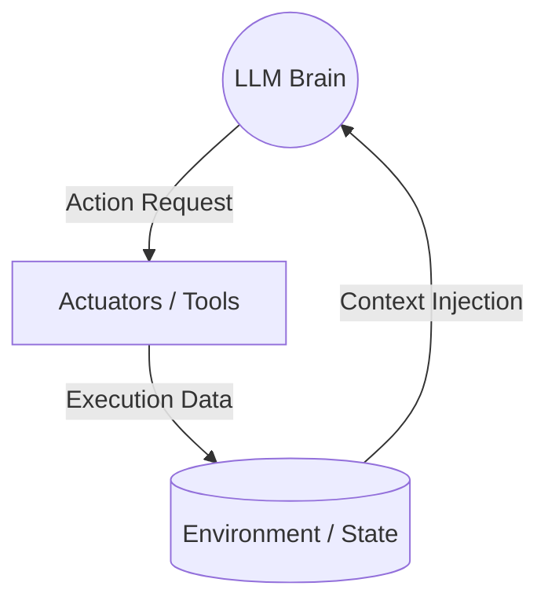
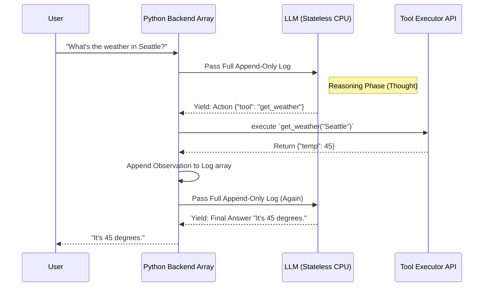

# 1. Mental Models and Core Concepts: The Engineering Paradigm Shift

Designing AI agents for an audience of traditional software engineers requires shifting the mental model from **deterministic** (if-this-then-that) to **probabilistic** (goal-oriented) systems. 

To a traditional developer, a program is a recipe. To an agent developer, a program is a **manager**. 

Before building complex technical architectures, we must establish definitive vocabulary rooted in published research (from Google DeepMind, Anthropic, and OpenAI) and map abstract AI terminology directly onto standard computing principles.

---

## 1.1 How to Understand and Learn (The Mental Shift)

### Deterministic (Traditional Software)
When you write an `if` statement or define a loop, you know exactly what path the execution thread will take. If an API returns an error, your explicit `try/catch` block handles it exactly as you programmed. The output of the software, given the exact same input state, is **100% predictable**.

### Probabilistic (Agentic Software)
When you build an Agent, the "core engine" executing logic is a Large Language Model (LLM). LLMs operate on probabilities of the next token. If an API returns an error, the LLM is capable of reading the error message, reasoning about why the input failed, and rewriting the input to try again without you ever writing an explicit retry loop.

## 1.2 What Exactly is an AI Agent?

Industry marketing uses "Agent" loosely, often applying it to simple chatbots. From an engineering perspective, an **Agent** is defined by three strict components operating in a loop:

1.  **The Brain (LLM):** A Large Language Model acts as the reasoning engine to process input and decide on actions.
2.  **The Environment (State & Memory):** The data the Agent can "see" (Context Windows) and "remember" (Vector Databases).
3.  **The Actuators (Tools):** The ability to affect the real world (e.g., executing a SQL query, hitting a Stripe API).

## 1.3 The Autonomy Spectrum: Workflow vs. Agent

*Reference: Anthropic AI, "Building Effective Agents" (2024)*

A traditional software engineer's most common failure mode is building an Agent when a Workflow was required. As emphasized by Anthropic's applied research, engineering teams must understand the spectrum of autonomy:

*   **Workflow (Routing & Chains):** A pre-defined code path where LLMs execute specific nodes. *The LLM does not control the flow; the Python script does.*
*   **Agent (Autonomous):** The system is given a goal. The LLM dictates the complete control and routing flow dynamically.

**The Golden Rule from Anthropic:** Advocate for "simplicity in design." If you can draw a flowchart that covers 98% of edge cases, build a predictable Workflow. If the path to the solution varies wildly depending on the data discovered at runtime, build an Agent.

## 1.4 Industry-Standard Design Patterns

Before writing complex architectures, you must understand the foundational design patterns used to construct probabilistic systems:

1.  **Tool Use (Function Calling):** The baseline ability to request external API data.
2.  **Evaluator-Optimizer (Reflection):** Iterative generation through a "Critic" loop.
3.  **Prompt Chaining / Planning:** Forcing a step-by-step checklist before execution.
4.  **Orchestrator-Workers (Multi-Agent):** A central supervisor delegating to specialized workers.

---

## 1.5 Deconstructing the "Magic": The Hardware Analogy

Do not think of a Large Language Model as an all-knowing monolithic brain. Think of it as a bare-metal computing component with strict physical limitations.

*   **The LLM = The CPU Core:** It is *stateless*. It has zero memory of previous instructions unless fed the entire dataset again.
*   **The Tokenizer = The Broken ALU:** LLMs compute sub-word vectors, not strings/integers. Do not treat them as calculators.
*   **The Context Window = RAM (Runtime Memory):** Everything the Agent is "thinking" about must fit here. Too large = OOM errors.
*   **Vector Databases (RAG) = The Hard Drive:** Long-term storage queried via similarity searches to inject specific facts back into RAM.

## 1.6 State Management: The Append-Only Log

A fundamental difference revolves around **variable mutation**. In standard code, you mutate `attempts += 1`.
In LLM architectures, the "Context Window" RAM is an **Immutable, Append-Only Log**. You cannot mutate past text; you can only append new text to the bottom of the array.

## 1.7 Unpacking the ReAct Loop (The "Hello World" of Agency)

*Reference: "ReAct: Synergizing Reasoning and Acting in Language Models" (Google Research, 2022)*

You will hear the term **ReAct** (Reason + Act). Underneath the hood, an autonomous agent is simply a `while(true)` loop running on your backend server processing ReAct strings.

## 1.8 The Fallacy of "Prompt Engineering"

Traditional developers treat "prompt engineering" as politely bargaining with the AI. For production agents, you build **Context Compilers**. Your backend dynamically retrieves DB records, formats them as XML, and injects them into the RAM array *before* hitting the LLM. 

> **Next Path:** Proceed to [Problem Selection and Architecture](02_Problem_Selection_and_Architecture.md).
