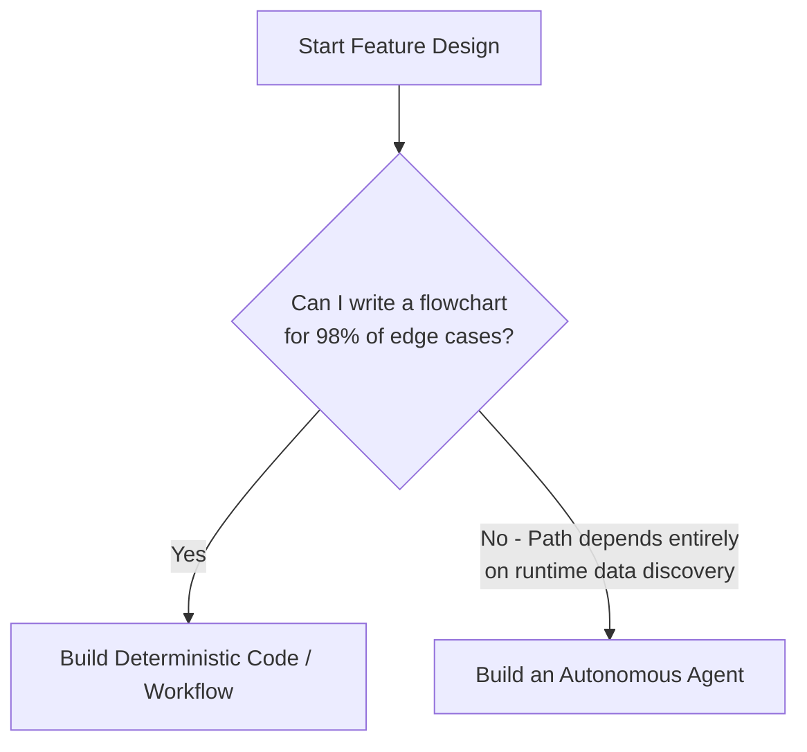
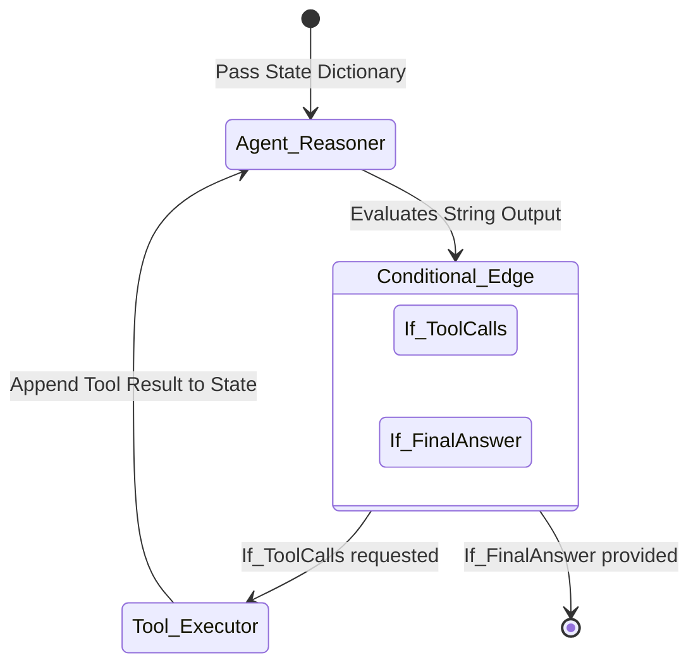

# 2. Problem Selection and Architecture

Taking an agent from a toy-script to a production system requires rigorous architectural decisions. We focus entirely on **Python** and **LangGraph** as the execution stack.

## 2.1 The Flowchart Test: Do you even need an Agent?

The biggest trap for a senior engineer is using an Agent to solve a deterministic problem. Agents are slow, expensive, and unpredictable.



## 2.2 Advanced Function Calling: The Parallel Paradigm

*Reference: OpenAI Function Calling Architecture*

When you initialize your LLM, you pass a JSON schema array defining your tools. The LLM does not execute code; it generates a payload requesting your backend to execute it.

```json
// LLM Response requesting Parallel Execution
"tool_calls": [
  {"id": "c1", "type": "function", "function": {"name": "get_weather", "arguments": "{\"city\": \"Seattle\"}"}},
  {"id": "c2", "type": "function", "function": {"name": "get_weather", "arguments": "{\"city\": \"SF\"}"}}
]
```
**Architecture Rule:** Your Python backend must execute these array items concurrently `asyncio.gather(*tool_tasks)` and return exactly 2 observations.

## 2.3 State Machines: Abstracting the Loop with LangGraph

You could write that interception loop yourself via endless `while` loops, but production architecture requires routing, retry bounds, and state persistence. **LangGraph** treats agents as **Directed Acyclic Graphs (DAGs)**.

### Architectural Diagram Mapping



1.  **Node: `Agent_Reasoner`:** The LLM receives the State (RAM). It outputs a Tool Call request.
2.  **Conditional Edge: `evaluate_output`:** Your code inspects the LLM's output. 
    *   *If* output has `tool_calls` -> Route to **Tool_Executor**.
    *   *If* output is plain text -> Route to **End**.
3.  **Node: `Tool_Executor`:** Dynamically invokes the requested tool API, appends the result to the array, and loops back.

### Handling Failure States Natively
If `Tool_Executor` throws an `HTTP 500` error, you aggressively capture the exception, append the literal Python traceback to the Message array, and route back to `Agent_Reasoner`. **The LLM is now aware the tool failed and will logically attempt a workaround.**

## 2.4 Shortcomings of the LangGraph DAG Paradigm
While LangGraph provides safety, it has severe limitations:
1.  **State Bloat:** Passing massive dictionaries between nodes exponentially increases memory footprint for long-running swarms.
2.  **Rigidity overhead:** Replacing a simple ReAct loop with 14 distinct Python Nodes/Edges adds massive boilerplate.
3.  **False Autonomy:** Hardcoding conditional edges (`if tool == refund: goto_refund`) is fundamentally a deterministic Workflow, *not* an Agent.

> **Next Path:** Proceed to [Evaluation and Observability](03_Evaluation_and_Observability.md).
