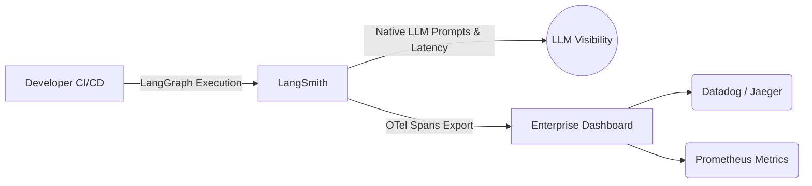

# 3. Evaluation and Observability: The End of `assertEquals`

In traditional CI/CD pipelines, you assert that given inputs $X$, the output is exactly $Y$. 
When transitioning to AI Agents, a strict string continuous-integration assertion will fail your build instantly due to probabilistic variance. You must transition your engineering team to **Evals (Evaluations)** and deep **Telemetry (OpenTelemetry / LangSmith)**.

## 3.1 LLM-as-a-Judge and the Semantic Eval

*Reference: "Judging LLM-as-a-Judge with MT-Bench and Chatbot Arena" (Zheng et al., 2023)*

To unit-test an Agent, you use a pristine, separate LLM to grade the output. Research demonstrates that frontier models (e.g. GPT-4o) correlate with professional human judgment $>80\%$ of the time when adequately prompted.

### Outcome vs. Process Reward Models

*Reference: "Let's Verify Step by Step" (OpenAI, 2023)*

OpenAI research proved that Outcome Reward Models (ORMs) are inadequate for Agents. An agent might reach the correct final answer via a totally hallucinated, dangerous reasoning path. **Process Reward Models (PRMs)** evaluate the `Thought` process itself.

```mermaid
graph TD
    A[Agent Execution Trace] -->|Contains| B(Input)
    A -->|Contains| C(Intermediate Thoughts & Tool Calls)
    A -->|Contains| D(Final Output String)
    
    C -->|Extract Internal Monologue| E{Judge LLM (PRM)}
    D -->|Extract Final Answer| F{Judge LLM (ORM)}
    
    E -->|Grades Logic Path| G[Process Score]
    F -->|Grades Result Match| H[Outcome Score]
    
    G --> I((CI/CD Pipeline Check))
    H --> I
```

**PRM Eval Target:** The Judge LLM evaluates the *logic* of the tool selection. If the Agent guessed an API parameter instead of dynamically querying the exact ID from the database, the PRM Eval fails the build, even if the guessed ID happened to yield the right answer.

## 3.2 Deep Observability: OTel and LangSmith

When a LangGraph State Machine fails, it does not crash—it confidently outputs a hallucination. You cannot debug a multidimensional vector matrix without explicit trace mapping.

### Technical Tracing Stack



### Manual Instrumentation with OpenTelemetry (OTel)
While LangSmith expertly covers the LLM side, traditional SWEs need a unified pane of glass. You must export traces to your existing infrastructure (Datadog, Jaeger) using **OpenTelemetry (OTel)** so AI operations correlate directly with standard database operations.

```python
from opentelemetry import trace
from langgraph.graph import StateGraph

tracer = trace.get_tracer("agent.orchestrator")

# LangGraph Node
def execute_database_tool(state: AgentState):
    # Create an explicit OTel span for observability
    with tracer.start_as_current_span(
        "ToolExecution.Database",
        attributes={"agent.recursion_depth": state["recursion_depth"]}
    ) as span:
        try:
            result = my_db.query(state["entity_id"])
            return {"messages": [result]}
            
        except Exception as e:
            # Emit error to Datadog/Jaeger alongside the LLM trace
            span.record_exception(e)
            span.set_status(trace.Status(trace.StatusCode.ERROR))
            
            # Allow the agent to self-heal
            return {"messages": [f"Error querying DB: {str(e)}"]}
```

### Shortcomings of Current Observability
*   **Data Masking Failure:** If your Agent is processing PII (e.g., medical records), LangSmith and OTel will automatically transmit that raw output trace to your dashboards. You must write aggressive middleware sanitizers to scrub `state["messages"]`.
*   **Log Bloat:** A single ReAct loop can generate 15 nested spans. Running thousands of parallel agents will overwhelm traditional Prometheus setups financially.

> **Next Path:** Proceed to [Maintenance and Productionization](04_Maintenance_and_Productionization.md).
