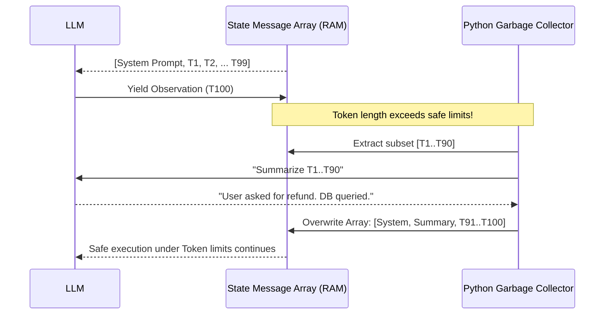
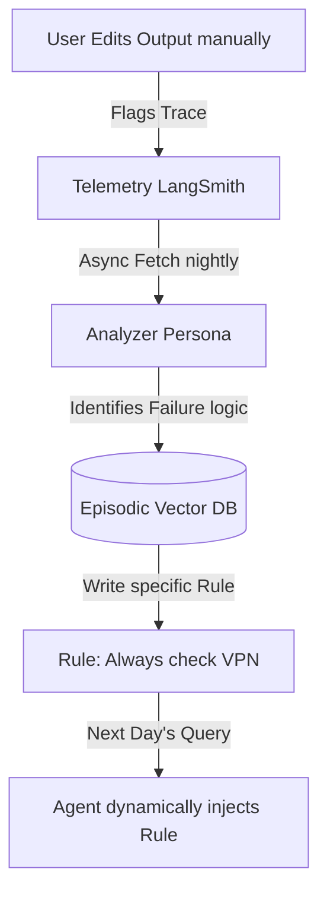

# 4. Maintenance and Productionization: Operations for Autonomous Systems

Operating traditional APIs involves managing CPU, RAM, and Disk I/O. Operating autonomous systems requires managing a new critical resource metric: **Tokens**. 

## 4.1 "Token Leaks" and the "Lost in the Middle" Phenomenon

*Reference: "Lost in the Middle: How Language Models Use Long Contexts" (Liu et al., 2023 - Stanford/UC Berkeley)*

The most common failure in production agents is a **Token Leak**. 
Remember that an LLM is a stateless CPU. To maintain a long-running task inside LangGraph, you must append every Tool Output to `state["messages"]` and resubmit the *entire array* to the LLM on the next cycle.

**The Catastrophe:** If an agent requests 1,000 rows from your database, the tool injects a massive JSON string into the array. 
*   **Latency explodes:** Generation time correlates massively with input token size. 
*   **The Stanford Bug:** Research demonstrates that if an LLM's context window exceeds 30,000 tokens, it literally "forgets" information buried in the middle of the prompt. 

### The Fix: LangGraph "Garbage Collection" Nodes
You must write deterministic middleware in Python that monitors the State array and acts as a Garbage Collector, executing *before* the reasoning LLM.



```python
from langchain_core.messages import SystemMessage

def garbage_collector_node(state: AgentState):
    messages = state["messages"]
    
    if len(messages) > 100:
        # Save the vital System Instruction (index 0)
        sys_message = messages[0]
        
        # Use a fast, cheap model to summarize the massive log
        summary_prompt = "Summarize the actions taken by the agent over the last 90 messages in one paragraph."
        summary_result = fast_llm.invoke(summary_prompt, messages[1:-10])
        
        # Rewrite the array: Keep system prompt, inject summary, keep 10 most recent
        new_state_array = [
            sys_message, 
            SystemMessage(content=f"PREVIOUS ACTIONS SUMMARY: {summary_result.content}"), 
            *messages[-10:]
        ]
        
        return {"messages": new_state_array}
        
    return {"messages": messages}
```

## 4.2 Handling Infinite Loops via Graph Constraints

Because the ReAct loop is literally a directional graph, a confused agent attempting to use a broken API will loop indefinitely until it runs out of money or hits a provider rate limit `HTTP 429`.

In LangGraph, you must strictly bound the DAG by enforcing an incremented counter inside your State dictionary: `recursion_depth: int`. 

**Shortcoming of LLM Constraints:** You cannot rely on an LLM to "decide" when to stop. If you prompt it with "Stop after 5 errors," it will hallucinate. The condition must be evaluated by static Python code in the edge: `if state["recursion_depth"] > max_hops: route_to("fail_safely_node")`.

## 4.3 The Active Feedback Loop (Continuous Deployment)

The most advanced agent teams do not sit around manually writing `System_Prompts` to fix bugs. They let the user and the system telemetry do it natively.



1.  **Implicit Negative Feedback:** A user asks the agent to generate an email. The agent does so. The user copies the text, heavily deletes the middle paragraph, and sends it.
2.  **Telemetry Capture:** Your LangSmith/OTel pipeline detects the heavy client-side edits. It flags the LangSmith Trace ID as "Failed Intent."
3.  **Dynamic Generation:** An internal asynchronous job reads the failed trace, compares the Agent output to the human edit, and asks an Evaluation LLM to write a generic "Rule".
4.  **The Fix:** This rule is stored. The system has self-healed based on telemetry.

> **Next Path:** Proceed to [Practical Implementation](05_Practical_Implementation.md).
