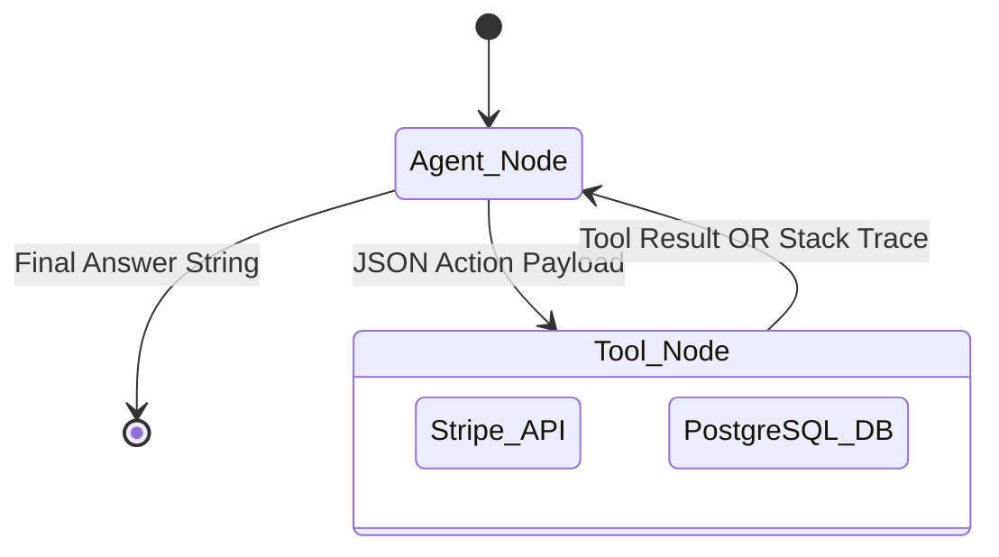
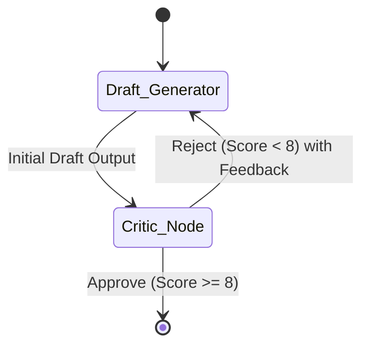
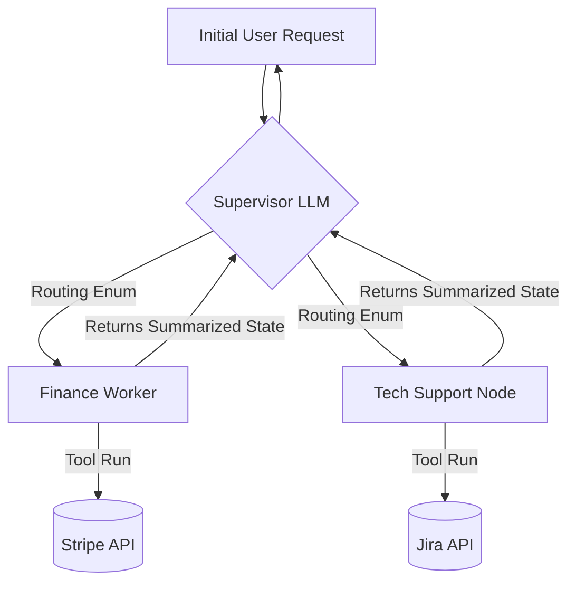
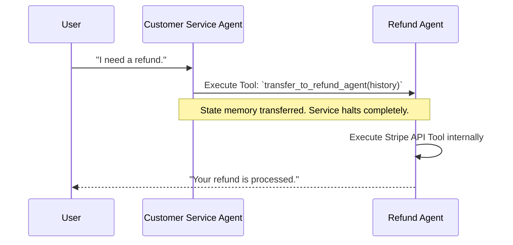

# 5. Practical Implementation: The Definitive Guide to Patterns

To move from theory to production architecture, you must implement the core Agentic Design Patterns using LangGraph and Python. Every pattern inherently sacrifices either Latency, Cost, or Reliability. **You must understand the explicit shortcomings of the architecture you choose.**

---

## 5.1 Pattern 1: Single-Agent Tool Loop (The Baseline)
A monolithic LLM Persona equipped with an array of tools. The LLM is responsible for reasoning, planning, and executing across the entire system.



*   **Best For:** Simple conversational chatbots with $<5$ CRUD capabilities.
*   **The Shortcoming:** **"Context Collapse."** If you give one LLM 15 distinct tools (e.g., Jira, Slack, Postgres, Gmail), it hallucinates tool names, confuses parameters, and suffers intense latency spikes.

---

## 5.2 Pattern 2: Evaluator-Optimizer (Reflection)
The Agent generates an output, but a *separate* Critic LLM evaluates the output against brand guidelines before returning it.



*   **Best For:** Coding generation, copywriting, and high-consequence compliance actions.
*   **The Shortcoming:** **100% Cost & Latency Overhead.** You are running 2 inferencing cycles minimum. Do not use this for simple routing tasks.

---

## 5.3 Pattern 3: Multi-Agent Systems (The Masterclass)
You separate concerns identically to how a software engineering team operates. Instead of one massive prompt, you build specialized "Personas" that talk to each other.

### 5.3.1 When MUST you use a Multi-Agent System?
You should upgrade from a Single-Agent to a Multi-Agent architecture when:
1.  **Too Many Tools:** The model’s performance violently degrades when it has $>10$ tools to choose from. Multi-Agent allows you to build a `Database_Agent` (3 DB tools) and a `Github_Agent` (3 Git tools) and let them pass state.
2.  **Prompt Contradiction:** When your System Prompt exceeds 4,000 text tokens of strict rules (e.g., "Always be polite. But if deleting a DB, be aggressive and demand 2FA. But if writing code, use concise snake_case.") The LLM will ignore rules. You must split these into isolated Personas.
3.  **Security Segmentation:** You do not want the agent reading public web search data to also have the API keys to drop your production database.

### 5.3.2 What MUST be taken care of? (The Pitfalls)
When engineering Multi-Agent communication, you must solve three distinct architectural threats:
1.  **The Ping-Pong Loop:** `Agent_A` gets confused and hands off to `Agent_B`. `Agent_B` doesn't know the answer and hands back to `Agent_A`. Infinite loop. You must enforce a `sender` trace in your State dictionary and write Python guards to prevent an agent from routing to its immediate predecessor without new data.
2.  **State Isolation:** Does `Agent_B` need to see the 8 `Thought` logs generated by `Agent_A`'s internal reasoning, or does it only need the final summarized string? *Pass the summarized string.* Do not dump raw state arrays between agents, or token costs will bankrupt the system.
3.  **The Supervisor Bottleneck:** If relying on a central "Router" LLM, that Router executes on *every single turn*. If it hallucinates the route, the whole swarm breaks.

### 5.3.3 The LangGraph Orchestrator-Worker Architecture



**The Code Example (Python & LangGraph):**
```python
from typing import TypedDict, Annotated, Sequence
from langchain_core.messages import BaseMessage
import operator

# 1. Define the Global State mapped across the entire swarm
class SwarmState(TypedDict):
    messages: Annotated[Sequence[BaseMessage], operator.add]
    next_worker: str # The explicit route
    active_agent: str # Traceability for the Ping-Pong guard
    
# 2. The Supervisor Node (Strict Routing)
def supervisor_node(state: SwarmState):
    # We force the LLM to output a strict structured PyDantic Enum
    route_decision = fast_routing_llm.with_structured_output(RouteSchema).invoke(
        "You are the Supervisor. Look at the conversation. "
        "Route to 'Finance_Agent', 'TechSupport_Agent', or 'End'."
    )
    return {"next_worker": route_decision.destination}

# 3. The Specialized Worker Node
def finance_worker_node(state: SwarmState):
    # Notice this prompt only exists in this Node. 
    # It has no idea Jira tools exist.
    system_prompt = "You are a restricted Finance bot. Answer billing queries using Stripe."
    
    # Execute the LLM strictly with finance tools
    result = finance_llm.invoke([system_prompt] + state["messages"], tools=[stripe_api])
    
    # We return the AI's result, and manually set the active trace
    return {
        "messages": [result], 
        "active_agent": "Finance", 
        "next_worker": "Supervisor" # Force return to the boss
    }

# 4. Building the deterministic routing DAG
from langgraph.graph import StateGraph, END

graph = StateGraph(SwarmState)
graph.add_node("Supervisor", supervisor_node)
graph.add_node("Finance_Agent", finance_worker_node)

# The Conditional Edge relies explicitly on the `next_worker` string the Supervisor wrote
graph.add_conditional_edges(
    "Supervisor",
    lambda state: state["next_worker"], 
    {"Finance_Agent": "Finance_Agent", "TechSupport_Agent": "TechSupport_Agent", "End": END}
)

# Workers blindly route back to the Supervisor when finished
graph.add_edge("Finance_Agent", "Supervisor")
```

---

## 5.4 Pattern 4: The OpenAI "Swarm" (Lightweight Handoffs)

*Reference: OpenAI "Swarm" conceptual framework (October 2024)*

The Orchestrator-Workers DAG above is very heavy—every action must route back through the Supervisor. OpenAI's recent research advocates removing the massive central "Supervisor" completely in favor of **lightweight routine handoffs**.

Instead of a master router, Agents are just functions, and they possess a specialized tool called `transfer_to_agent_b()`. 



*   **The Paradigm Shift:** The `Customer_Service_Agent` is talking to the user. The user asks for a refund. The `Customer_Service_Agent` executes a literal Python tool `call_refund_agent()`. State natively jumps to the new context.
*   **The Shortcoming:** **Traceability Chaos.** Because there is no central orchestrator forcing structured DAG transitions, tracking *what* agent currently holds the state is terrifying. You must rely on injecting OpenTelemetry (OTel) `tracer.start_as_current_span("Handoff: Service->Refund")` into every single transfer function. Without it, your cloud dashboard is a massive black box.

> **Next Path:** To transcend strict state machines entirely, you must build agents that actively learn and optimize their own logic paths using internal memories. Proceed to [Advanced Concepts](06_Advanced_Concepts.md).
