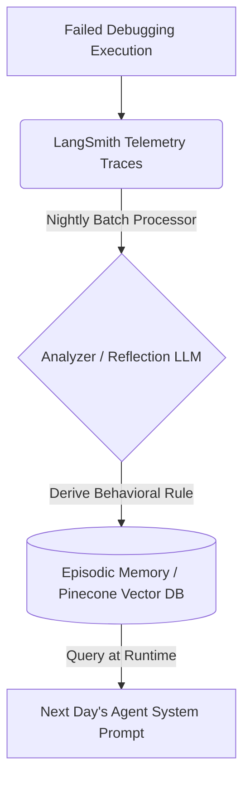
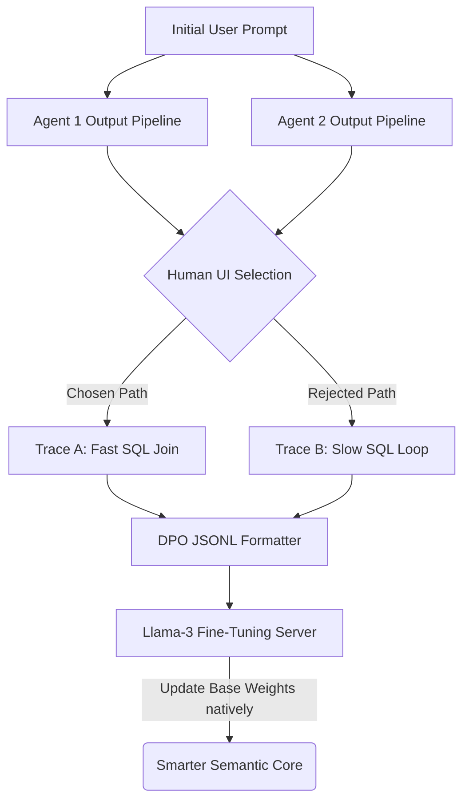

# 6. Advanced Concepts: The Path to Autonomous Optimization

Everything discussed in Modules 1-5 relies on a human software engineer observing traces (LangSmith), checking evaluations (PRM datasets), and manually adjusting Python `System_Prompt` strings or DAG edges to fix failures. 

The frontier attempts to eliminate the human manually modifying code from this optimization loop.

---

## 6.1 The DeepAgent Paradigm and Episodic Memory

*Reference: "Generative Agents: Interactive Simulacra of Human Behavior" (Stanford, 2023)*

If an LLM hallucinates an invalid parameter for an API today, it will hallucinate the exact same parameter next week. **DeepAgent** architectures resolve this by giving the agent long-term **Episodic Memory**.



### The Reflection Module Architecture
1.  **The Analyzer:** Overnight, a separate batch-processing LLM reads an execution trace from LangSmith.
2.  **The Optimization:** The Analyzer identifies the logic failure: *"The agent queried the staging DB before checking VPN status."*
3.  **The Memory Write-Back:** The Analyzer generates a "Golden Rule" and inserts a JSON payload into a Vector Database.

**Raw Episodic Write Payload:**
```json
{
  "task_type": "debugging_codebase",
  "discovered_rule": "CRITICAL: Always execute `verify_vpn()` BEFORE querying the database to prevent 502 Timeout failures.",
  "trace_id_reference": "abcd-8901x"
}
```

4.  **Self-Correction at Runtime:** Tomorrow, the backend queries the Vector DB *first*, retrieves the discovered rule, and dynamically concatenates it into the Agent's system prompt prior to generation.

---

## 6.2 Application-Tier RLHF (Direct Preference Optimization)

*Reference: "Direct Preference Optimization: Your Language Model is Secretly a Reward Model" (Stanford, 2023)*

Advanced systems implement RLHF optimization *at the application tier* to make custom models infinitely smarter without massive compute costs, utilizing **DPO**.



### The Contrastive Learning Loop
1.  **Parallel Execution:** An orchestrator agent spins up **2 identical agents** in parallel to generate the exact same report.
2.  **Human UI Phase:** The end-user is presented with Output A and Output B. They click Output B.
3.  **DPO Assembly:** Your backend automatically gathers the unedited reasoning traces of Agent A (Rejected) and Agent B (Accepted) into JSONL.

**Raw DPO Training Payload:**
```json
{
  "prompt": "Write a query fetching Q3 Active Users.",
  "chosen": "Thought: I need joined tables for performance. Action: use_inner_join...",
  "rejected": "Thought: I will query all tables independently and map them. Action: use_select_all..."
}
```

4.  **The Pipeline:** This payload is piped asynchronously to an API. The deep foundational weights of the model are adjusted to mathematically favor the internal reasoning structure present in the `chosen` trace.

### The Engineering Reality
Running active continuous DPO or massive Hierarchical Swarms is financially catastrophic for most startups today due to compounding API costs. However, as inference cost drops exponentially toward zero, dynamic Architect-led Swarms driven by episodic memory caches will inevitably replace static Multi-Agent DAG routing. 

---

### Conclusion
By treating Agents not as "magic boxes," but as deterministic Python programs constraining probabilistic hardware CPUs—bound by extensive State DAGs, JSON schema rigor, and OpenTelemetry—a traditional developer transforms into an AI Systems Architect. Focus your time not on prompt-engineering, but on the determinisitic "plumbing": **The Traces, the DAG Edges, and the Data Compilers.**
