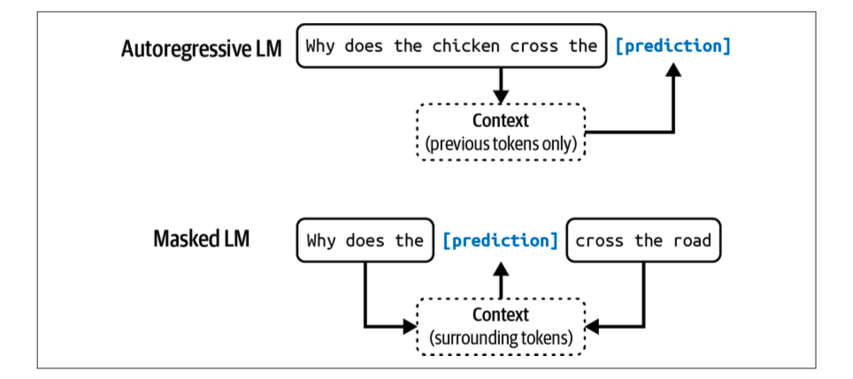

## Language Models

A language model is a statistical model that is trained on a large corpus of text data in one or more languages. It learns the patterns and structures of the language, allowing it to generate text that is coherent and contextually relevant.

Basic unit of langyage model is a token. A token can be character, a word or a part of word, depending on the model. For example, in the case of GPT-4 it breaks the phrase "I can't wait to build AI applications" into nine tokens.

The process of breaking the original text into tokens is called tokenization. For GPT-4, an average token is approximately 3/4 lenght of a word, so 1000 tokens is approximately 750 words.

The set of all tokens that a language model can understand is called its vocabulary. The vocabulary size can vary depending on the model, but it typically ranges from tens of thousands to hundreds of thousands of tokens. For GPT-4, the vocabulary size is around 100,256 tokens.

There are two main types of language models: **masked language models** (MLMs) and **autoregressive language models** (ARLMs).

- Masked language models (MLMs) are trained to predict missing tokens anywhere in a sequence, using the context from both before and after the missing token. This allows them to learn bidirectional context, making them effective for tasks like text classification and named entity recognition. Examples of MLMs include BERT and RoBERTa. Commonly used for non-generative tasks such as text classification, sentiment analysis, and named entity recognition.

- Autoregressive language models (ARLMs) are trained to predict the next token in a sequence, using only the context from the tokens that come before it. This makes them suitable for tasks like text generation and completion. Examples of ARLMs include GPT-3 and GPT-4. Commonly used for generative tasks such as text generation, summarization, and translation.

A model that can generate open-ended outputs is called generative, hence the name generative AI. All these completions are predictions based on probabilites and not guranted to be correct. The model does not have an understanding of the world, it just predicts the next token based on the patterns it has learned from the training data.

Language model is one of the many ML algorithms.

**Language Model is self-supervised**. It is trained on a large corpus of text data without any human annotations. Self-supervised learning means that language models can learn from test sequences without requiring any labeling.

### Important points

- A model that can work with more than one data modality is also called a multimodal model. For example, GPT-4 can work with both text and images. A multimodal generates the next token conditioned on both text and image tokens.

- Prompt engineering, RAG (Retrieval Augmented Generation) and fine tuning are three very common AI engineering techniques that you can use to adapt a model to your needs.

- AI engineering refers to the process of building applications on top of foundation models. Traditional ML engineering involved developing ML models, AI engineering leverage existing one.

## Foundation Models
