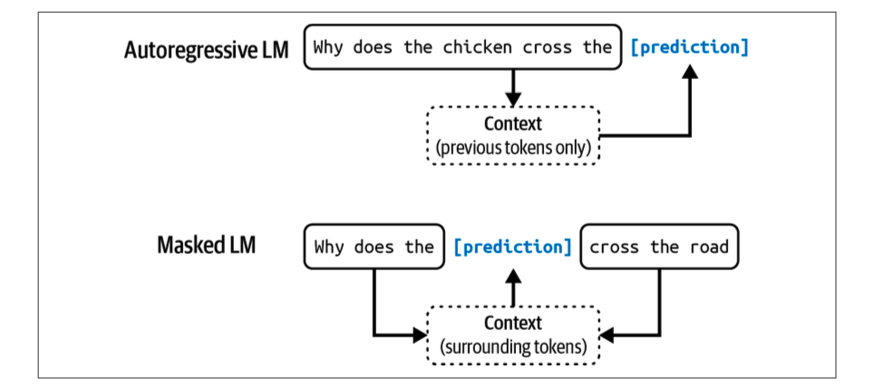
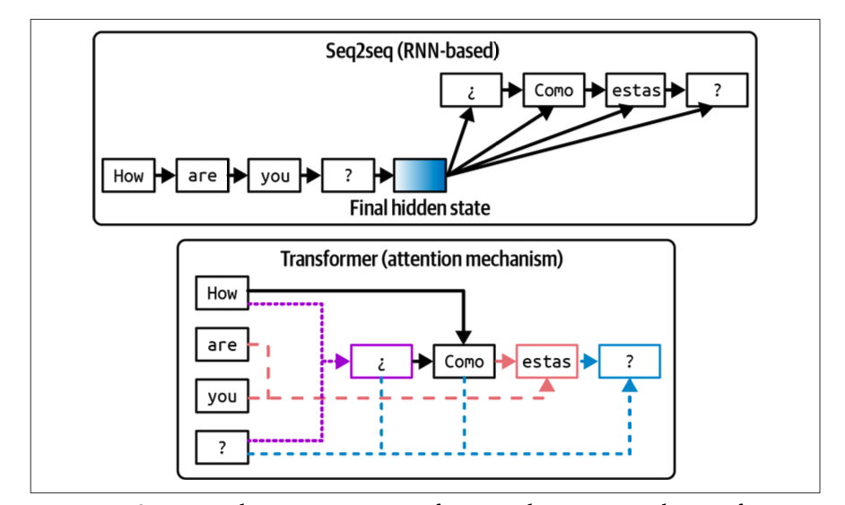
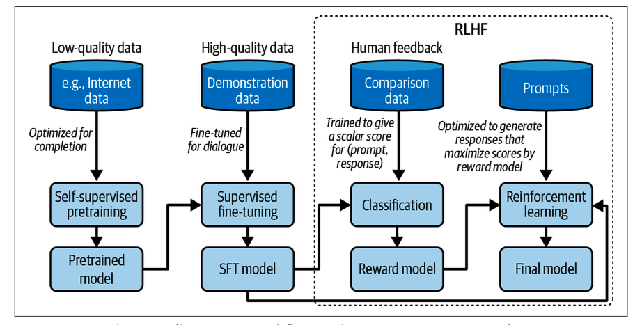

# Overview

Under this we are trying to capture the summary of book "AI Engineering- Building Applications with Foundation Models."

## Language Models

A language model is a statistical model that is trained on a large corpus of text data in one or more languages. It learns the patterns and structures of the language, allowing it to generate text that is coherent and contextually relevant.

Basic unit of langyage model is a token. A token can be character, a word or a part of word, depending on the model. For example, in the case of GPT-4 it breaks the phrase "I can't wait to build AI applications" into nine tokens.

The process of breaking the original text into tokens is called tokenization. For GPT-4, an average token is approximately 3/4 lenght of a word, so 1000 tokens is approximately 750 words.

The set of all tokens that a language model can understand is called its vocabulary. The vocabulary size can vary depending on the model, but it typically ranges from tens of thousands to hundreds of thousands of tokens. For GPT-4, the vocabulary size is around 100,256 tokens.

There are two main types of language models: **masked language models** (MLMs) and **autoregressive language models** (ARLMs).

- Masked language models (MLMs) are trained to predict missing tokens anywhere in a sequence, using the context from both before and after the missing token. This allows them to learn bidirectional context, making them effective for tasks like text classification and named entity recognition. Examples of MLMs include BERT and RoBERTa. Commonly used for non-generative tasks such as text classification, sentiment analysis, and named entity recognition.

- Autoregressive language models (ARLMs) are trained to predict the next token in a sequence, using only the context from the tokens that come before it. This makes them suitable for tasks like text generation and completion. Examples of ARLMs include GPT-3 and GPT-4. Commonly used for generative tasks such as text generation, summarization, and translation.

A model that can generate open-ended outputs is called generative, hence the name generative AI. All these completions are predictions based on probabilites and not guranted to be correct. The model does not have an understanding of the world, it just predicts the next token based on the patterns it has learned from the training data.

Language model is one of the many ML algorithms.

**Language Model is self-supervised**. It is trained on a large corpus of text data without any human annotations. Self-supervised learning means that language models can learn from test sequences without requiring any labeling.

### Important points

- A model that can work with more than one data modality is also called a multimodal model. For example, GPT-4 can work with both text and images. A multimodal generates the next token conditioned on both text and image tokens.

- Prompt engineering, RAG (Retrieval Augmented Generation) and fine tuning are three very common AI engineering techniques that you can use to adapt a model to your needs.

- AI engineering refers to the process of building applications on top of foundation models. Traditional ML engineering involved developing ML models, AI engineering leverage existing one.

## Foundation Models

Sampling is how a model chooses an output from all possible options, chooseing right sampling strategy can also significantly boost
a model's performane with relatively little effort.

An AI model is only as good as the data it was trained on. If you want a model to improve on a certain task, you might want to include more data for that task in the training data. While language and domain specific foundation models can be trained from scratch, it's also common to finetune them on top of general-purpose methods.

Given the dominance of English in the internet data, it's nos surprising that general purpose model work much better with English
than other languages.

Under-rrepresentation is a big reason for this underperformance. However under-representation is not the only reason. A language's
structure and culture it embodies cam also make a language harder for a model to learn. Other than quality issues, models can also be slower and more expensive for non English languages. **A model's inference latency and cost is proportaional to the number of token in the input and response. It turn out that tokenization can be much more efficient for some languages than others.**

Even though general-purpose foundation models can answer everyday questions about different domains, they are unlikely to perform well on domain-specific tasks.

### Modeling

Before training a model, developers need to decide that the model should look like. What architecture should it follow? How many parameters should it have?.

#### **Model Architecure**: The most domninant architecture for language-based foundation models is the transformer architecure, which is based on the attention mechanism.**

Transformer architecture as popularized on the heels of the success of seq2seq(sequence-to-sequence) architecture. At the high level,
seq2seq contains an encode that processes inputs and a decoder that generates outputs. Both inputs and outputs are the sequence of tokens, uses RNNs (recurrent neural networks) as its encoder and decoder. The encoder processes the input tokens sequentially, outputting the final hidden state that represents the input. The decoder then generates output tokens sequentiall, conditioned on both the final hidden state of the input and the previously generated token.

There are two problems with seq2seq:

1. First the vanilla seq2seq decoder generates output tokens using only the final hidden state of input. Intuitively, this is like generating answers about a book using the book summary. This limits the quality of the genrated outputs.

2. Second, the RNN encoder and decoder mean that both input processing and output generation are done sequentially, making it slow for long sequences.

The transformer architecture addresses both problems with the attention mechanism. The attention mechanism allows the model to weigh the importance of different input tokens when generating each output token. The transformer architecture dispenses with RNNs entirely. With transformers, the input token can be processed in parallel, significanly speeding up input processing. While the transformer removed the sequential input bottleneck, transformer-based autoregressive language models still have the sequential output bottleneck. Consists two steps:

- **Prefil**: Model processes the input token in parallel. This step creates the intermediate state ncesessary to generate the first output token. The intermediate state includes the key and value vectors for all input tokens.
- **Decode**: The model generates one output token at a time.

**Attention mechanism:** Under the hood, the attention mechanism leverages key, value and query vectors:

- The query vector (Q) represents the current state of the decoder at each decoding step.
- Each key vector (K) represents a previous token. If each previous token is a page in the book, each key vector is like the page number.
- Each value vector (V) represents the actual value of a previous token, as learned by the model.

The attention mechanism computes how much attention to give an input token by performing a dot product between the query vector and its key vector.

- **Model Size**: Much of AI progress in recent years can be attibuted to increased model size. In general, increasing a model's parameters increasing its capacity to learn, resulting in better models. The number of parameters can be mis-leading if the model is sparse. A sparse model has a large percentage of zero-value parameters. Sparsing allows for more efficient data storage and computation. This means that a large sparse model 
can require less compute than a small dense model.

A larger model can also underperform a small model if it's not trained on enough data. When discussin model size,
its important to consider the size of the data it was trained on. For most models, datasets sizes are measured by the number of training samples. In summary, three numbers signal a models'scale:

1. Number of parameters, which is a proxy got the model's learning capacity.
2. Number of tokens a model was trained on, which is a proxy for how much a model learned.
3. Number of FLOPs (Floating Point Operation), which is a proxy for the training cost.

- **Post Training**: Let's say you have pre-trained a foundation model using self-supervision. Pre-trained model typically has two issues. First, self-supervision optmimizes the model for text completion, not conversations.
Second, if the model is pre trained on data indiscriminately scrapped from the internet, its output can be recist,
sexist, rude or just wrong. Post training hanldes these issues 

1. **Supervised Finetuning(SFT)**: Finetune the pre-trained model on high-quality instruction data to optimize models for conversations instead of completion.
2. **Preference finetuning**: Further finetune the model to output responses that align with human preferences.
Preference finetuning is typically done with reinforcement learning.

]

As you see in diagram

1. Self-supervised pre-training result in a rogue model that be considered an untamed monster because it uses
indiscriminate data from the internet.
2. This monster is then supervised finetuned on higher-quality data which makes it more socially acceptable.
3. This finetuned model is further polished using preference finetuning to make it customer-appropriate.

## Sampling

A mdoel constructs its outputs through a process known as sampling. Sampling makes AI outputs probablistics.
Understand this probablistic nature is important for handing AI's behaviors, such as incosistency and hallucination.

### Sampling Fundamentals

Given an input, a neural network produces an output by first computing the probablities of possible outcomes. For a classification model, possible outcomes are the available classes. For a language model, to generate the next token, the model first compute the probalistic distribution over all tokens in the vocabulary. When working with possible outcomes of different probabilities, a common strategy is to pick the outcome with the highest probability. Always picking the most likely outcome = is called greedy sampling. This often works for classification tasks. However, for a language model, greedy sampling creates boring outputs. Imagine a model that, for whatever question you ask, always responds with the most common words.

