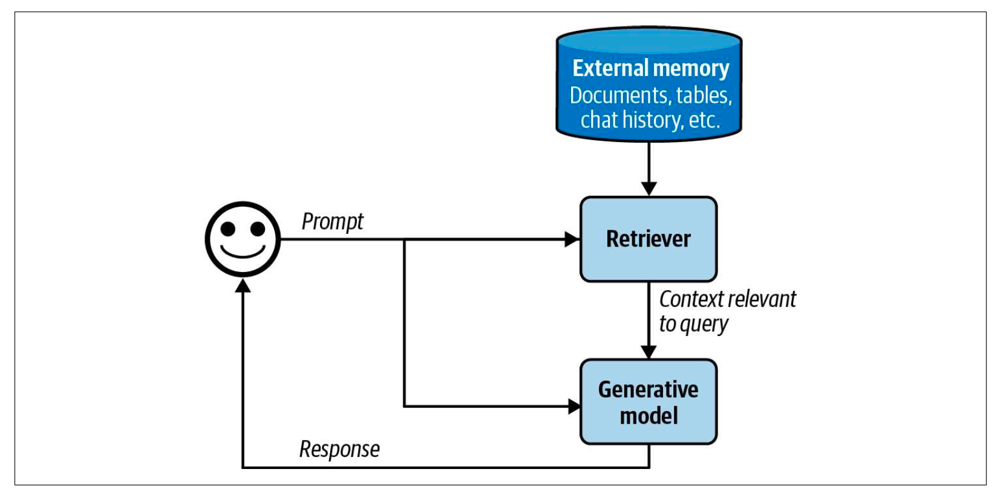

# Overview

## Neural Networks

The first thing to note is that neuralt networks can only take numbers as inputs and can only output numbers. No Exceptions. So, any data that is not in numerical format must be converted to numbers before it can be fed into a neural network. This includes text, images, audio, and video.

### Neurons/nodes: The numbers in the circles

### Weights: The colored numbers on the lines

### Layers: A collection of neurons is called a layer. You could think of this network as having 3 layers: Input layer with 4 neurons, Middle layer with 3 neurons, and the Output layer with 2 neurons

This network has no notion of what a leaf or a flower is, or what (RGB, Vol) are. It has a job of taking in exactly 4 numbers and giving out exactly 2 numbers. The numbers that go into the network are called inputs, and the numbers that come out of the network are called outputs. It's our interpretation of these numbers that gives them meaning that the 4 input numbers are (RGB,Vol) and it also our decision to look at the ouput numbers and infer that if the first number is larger it's a leaf and so on, its also up to us to choose the right weights such that the model will take our input numbers and give us the right output numbers.

The network just gives you two numbers, whether you interpret it as classification or regression is up to you. If you want to use it for classification, you can interpret the output numbers as probabilities of each class. If you want to use it for regression, you can interpret the output numbers as continuous values.

//ToDo ...read and understand about Activation layer, Bias, Softmax, Dropout, Batch Normalization, Gradient Clipping, Weight Initialization, Regularization, and Optimizer etc.

Similar mechanism used by models to generate language, images, audio and video.

So now we can predict one character ahead by providing the network a list of characters. We can use this to generate text by providing a starting character and then repeatedly predicting the next character and appending it to the input sequence.

### Context Length

Context that is provided to the network to make future predictions. The more context you provide, the better the predictions will be. But there is a limit to how much context you can provide. This limit is called the context length. For example, if the context length is 5, then you can only provide the last 5 characters to the network to make a prediction. Modern networks can have very large context lengths (several thoudand words).

### Embeddings

When we trained the models above, the way we did it was by moving around weights and seeing that gives us a smaller loss in the end. And then slowly and recursively changing the weights. At each turn we would calculate the loss and see if it is smaller than before. If it is, we keep the new weights, otherwise we discard them and try again. This is called gradient descent. In this process, the inputs are fixed; the numbers we are putting in now for a,b,c.etc..are arbitrarily picked by us. What if at every iteration in addition to moving the weights around by a bit we also moved the input around and see if we get a smaller loss. This is called learning embeddings. The inputs are no longer fixed, they are also learned. The inputs are now called embeddings.

We talked about embeddings that are just one number per character. But in practice, embeddings are usually multi-dimensional. For example, instead of representing each character with a single number, we can represent it with a vector of 8 numbers. This is called an 8-dimensional embedding. The idea is that each dimension can capture some aspect of the character. For example, one dimension can capture the character's position in the alphabet, another dimension can capture the character's frequency of occurrence in the text, and so on.

Let's call an ordered collection of same-sized vectors a matrix. This matrix is called an embedding matrix. Each row in the matrix corresponds to a character, and the columns correspond to the dimensions of the embedding. So, if we have 26 characters and we want to use 8-dimensional embeddings, our embedding matrix will be of size 26x8.

When we train the model, we will learn both the weights of the network and the values in the embedding matrix. The embedding matrix will be learned such that similar characters will have similar embeddings. For example, the embeddings for 'a' and 'b' will be closer to each other than the embeddings for 'a' and 'z'.

### Subword Tokenizers

What if we directly assigned embeddings to words and made the network predict the next word. The network doesn't understand anything more than numbers anyway, so we can assign a 10-length vector to each word in the vocabulary. The problem with this approach is that the vocabulary size can be very large. For example, if we have a vocabulary of 100,000 words and we want to use 10-dimensional embeddings, our embedding matrix will be of size 100,000x10. This can be very large and can lead to overfitting. Token is the term for a single unit that we embed and then feed to the model. A token can be a character, a word, or a subword.

A Toeknizer is a tool that converts text into tokens and gives you the corresponding numbers that you need to look up the embedding vector for that token in the embedded matrix. There are many different types of tokenizers.

### Self Attention

ToDo

### Softmax

ToDo

### Residual Connections

### Layer Normalization

### Dropout

### Multi head Attention

### Positional encoding and embeddings

## The GPT architecture

Read this <https://medium.com/data-science/understanding-llms-from-scratch-using-middle-school-math-e602d27ec876>

Under this we are trying to capture the summary of book "AI Engineering- Building Applications with Foundation Models."

## Language Models

A language model is a statistical model that is trained on a large corpus of text data in one or more languages. It learns the patterns and structures of the language, allowing it to generate text that is coherent and contextually relevant.

Basic unit of langyage model is a token. A token can be character, a word or a part of word, depending on the model. For example, in the case of GPT-4 it breaks the phrase "I can't wait to build AI applications" into nine tokens.

The process of breaking the original text into tokens is called tokenization. For GPT-4, an average token is approximately 3/4 lenght of a word, so 1000 tokens is approximately 750 words.

The set of all tokens that a language model can understand is called its vocabulary. The vocabulary size can vary depending on the model, but it typically ranges from tens of thousands to hundreds of thousands of tokens. For GPT-4, the vocabulary size is around 100,256 tokens.

There are two main types of language models: **masked language models** (MLMs) and **autoregressive language models** (ARLMs).

- Masked language models (MLMs) are trained to predict missing tokens anywhere in a sequence, using the context from both before and after the missing token. This allows them to learn bidirectional context, making them effective for tasks like text classification and named entity recognition. Examples of MLMs include BERT and RoBERTa. Commonly used for non-generative tasks such as text classification, sentiment analysis, and named entity recognition.

- Autoregressive language models (ARLMs) are trained to predict the next token in a sequence, using only the context from the tokens that come before it. This makes them suitable for tasks like text generation and completion. Examples of ARLMs include GPT-3 and GPT-4. Commonly used for generative tasks such as text generation, summarization, and translation.

A model that can generate open-ended outputs is called generative, hence the name generative AI. All these completions are predictions based on probabilites and not guranted to be correct. The model does not have an understanding of the world, it just predicts the next token based on the patterns it has learned from the training data.

Language model is one of the many ML algorithms.

**Language Model is self-supervised**. It is trained on a large corpus of text data without any human annotations. Self-supervised learning means that language models can learn from test sequences without requiring any labeling.

### Important points

- A model that can work with more than one data modality is also called a multimodal model. For example, GPT-4 can work with both text and images. A multimodal generates the next token conditioned on both text and image tokens.

- Prompt engineering, RAG (Retrieval Augmented Generation) and fine tuning are three very common AI engineering techniques that you can use to adapt a model to your needs.

- AI engineering refers to the process of building applications on top of foundation models. Traditional ML engineering involved developing ML models, AI engineering leverage existing one.

## Foundation Models

Sampling is how a model chooses an output from all possible options, chooseing right sampling strategy can also significantly boost
a model's performane with relatively little effort.

An AI model is only as good as the data it was trained on. If you want a model to improve on a certain task, you might want to include more data for that task in the training data. While language and domain specific foundation models can be trained from scratch, it's also common to finetune them on top of general-purpose methods.

Given the dominance of English in the internet data, it's nos surprising that general purpose model work much better with English
than other languages.

Under-rrepresentation is a big reason for this underperformance. However under-representation is not the only reason. A language's
structure and culture it embodies cam also make a language harder for a model to learn. Other than quality issues, models can also be slower and more expensive for non English languages. **A model's inference latency and cost is proportaional to the number of token in the input and response. It turn out that tokenization can be much more efficient for some languages than others.**

Even though general-purpose foundation models can answer everyday questions about different domains, they are unlikely to perform well on domain-specific tasks.

### Modeling

Before training a model, developers need to decide that the model should look like. What architecture should it follow? How many parameters should it have?.

#### **Model Architecure**: The most domninant architecture for language-based foundation models is the transformer architecure, which is based on the attention mechanism.\*\*

Transformer architecture as popularized on the heels of the success of seq2seq(sequence-to-sequence) architecture. At the high level,
seq2seq contains an encode that processes inputs and a decoder that generates outputs. Both inputs and outputs are the sequence of tokens, uses RNNs (recurrent neural networks) as its encoder and decoder. The encoder processes the input tokens sequentially, outputting the final hidden state that represents the input. The decoder then generates output tokens sequentiall, conditioned on both the final hidden state of the input and the previously generated token.

There are two problems with seq2seq:

1. First the vanilla seq2seq decoder generates output tokens using only the final hidden state of input. Intuitively, this is like generating answers about a book using the book summary. This limits the quality of the genrated outputs.

2. Second, the RNN encoder and decoder mean that both input processing and output generation are done sequentially, making it slow for long sequences.

The transformer architecture addresses both problems with the attention mechanism. The attention mechanism allows the model to weigh the importance of different input tokens when generating each output token. The transformer architecture dispenses with RNNs entirely. With transformers, the input token can be processed in parallel, significanly speeding up input processing. While the transformer removed the sequential input bottleneck, transformer-based autoregressive language models still have the sequential output bottleneck. Consists two steps:

- **Prefil**: Model processes the input token in parallel. This step creates the intermediate state ncesessary to generate the first output token. The intermediate state includes the key and value vectors for all input tokens.
- **Decode**: The model generates one output token at a time.

**Attention mechanism:** Under the hood, the attention mechanism leverages key, value and query vectors:

- The query vector (Q) represents the current state of the decoder at each decoding step.
- Each key vector (K) represents a previous token. If each previous token is a page in the book, each key vector is like the page number.
- Each value vector (V) represents the actual value of a previous token, as learned by the model.

The attention mechanism computes how much attention to give an input token by performing a dot product between the query vector and its key vector.

- **Model Size**: Much of AI progress in recent years can be attibuted to increased model size. In general, increasing a model's parameters increasing its capacity to learn, resulting in better models. The number of parameters can be mis-leading if the model is sparse. A sparse model has a large percentage of zero-value parameters. Sparsing allows for more efficient data storage and computation. This means that a large sparse model
  can require less compute than a small dense model.

A larger model can also underperform a small model if it's not trained on enough data. When discussin model size,
its important to consider the size of the data it was trained on. For most models, datasets sizes are measured by the number of training samples. In summary, three numbers signal a models'scale:

1. Number of parameters, which is a proxy got the model's learning capacity.
2. Number of tokens a model was trained on, which is a proxy for how much a model learned.
3. Number of FLOPs (Floating Point Operation), which is a proxy for the training cost.

- **Post Training**: Let's say you have pre-trained a foundation model using self-supervision. Pre-trained model typically has two issues. First, self-supervision optmimizes the model for text completion, not conversations.
  Second, if the model is pre trained on data indiscriminately scrapped from the internet, its output can be recist,
  sexist, rude or just wrong. Post training hanldes these issues

1. **Supervised Finetuning(SFT)**: Finetune the pre-trained model on high-quality instruction data to optimize models for conversations instead of completion.
2. **Preference finetuning**: Further finetune the model to output responses that align with human preferences.
   Preference finetuning is typically done with reinforcement learning.

]

As you see in diagram

1. Self-supervised pre-training result in a rogue model that be considered an untamed monster because it uses
   indiscriminate data from the internet.
2. This monster is then supervised finetuned on higher-quality data which makes it more socially acceptable.
3. This finetuned model is further polished using preference finetuning to make it customer-appropriate.

## Sampling

A mdoel constructs its outputs through a process known as sampling. Sampling makes AI outputs probablistics.
Understand this probablistic nature is important for handing AI's behaviors, such as incosistency and hallucination.

### Sampling Fundamentals

Given an input, a neural network produces an output by first computing the probablities of possible outcomes. For a classification model, possible outcomes are the available classes. For a language model, to generate the next token, the model first compute the probalistic distribution over all tokens in the vocabulary. When working with possible outcomes of different probabilities, a common strategy is to pick the outcome with the highest probability. Always picking the most likely outcome = is called greedy sampling. This often works for classification tasks. However, for a language model, greedy sampling creates boring outputs. Imagine a model that, for whatever question you ask, always responds with the most common words.

Instead of always picking the next most likely token, the model can sample the next token according to the probability distribution over all possible values.

## Test Time Compute

One simple way to improve a model’s response quality is test time compute: instead of generating only one response per query, you generate multiple responses to increasethe chance of good responses.

- Probabilistic nature can cause inconsistency and hallucinations. Inconsistency is when a model generates very different responses for the same or slightly different prompts.

- Hallucination is when a model gives a response that isn’t grounded in facts.

## Prompt Engineering

Process of crafting an instruction that get a model to generate the desired outcome. Unlike finetuning, prompt engineering guides model behavior without changing the model's weights. A prompt generally consists of one or mmore of the following parts:

- **Task Description**: What you want the model to do, including the role you want the model to play and the output format.

- **Example(s) of how to do this task**: For example, if you want the model to detect toxicity in text, you might provide a few examples of what toxicity and nontoxicity look like.

- **The Task**: The concreate task you want the model to do, such as the question to answer or the book to summarize.

You can measure a model's robustness by randomly peturbing the prompts to see how the output changes. Teaching models what to do via prompts is also known as in-context learning. In-context learning allows a model to incorporate new information continually to make decisions, preventing it from becoming outdated. Each example provided in the prompt is called a shot. Teaching a model to learn from examples in the prompt is also called **few-shot learning**.

### System Prompt & User Prompt

Its a kind of task description. Typically, the instructions provided by application developers are put into the system prompt, while the instructions provided by the users are put into the user prompt.

Given a system prompt and a user prompt, the model combines them into a single prompt typically following a template.

Not all parts of prompts a are equal, research has shown that a model is much better at understanding instructions given at the begining and the end of a prompt than in the middle.

### Prompt Engineering Best Practices

- Explain, without ambiguity, what you want the model to do.
- Ask the model to adopt a persona.
- Provide examples
- Specify the output format. If you want model to be concise, tell it so. Long outputs are not only constoly but also increase latency.
- Provide sufficient context. Conetext also helps in mitigate hallucinations.
- For complex tasks that require multiple steps, break those tasks into subtasks. Instead of having one giant prompt for the whole task, each subtask has its own prompt. These subtasks are then chained together.
- As you experiment with different prompts, make sure to test changes systemattically and version your prompts.

### Prompt Stuffing

When question/input provided along with the context to LLM and ask it to respond. Mechanism of putting prompt along with context called prompt stuffing.

### Chain of Thought (CoT)

Explicitly asking model to think step by step, nudging it towards a more systematic approach to problem solving. It also reduces model hallucinations.

### Defensive Prompt Engineering

There are three main types of attacks:

1. Prompt Extraction - Extracting the application's prompt, including the system prompt, either to replicate or exploit the application

2. Jailbreaking and prompt injection- Getting the model to bad things

3. Information Extraction - Getting the model to reveal its training data or information used in its context.

4. Remote code or tool execution

5. Data leaks

6. Social Harma

7. Misinformation

8. Service interruption: Giving access to user who shouldn't have access, giving high scores to bad submissions, or rejecting a load application that should have been approved. A malicious instruction that asked the model to refuse to answer all the questions can cause service interruption.

9. Brand Risk

## RAG && RAG Agents

RAG pattern allows the model to retrieve relevant information from external data sources. The Agentic pattern allows the model to use tools such as web search and new APIs to gather information.

While the RAG pattern is chiefly used for constructing context, the agentic pattern can do much more than that.External tools can help models addresses their shortcoming and expand their capabilities.

RAG is a technique that enhances a model's generation by retrieving tha relevant information from external memory sources (datanase, previous chat sessions or internet). You can think of RAG as technique to construct context specific to each query, instead of using the same context for all queries.

A RAG system has two components: a retriever that retrieves information from external memory sources and a generator that generates a response based on the retrieved information.

]

The success of a RAG system depends on the quality of retriever. A retiever has two main functions: indexing and querying. Indexing involves processing data so that it can be quickly retireved later. Sending a query to retireve data relevant to it is called querying. Retrieval is typically limited to one database or system, whereas search involves retrieval across various systems.

A agent is anything that can perceive its environment and act upon that environment. This means that an agent is characterized by the environment it operates and the set of actions (augmented bt the tools) it can perform. An AI Agent is meant to accomplish tasks typically provided by the users in the inputs. In an AI agent, AI is the brain that processes the information it receives including the ask and feedback from the environment, plans a sequnce of action to achieve this task, and determined whether the task has been accomplished.

Compare to non-agent use cases, agents typically require more powerful models for two reasons:

- **Compound mistakes**: An agent often need to perform multiple steps to accomplish a task, and the overall accuracy decreases as the number of steps increases. If the model's accuracy is 95% per step, over 10 steps, the accuracy will drop to 60%, and over 100 steps, the accuracy will be only 0.6%

- **Higher Stakes**: with access to tools, agents are capable of performing more impactful tasks, but any failure could have more severe consequences.

A task that required many steps can take time and money to run.

## Planning

Given a task, there are many possible ways to decompose it, but not all of them will lead to a successful outcome.Among the correct solutions, some are more efficient than others. To avoid fruitless execution, planning should be decoupled from execution. You ask the agent to first generate a plan, and only after this plan is validated is it executed. The plan can be validated using heuristics.

To speed up the process, you can generate plan in parallel and ask the executor to pick the most promising one. This is called parallel planning.

Your system now has three components: one to generate the plan, one to validate the plan, and one to execute the plan. The planner can be a simple model that generates a sequence of steps, or it can be a more complex model that generates a detailed plan with contingencies.If you consider each component an agent, this is a multi-agent system. In a multi-agent system, each agent can have its own model, and the agents can communicate with each other to coordinate their actions.

Solving a task typically involves:

1. **Plan Generation**: The agent generates a plan to solve the task. This plan can be a sequence of steps or a more detailed plan with contingencies. A plan is a sequence of manageable actions, so the process is also called task decomposition.

2. **Reflection and error correction**: The agent reflects on the plan and corrects any errors. This can be done by validating the plan against heuristics or by running simulations to see if the plan will work.

3. **Execution**: The agent executes the plan, which can involve running code, making API calls, or performing other actions.

4. **Reflection and error correction**: After executing the plan, the agent reflects on the outcome and corrects any errors.

**The simplest way to turn a model into a plan generator is with prompt engineering.** You can provide the model with a task description and ask it to generate a plan to solve the task. The model can then generate a sequence of steps or a more detailed plan with contingencies.

### Few approaches to plan better

1. Write a better system prompt with more examples.

2. Give better description of tools and their parameters so that the model understand them better.

3. Rewrite the function themselves to make them simpler, such as refactoring a complex function into multiple simpler functions.

4. Finetune a model for plan generation. This can be done by training a model on a dataset of tasks and their corresponding plans.

## Context Length and Context Efficiency

- How much information can be included in a prompt depends on the model's context length limit.
- The longer the context, the more likely the model is to focus on the wrong part of the context.

## Evaluation

There are four important elements:

1. Dataset: The dataset used to evaluate the model. It should be representative of the task and cover a wide range of scenarios.

- Developer curated examples (Manually Created): These are examples that developers create to evaluate the model's performance. They should be diverse and cover a wide range of scenarios.
- User provided examples (From User logs or feedback): These are examples that users provide to evaluate the model's performance. They should be diverse and cover a wide range of scenarios.
- LLM-generated examples (synthetic): These are examples that the model generates to evaluate its own performance. They should be diverse and cover a wide range of scenarios.

2. Evaluator:

- LLM as Judge: Using a language model to evaluate the model's performance. This can be done by asking the model to generate a response and then evaluating that response using another model.
- Human as Judge: Using a human to evaluate the model's performance.
- Heuristics: Hard coded decision rules that evaluate the model's performance based on specific criteria. This can be used to evaluate the model's performance on specific tasks or scenarios.
- Comparison: Compare a pair of generations.
- Reference free: Compare generation to criteria.
- Ground Truth: Compare generation to ground truth.

3. Task: The task that the model is being evaluated on. It should be well-defined and cover a wide range of scenarios.

- RAG: Question Answering
- Chat: Conversation
- Code gen: Code generation
- Agent: Task completion
- Content gen: Content generation

4. Interpration:

- Unit Test: Evaluating the model's performance on a specific task or scenario.
- Evaluation: Judge feedback to improve app.
- A/B testing: Comparative app eval.

## Memory

Memory refers to mechanism that allows a model to retail and utilize information. A RAG system relies on memory for its augmented context, which can grow over multiple turns as it retrieves more information. An agentic system need memory to store instructions, example context, tool inventories, plans, tool outputs, reflections and more.

A AI model has typically three main memory types:

1. **Internal Knowledge**: Model retains the knowledge it learned during training. This knowledge is static and does not change over time. It is the model's understanding of the world, which it uses to generate responses.

2. **Short-term Memory**: Model retains information from the current conversation or task. This memory is temporary and is cleared after the conversation or task is completed. It is used to keep track of the current context and the user's input.

3. **Long-term Memory**: Model retains information from previous conversations or tasks. This memory is persistent and can be used to improve the model's performance over time. It is used to keep track of the user's preferences, past interactions, and other relevant information.

Augmenting an AI model with a memory system has many benefits:

1. **Manage information overflow within a session**: During the process of executing a task, an agent acquires a lot of new information, which can exceed the agent's maximum context length. The excess information can be stored in memory, allowing the agent to continue working on the task without losing important information.

2. **Persistent information between sessions**: Memory allows an agent to retain information between sessions, which can be used to improve the agent's performance over time. This is especially useful for agents that need to remember user preferences or past interactions.

3. **Boost a model's consistency**: Memory can help an agent maintain consistency in its responses by retaining information from previous interactions. This is especially useful for agents that need to remember user preferences or past interactions.

4. **Maintain data structural integrity**: Having a memory system capable of storing structured data can help an agent maintain the integrity of its data. This is especially useful for agents that need to remember user preferences or past interactions.

A memory system for AI models typically consists of two functions:

1. **Memory management**: This function is responsible for storing, retrieving, and updating information in the memory system. It can be implemented using various data structures, such as key-value stores, databases, or graph databases.

2. **Memory Retrieval**: This function is responsible for retrieving relevant information from the memory system when needed. It can be implemented using various techniques, such as keyword matching, semantic search, or graph traversal.

## Langsmith Evaluation

- Traces are just collection of run.
- Project are collection of traces.

Sampling is how a model chooses an output from all possible options, chooseing right sampling strategy can also significantly boost
a model's performane with relatively little effort.

An AI model is only as good as the data it was trained on. If you want a model to improve on a certain task, you might want to include more data for that task in the training data. While language and domain specific foundation models can be trained from scratch, it's also common to finetune them on top of general-purpose methods.

Given the dominance of English in the internet data, it's nos surprising that general purpose model work much better with English
than other languages.

Under-rrepresentation is a big reason for this underperformance. However under-representation is not the only reason. A language's
structure and culture it embodies cam also make a language harder for a model to learn. Other than quality issues, models can also be slower and more expensive for non English languages. **A model's inference latency and cost is proportaional to the number of token in the input and response. It turn out that tokenization can be much more efficient for some languages than others.**

Even though general-purpose foundation models can answer everyday questions about different domains, they are unlikely to perform well on domain-specific tasks.

### Modeling

Before training a model, developers need to decide that the model should look like. What architecture should it follow? How many parameters should it have?.

- **Model Architecure**: The most domninant architecture for language-based foundation models is the transformer architecure, which is based on the attention mechanism.

Transformer architecture as popularized on the heels of the success of seq2seq(sequence-to-sequence) architecture. At the high level,
seq2seq contains an encode that processes inputs and a decoder that generates outputs. Both inputs and outputs are the sequence of tokens, uses RNNs (recurrent neural networks) as its encoder and decoder. The encoder processes the input tokens sequentially, outputting the final hidden state that represents the input. The decoder then generates output tokens sequentiall, conditioned on both the final hidden state of the input and the previously generated token.

## Patterns of AI Models

### "Loop until you solve it" Pattern -

#### Pros

1. **Reactivity**: Designed to perceive and respond to real-time inputs, often in dynamic environments. They are capable of processing sensory data and making decisions based on current conditions.

2. **Autonomy**: Operate independently without human intervention, making decisions and taking actions based on their programming and the data they receive.

3. **Goal-Oriented**: Programmed to achieve specific objectives or tasks, often involving complex problem-solving and decision-making processes.

4. **Adaptability**: Capable of learning from their experiences and adapting their behavior to improve performance over time.

5. **Multi-Modality**: Able to process and integrate information from multiple data sources or modalities, such as text, images, audio, and sensor data.

6. **Planning and Reasoning**: Equipped with the ability to plan actions and reason about their environment, often using techniques like search algorithms, logic, or probabilistic reasoning.

7. **Memory**: Utilize memory systems to retain information over time, allowing them to build context and improve decision-making based on past experiences.

8. **Collaboration**: Some AI agents are designed to work collaboratively with humans or other agents, sharing information and coordinating actions to achieve common goals.

#### Cons of "Loop until you solve it" Pattern

1. **Complexity**: AI agents can be complex to design, implement, and maintain, requiring significant expertise in AI and related fields.

2. **Resource Intensive**: They may require substantial computational resources, including processing power, memory, and energy, which can limit their deployment in resource-constrained environments.

3. **Unpredictability**: The autonomous nature of AI agents can lead to unpredictable behavior, especially in dynamic or uncertain environments. This can pose challenges for safety and reliability.

4. **Ethical and Legal Concerns**: The deployment of AI agents raises ethical and legal issues, including concerns about privacy, accountability, and the potential for misuse or harm.

5. **Bias and Fairness**: AI agents can inherit biases from their training data or design, leading to unfair or discriminatory outcomes.
