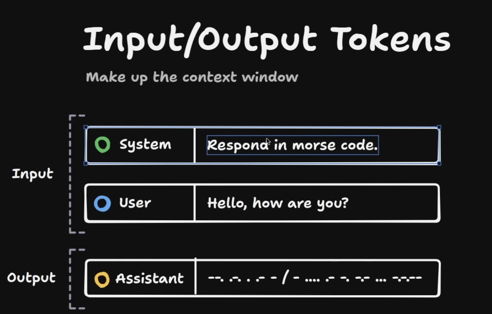
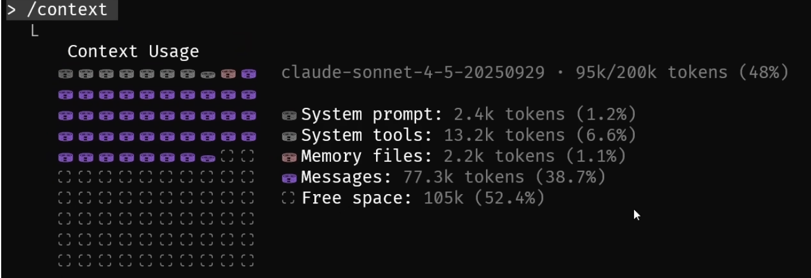

# Context Engineering

Context Window is a crucial component in the design and functionality of AI agents. It refers to the amount of information or data that an AI agent can consider at any given time when making decisions or generating responses. The context window plays a significant role in determining how effectively an AI agent can understand and respond to user inputs.

## What's makes up Context Window

The context window is made up of several key elements:

1. **Input Data**: This includes the text, images, or other forms of data that the AI agent receives from users. The quality and relevance of this input data directly impact the agent's ability to provide accurate and meaningful responses.

    - System Instructions: These are predefined guidelines or rules that help shape the behavior of the AI agent. They provide context about how the agent should interpret and respond to user inputs.
    - User Queries: These are the specific questions or requests made by users. The context window must effectively capture the nuances of these queries to generate appropriate responses.

2. Output Data: This is the information generated by the AI agent in response to user inputs. The context window must ensure that the output is relevant and coherent with the input data.

Whole context window is a combination of input data, system instructions, and output data that the AI agent uses to understand and respond to user queries effectively. As you interact more with AI Agent this data will increase linerarly until it hits the max limit of the context window.

***Context window limit is hardcoded based on the model you are using. For example, GPT-3.5-turbo has a context window of 4,096 tokens, while GPT-4 can handle up to 8,192 tokens or even 32,768 tokens in its extended version.***

You can hit this limit quickly if you are passing large documents/image/video or have long conversations with the AI agent. When the context window limit is reached, older parts of the conversation or document may be truncated or removed to make room for new information. This can lead to loss of important context and affect the quality of responses generated by the AI agent.

Checkout this [website](https://models.dev ) to see context window of different models.

## Why there is a limit on Context Window?

The limit on the context window is primarily due to computational and memory constraints associated with processing large amounts of data. Here are some reasons why context window limits exist:

1. **Computational Resources**: Processing large context windows requires significant computational power. AI models, especially large language models, have limitations on the amount of data they can process efficiently. Larger context windows can lead to increased latency and slower response times.

2. **Memory Constraints**: AI models have finite memory capacity, which limits the amount of information they can retain at any given time. Larger context windows require more memory to store and process the data, which can lead to memory overflow and crashes.

3. **Model Architecture**: The architecture of AI models, such as transformers, is designed to handle a specific amount of input data. Increasing the context window size may require significant changes to the model architecture, which can be complex and resource-intensive.

4. **Training Data Limitations**: AI models are trained on large datasets, but there are practical limits to the amount of data that can be used during training. Larger context windows may require more extensive training data, which can be challenging to obtain and process.

## Bigger is Better?

While a larger context window can provide more information for the AI agent to work with, it is not always the case that bigger is better. Here are some considerations:

1. **Relevance of Information**: A larger context window may include irrelevant or redundant information that can confuse the AI agent. It is essential to ensure that the information within the context window is relevant to the task at hand.

2. **Processing Overhead**: Larger context windows can lead to increased processing overhead, which may result in slower response times and reduced efficiency. It is crucial to balance the size of the context window with the need for timely responses.

3. **Quality of Responses**: The quality of responses generated by the AI agent may not necessarily improve with a larger context window. It is essential to focus on the quality and relevance of the information rather than just the quantity.

## What is Lost in Middle problem?

The "Lost in the Middle" problem refers to a situation where important context or information is lost or overlooked by an AI agent due to the limitations of the context window. This can occur when the context window is too small to capture all relevant information, leading to incomplete or inaccurate responses.

For example, in a long conversation, if the context window only captures the most recent exchanges, earlier parts of the conversation may be lost, resulting in the AI agent failing to consider important details that were discussed previously. This can lead to misunderstandings or incorrect responses.

The Lost in Middle problem can come with models with small context windows like GPT-3.5-turbo (4096 tokens) but can also happen with larger context window models if the conversation or document is too long.

## Strategies to manage Context Window

To effectively manage the context window and ensure optimal performance of AI agents, several strategies can be employed:

1. **Summarization**: Implement techniques to summarize long documents or conversations, retaining only the most relevant information. This helps in reducing the amount of data within the context window while preserving essential context.

2. **Chunking**: Break down large documents into smaller, manageable chunks that can be processed sequentially. This allows the AI agent to focus on specific sections of the document without overwhelming the context window.

3. **Prioritization**: Identify and prioritize the most critical information that needs to be retained within the context window. This may involve filtering out less relevant data or focusing on key topics.

4. **Dynamic Context Management**: Implement mechanisms to dynamically adjust the context window based on the current task or conversation. This may involve temporarily expanding or contracting the context window as needed.

5. **External Memory**: Utilize external memory systems to store and retrieve information that exceeds the context window limit. This allows the AI agent to access additional context without overwhelming the immediate context window.

By employing these strategies, developers can enhance the effectiveness of AI agents in handling complex tasks and providing accurate responses, even when faced with the limitations of context window size.
