# Context Graphs in AI

Context Graphs represent an advanced evolution in AI knowledge representation, specifically engineered to enhance how Large Language Models (LLMs) access, understand, and reason with structured information. Unlike traditional knowledge graphs that simply map entities and relationships, Context Graphs are AI-optimized data structures that provide semantically rich, contextually relevant, and verifiable information to LLMs.

## What is a Context Graph?

A Context Graph is a specialized form of knowledge graph designed to address the fundamental limitations of LLMs. It structures information as interconnected nodes (entities) and edges (relationships), enriched with metadata that provides additional context about when, where, and how reliable each piece of information is.


### Key Characteristics

| Feature | Traditional Knowledge Graph | Context Graph |
|---------|----------------------------|---------------|
| **Purpose** | General knowledge storage | LLM consumption & reasoning |
| **Metadata** | Limited | Rich (temporal, spatial, confidence, provenance) |
| **Token Efficiency** | Not optimized | Highly optimized for minimal token usage |
| **Update Frequency** | Batch updates | Real-time dynamic updates |
| **Query Interface** | SPARQL, Cypher | LLM-friendly retrieval APIs |
| **Relevance Ranking** | Basic | Advanced, context-aware |

## Why Context Graphs Matter for LLMs

Context Graphs address several fundamental challenges that LLMs face when processing information:

### 1. Context Window Limitations

LLMs have finite context windows (e.g., 128K tokens for GPT-4 Turbo). Context Graphs enable intelligent information management by:

- **Dynamic Retrieval**: Fetching only the most relevant subgraph for a query
- **Summarization**: Providing condensed representations of complex relationships
- **Priority Ranking**: Ensuring critical information appears first

```mermaid
flowchart LR
    subgraph "Without Context Graph"
        A1["📄 Full Document<br/>50,000 tokens"] --> B1["❌ Exceeds Context<br/>Window Limit"]
    end
    
    subgraph "With Context Graph"
        A2["🔍 Query"] --> B2["📊 Context Graph<br/>Subgraph Retrieval"]
        B2 --> C2["✅ Relevant Facts<br/>500 tokens"]
        C2 --> D2["🤖 LLM Processing"]
    end
    
    style B1 fill:#FF6B6B,stroke:#333
    style C2 fill:#4ECDC4,stroke:#333
```



### 2. Hallucination Reduction

LLMs can generate plausible-sounding but factually incorrect information. Context Graphs mitigate this by:

- **Grounding in Facts**: Providing verified, source-attributed information
- **Confidence Scores**: Indicating the reliability of each fact
- **Provenance Tracking**: Showing the origin and verification status of data


### 3. Multi-Hop Reasoning

Complex queries often require connecting multiple pieces of information. Context Graphs excel at this by:

- **Path Traversal**: Following relationship chains across entities
- **Implicit Connection Discovery**: Finding non-obvious relationships
- **Reasoning Chains**: Providing step-by-step logical connections

```mermaid
flowchart LR
    subgraph "Multi-Hop Query Example"
        Q["🔍 Query: Which companies have CEOs<br/>who attended Stanford?"]
        
        subgraph "Graph Traversal"
            C1[("🏢 Apple")] --> |CEO| P1[("👤 Tim Cook")]
            P1 --> |EDUCATION| S1[("🎓 Duke")]
            
            C2[("🏢 Google")] --> |CEO| P2[("👤 Sundar Pichai")]
            P2 --> |EDUCATION| S2[("🎓 Stanford")]
            
            C3[("🏢 Microsoft")] --> |CEO| P3[("👤 Satya Nadella")]
            P3 --> |EDUCATION| S3[("🎓 UW Milwaukee")]
        end
        
        S2 --> R["✅ Answer: Google"]
    end
    
    style S2 fill:#4ECDC4,stroke:#333
    style R fill:#95E1D3,stroke:#333
```



## Architecture of Context Graphs

### Core Components

A comprehensive Context Graph system consists of several interconnected layers:

```mermaid
graph TB
    subgraph "Data Sources"
        DS1["📄 Unstructured Text"]
        DS2["🗃️ Structured Databases"]
        DS3["🌐 APIs & Feeds"]
        DS4["📊 Knowledge Bases"]
    end
    
    subgraph "Extraction Layer"
        EL["🔧 Entity & Relationship Extractor<br/>(NER, Relation Extraction, LLM-based)"]
    end
    
    subgraph "Graph Layer"
        GL["📊 Graph Database<br/>(Neo4j, FalkorDB, Memgraph)"]
        ON["📖 Ontology & Schema<br/>(Types, Attributes, Rules)"]
    end
    
    subgraph "Enrichment Layer"
        EN1["🎯 Confidence Scoring"]
        EN2["📅 Temporal Annotation"]
        EN3["📍 Spatial Tagging"]
        EN4["🔗 Provenance Linking"]
    end
    
    subgraph "Retrieval Layer"
        RL["🔍 Context-Aware Retriever<br/>(Vector + Graph)"]
    end
    
    subgraph "LLM Integration"
        LLM["🤖 Large Language Model"]
    end
    
    DS1 --> EL
    DS2 --> EL
    DS3 --> EL
    DS4 --> EL
    
    EL --> GL
    GL <--> ON
    
    GL --> EN1
    GL --> EN2
    GL --> EN3
    GL --> EN4
    
    EN1 --> RL
    EN2 --> RL
    EN3 --> RL
    EN4 --> RL
    
    RL --> LLM
    LLM -->|"Feedback & Updates"| GL
    
    style GL fill:#4ECDC4,stroke:#333,stroke-width:2px
    style LLM fill:#FF6B6B,stroke:#333,stroke-width:2px
```



### Node Structure

Each node in a Context Graph contains rich metadata:

```json
{
  "entity_id": "person_elon_musk_001",
  "entity_type": "Person",
  "primary_label": "Elon Musk",
  "aliases": ["Elon Reeve Musk", "@elonmusk"],
  "attributes": {
    "birth_date": "1971-06-28",
    "nationality": ["South African", "Canadian", "American"],
    "occupation": ["Entrepreneur", "Engineer", "Investor"]
  },
  "metadata": {
    "confidence_score": 0.99,
    "last_verified": "2024-01-10T00:00:00Z",
    "provenance": ["Wikipedia", "SEC Filings", "Bloomberg"],
    "temporal_relevance": "current",
    "access_level": "public"
  },
  "embeddings": {
    "text_vector": [0.123, -0.456, ...],
    "graph_vector": [0.789, 0.012, ...]
  }
}
```

### Edge Structure

Relationships carry their own contextual information:

```json
{
  "edge_id": "rel_ceo_001",
  "source": "person_elon_musk_001",
  "target": "company_tesla_001",
  "relationship_type": "CEO_OF",
  "attributes": {
    "start_date": "2008-10-01",
    "end_date": null,
    "is_current": true
  },
  "metadata": {
    "confidence_score": 0.99,
    "provenance": "SEC 10-K Filing 2023",
    "last_verified": "2024-01-05T00:00:00Z",
    "bidirectional": false
  }
}
```

## Building Context Graphs

### Entity Extraction Pipeline

The process of building a Context Graph involves several stages:


### Key Extraction Techniques

1. **Named Entity Recognition (NER)**: Identifying entities like persons, organizations, locations, dates
2. **Relation Extraction**: Discovering relationships between entities
3. **Coreference Resolution**: Linking mentions of the same entity
4. **Entity Linking**: Connecting entities to canonical knowledge bases
5. **LLM-based Extraction**: Using language models for complex, nuanced extraction

### Example: Building a Context Graph with Python

```python
from neo4j import GraphDatabase
from openai import OpenAI
import json

class ContextGraphBuilder:
    def __init__(self, neo4j_uri, neo4j_auth, openai_key):
        self.driver = GraphDatabase.driver(neo4j_uri, auth=neo4j_auth)
        self.llm = OpenAI(api_key=openai_key)
    
    def extract_entities(self, text: str) -> dict:
        """Use LLM to extract entities and relationships from text."""
        prompt = """
        Extract entities and relationships from the following text.
        Return JSON with:
        - entities: list of {id, type, name, attributes}
        - relationships: list of {source, target, type, attributes}
        
        Text: {text}
        """
        
        response = self.llm.chat.completions.create(
            model="gpt-4",
            messages=[{"role": "user", "content": prompt.format(text=text)}],
            response_format={"type": "json_object"}
        )
        
        return json.loads(response.choices[0].message.content)
    
    def add_to_graph(self, entities: list, relationships: list):
        """Add extracted entities and relationships to Neo4j."""
        with self.driver.session() as session:
            # Add entities
            for entity in entities:
                session.run("""
                    MERGE (e:Entity {id: $id})
                    SET e.type = $type,
                        e.name = $name,
                        e.attributes = $attributes,
                        e.confidence = $confidence,
                        e.last_updated = datetime()
                """, **entity)
            
            # Add relationships
            for rel in relationships:
                session.run("""
                    MATCH (source:Entity {id: $source})
                    MATCH (target:Entity {id: $target})
                    MERGE (source)-[r:RELATES_TO {type: $type}]->(target)
                    SET r.attributes = $attributes,
                        r.confidence = $confidence
                """, **rel)
    
    def query_context(self, query: str, max_hops: int = 2) -> list:
        """Retrieve relevant subgraph for a query."""
        # First, find seed entities using vector similarity
        # Then, expand the subgraph to max_hops
        with self.driver.session() as session:
            result = session.run("""
                CALL db.index.fulltext.queryNodes('entityIndex', $query)
                YIELD node, score
                WHERE score > 0.5
                CALL apoc.path.subgraphAll(node, {
                    maxLevel: $max_hops,
                    relationshipFilter: 'RELATES_TO'
                })
                YIELD nodes, relationships
                RETURN nodes, relationships
            """, query=query, max_hops=max_hops)
            
            return result.data()
```

## Context Graphs vs Other Approaches

### Context Graphs vs RAG (Vector Search)

```mermaid
graph TD
    subgraph "Traditional RAG"
        R1["📄 Documents"] --> R2["🔢 Chunk & Embed"]
        R2 --> R3["📊 Vector Store"]
        R3 --> R4["🔍 Similarity Search"]
        R4 --> R5["📝 Top-K Chunks"]
        R5 --> R6["🤖 LLM"]
    end
    
    subgraph "Context Graph / GraphRAG"
        G1["📄 Documents"] --> G2["🧠 Entity Extraction"]
        G2 --> G3["📊 Graph Database"]
        G3 --> G4["🌐 Graph Traversal<br/>+ Vector Search"]
        G4 --> G5["🔗 Connected Subgraph"]
        G5 --> G6["🤖 LLM"]
    end
    
    style R5 fill:#FFE66D,stroke:#333
    style G5 fill:#4ECDC4,stroke:#333
```



| Aspect | Vector RAG | Context Graph / GraphRAG |
|--------|------------|-------------------------|
| **Information Structure** | Flat chunks | Interconnected entities |
| **Retrieval Method** | Semantic similarity | Graph traversal + similarity |
| **Multi-hop Reasoning** | Limited | Native support |
| **Explainability** | Low (why these chunks?) | High (traceable paths) |
| **Fact Verification** | Difficult | Built-in with provenance |
| **Update Granularity** | Chunk-level | Entity/relationship-level |

### Context Graphs vs Fine-tuning

| Aspect | Fine-tuning | Context Graphs |
|--------|-------------|----------------|
| **Knowledge Updates** | Requires retraining | Real-time updates |
| **Cost** | High (compute-intensive) | Lower (graph operations) |
| **Hallucination Risk** | Can amplify | Reduces |
| **Knowledge Traceability** | Impossible | Full provenance |
| **Domain Adaptation** | Good for style/format | Good for facts/relationships |

## Enriching Context Graphs with Metadata

### Temporal Metadata

Temporal information allows Context Graphs to represent knowledge that changes over time:


```json
{
  "relationship": "CEO_OF",
  "source": "Tim Cook",
  "target": "Apple Inc.",
  "temporal": {
    "valid_from": "2011-08-24",
    "valid_to": null,
    "is_current": true,
    "temporal_granularity": "day"
  }
}
```

### Confidence Scoring

Confidence scores help LLMs weight information appropriately:

```python
def calculate_confidence(entity_or_relation):
    """
    Calculate confidence score based on multiple factors.
    """
    factors = {
        "source_reliability": get_source_score(entity.provenance),
        "recency": calculate_recency_score(entity.last_verified),
        "cross_references": count_confirming_sources(entity),
        "contradiction_score": 1 - count_contradictions(entity) / total_refs
    }
    
    # Weighted average
    weights = {
        "source_reliability": 0.35,
        "recency": 0.25,
        "cross_references": 0.25,
        "contradiction_score": 0.15
    }
    
    confidence = sum(
        factors[k] * weights[k] for k in factors
    )
    
    return round(confidence, 2)
```

### Provenance Tracking

Every piece of information should be traceable to its source:

```mermaid
graph LR
    subgraph "Provenance Chain"
        F["📊 Fact: Tesla Revenue $96.8B (2023)"]
        S1["📄 Source: SEC 10-K Filing"]
        S2["📰 Source: Bloomberg Report"]
        S3["🌐 Source: Company Press Release"]
        
        F --> S1
        F --> S2
        F --> S3
        
        S1 --> V1["✓ Primary Source<br/>Confidence: 0.99"]
        S2 --> V2["✓ Secondary Source<br/>Confidence: 0.95"]
        S3 --> V3["✓ Official Statement<br/>Confidence: 0.97"]
    end
    
    style V1 fill:#4ECDC4,stroke:#333
```



## Querying Context Graphs

### Query Types

Context Graphs support various query patterns:

#### 1. Entity Lookup

```cypher
// Find all information about Elon Musk
MATCH (p:Person {name: "Elon Musk"})
RETURN p, [(p)-[r]->(n) | {relation: type(r), target: n.name}] AS connections
```

#### 2. Relationship Traversal

```cypher
// Find all companies where Elon Musk is a founder or CEO
MATCH (p:Person {name: "Elon Musk"})-[r:FOUNDER_OF|CEO_OF]->(c:Company)
WHERE r.is_current = true
RETURN c.name, type(r), r.since
```

#### 3. Multi-hop Queries

```cypher
// Find people connected to Elon Musk through companies
MATCH (p:Person {name: "Elon Musk"})-[:WORKS_AT|CEO_OF]->(c:Company)<-[:WORKS_AT|CEO_OF]-(other:Person)
WHERE other.name <> "Elon Musk"
RETURN other.name, c.name, count(*) AS connection_strength
ORDER BY connection_strength DESC
```

#### 4. Temporal Queries

```cypher
// Find who was CEO of Apple in 2010
MATCH (p:Person)-[r:CEO_OF]->(c:Company {name: "Apple Inc."})
WHERE r.valid_from <= date("2010-01-01") 
  AND (r.valid_to IS NULL OR r.valid_to >= date("2010-12-31"))
RETURN p.name, r.valid_from, r.valid_to
```

### Hybrid Retrieval

Modern Context Graph systems combine graph queries with vector search:

```python
def hybrid_retrieval(query: str, graph_db, vector_store):
    """
    Combine vector similarity with graph structure for optimal retrieval.
    """
    # Step 1: Vector search to find relevant entities
    query_embedding = embed(query)
    similar_entities = vector_store.search(query_embedding, top_k=10)
    
    # Step 2: Expand to subgraph
    subgraph = graph_db.expand_subgraph(
        seed_nodes=similar_entities,
        max_hops=2,
        max_nodes=50
    )
    
    # Step 3: Rank by combined score
    ranked_nodes = []
    for node in subgraph.nodes:
        vector_score = node.similarity_to(query_embedding)
        graph_score = calculate_graph_centrality(node, subgraph)
        combined_score = 0.6 * vector_score + 0.4 * graph_score
        ranked_nodes.append((node, combined_score))
    
    return sorted(ranked_nodes, key=lambda x: x[1], reverse=True)
```

## Integration with LLMs

### Retrieval-Augmented Generation with Context Graphs


### Prompt Engineering for Context Graphs

When providing Context Graph information to LLMs, structure matters:

```python
def format_context_for_llm(subgraph, query):
    """
    Format graph context optimally for LLM consumption.
    """
    prompt = f"""
You are an AI assistant with access to a verified knowledge graph.
Answer the following query using ONLY the provided context.
If information is not in the context, say "I don't have that information."

## Query
{query}

## Verified Knowledge Graph Context

### Entities
{format_entities(subgraph.nodes)}

### Relationships
{format_relationships(subgraph.edges)}

### Confidence Notes
- Facts with confidence > 0.95 are highly reliable
- Facts with confidence 0.8-0.95 are reasonably reliable
- Facts with confidence < 0.8 should be noted as uncertain

## Instructions
1. Base your answer ONLY on the provided context
2. Cite confidence scores for key facts
3. If multiple sources agree, note this for reliability
4. If temporal information exists, use the most current data
"""
    return prompt
```

## Real-World Applications

### 1. Enterprise Knowledge Management

```mermaid
graph TD
    subgraph "Enterprise Context Graph"
        E1[("👤 Employee: John<br/>Sales VP")]
        E2[("📊 Project: Q4 Launch")]
        E3[("🏢 Client: Acme Corp")]
        E4[("📄 Contract: C-2024-001")]
        E5[("💰 Deal: $2M")]
        
        E1 -->|LEADS| E2
        E2 -->|FOR_CLIENT| E3
        E3 -->|HAS_CONTRACT| E4
        E4 -->|VALUE| E5
        E1 -->|OWNS_RELATIONSHIP| E3
    end
```



**Use Cases:**

- Sales intelligence: "Which clients have contracts expiring in Q1?"
- HR queries: "Who has experience with enterprise deals over $1M?"
- Project tracking: "What's the revenue pipeline for projects led by John?"

### 2. Conversational AI Agents

Context Graphs enable coherent, memory-aware conversations:

```python
class ConversationalAgent:
    def __init__(self, context_graph, llm):
        self.graph = context_graph
        self.llm = llm
        self.conversation_memory = []
    
    def respond(self, user_message):
        # Extract entities from current message
        entities = self.extract_entities(user_message)
        
        # Update conversation graph
        self.update_conversation_graph(entities)
        
        # Retrieve relevant context from both:
        # 1. Long-term knowledge graph
        # 2. Short-term conversation graph
        context = self.retrieve_combined_context(entities)
        
        # Generate response
        response = self.llm.generate(
            query=user_message,
            context=context,
            history=self.conversation_memory[-5:]  # Last 5 turns
        )
        
        return response
```

### 3. Research and Due Diligence

```mermaid
graph LR
    subgraph "Investment Due Diligence"
        C["🏢 Target Company"]
        F["👥 Founders/Executives"]
        R["📊 Revenue Metrics"]
        CP["🏆 Competitors"]
        I["💰 Investors"]
        P["⚖️ Patents/IP"]
        
        C --> F
        C --> R
        C --> CP
        C --> I
        C --> P
        
        F -->|PREVIOUSLY_AT| PC[Previous Companies]
        I -->|ALSO_INVESTED_IN| OC[Other Companies]
        CP -->|MARKET_OVERLAP| MS[Market Segments]
    end
```



### 4. Healthcare & Biomedical

```mermaid
graph TD
    subgraph "Biomedical Context Graph"
        D["🦠 Disease: Type 2 Diabetes"]
        S["😷 Symptom: Hyperglycemia"]
        T["💊 Treatment: Metformin"]
        G["🧬 Gene: TCF7L2"]
        SE["⚠️ Side Effect: GI Issues"]
        
        D -->|PRESENTS_WITH| S
        D -->|TREATED_BY| T
        D -->|ASSOCIATED_GENE| G
        T -->|MAY_CAUSE| SE
        G -->|INCREASES_RISK| D
    end
```



## Tools and Technologies

### Graph Databases

| Database | Best For | Key Features |
|----------|----------|--------------|
| **Neo4j** | Enterprise, Complex queries | Cypher query language, APOC procedures, GraphQL |
| **FalkorDB** | High performance, Redis-compatible | In-memory, low latency |
| **Memgraph** | Real-time analytics | Streaming support, MAGE algorithms |
| **Amazon Neptune** | Cloud-native | Managed service, SPARQL/Gremlin |
| **TigerGraph** | Large-scale, parallel | Distributed, GSQL |

### Context Graph Platforms

| Platform | Focus | Key Features |
|----------|-------|--------------|
| **Zep** | Agent memory | Long-term memory, fact extraction |
| **Graphiti** | Dynamic GraphRAG | Real-time updates, temporal knowledge |
| **TrustGraph** | AI-optimized KG | Token efficiency, hallucination reduction |
| **WhyHow.AI** | Knowledge graph creation | LLM-based extraction |

### Visualization Tools

- **Neo4j Bloom**: Interactive graph exploration
- **Gephi**: Network analysis and visualization
- **Graphistry**: GPU-accelerated visualization
- **yFiles**: Custom graph rendering

## Best Practices

### 1. Schema Design

```mermaid
graph TD
    subgraph "Recommended Schema Layers"
        L1["📋 Meta Schema<br/>(Entity types, Relation types)"]
        L2["📊 Domain Schema<br/>(Business-specific types)"]
        L3["🔢 Instance Layer<br/>(Actual data)"]
        
        L1 --> L2
        L2 --> L3
    end
```



**Guidelines:**

- Define clear entity types with inheritance if needed
- Standardize relationship naming conventions
- Use consistent attribute schemas across entity types
- Plan for temporal evolution of the schema

### 2. Data Quality

```python
class ContextGraphValidator:
    """Ensure quality of context graph data."""
    
    def validate_entity(self, entity):
        checks = [
            self.has_required_fields(entity),
            self.has_valid_confidence(entity),
            self.has_provenance(entity),
            self.passes_deduplication(entity),
            self.consistent_with_schema(entity)
        ]
        return all(checks)
    
    def has_valid_confidence(self, entity):
        conf = entity.get('confidence', 0)
        return 0 <= conf <= 1
    
    def has_provenance(self, entity):
        return bool(entity.get('provenance'))
```

### 3. Performance Optimization

| Strategy | Description |
|----------|-------------|
| **Indexing** | Create indexes on frequently queried properties |
| **Caching** | Cache frequently accessed subgraphs |
| **Partitioning** | Shard large graphs by domain or time |
| **Materialized Views** | Pre-compute common traversal patterns |
| **Query Optimization** | Use query profiling and optimization hints |

### 4. Security & Access Control

```mermaid
graph TD
    subgraph "Access Control Model"
        U["👤 User/Agent"]
        R["🔑 Role"]
        P["📋 Permission"]
        E["📊 Entity/Subgraph"]
        
        U -->|HAS_ROLE| R
        R -->|GRANTS| P
        P -->|ACCESS_TO| E
    end
```



## Challenges and Limitations

### Current Challenges

1. **Entity Resolution**: Accurately matching mentions to canonical entities
2. **Relation Extraction Accuracy**: Complex relationships are hard to extract
3. **Scale**: Managing billions of entities efficiently
4. **Freshness**: Keeping knowledge current
5. **Multilingual Support**: Cross-language entity linking

### Mitigation Strategies

| Challenge | Mitigation |
|-----------|------------|
| Entity ambiguity | Use embeddings + context for disambiguation |
| Extraction errors | Human-in-the-loop validation for critical domains |
| Scale issues | Distributed graph databases, smart partitioning |
| Stale data | Automated refresh pipelines, temporal validity |
| Language barriers | Cross-lingual embeddings, translation layers |

## Future Directions

### Emerging Trends

1. **Autonomous Graph Construction**: LLMs building and maintaining their own knowledge graphs
2. **Neuro-Symbolic Reasoning**: Combining neural networks with symbolic graph reasoning
3. **Federated Context Graphs**: Distributed graphs across organizations with privacy preservation
4. **Real-time Streaming Updates**: Continuous integration of new information
5. **Multimodal Context Graphs**: Incorporating images, audio, and video as graph nodes

### Research Frontiers


## Summary

Context Graphs represent a paradigm shift in how AI systems manage and utilize knowledge. By providing structured, verifiable, and contextually rich information to LLMs, they address fundamental limitations while enabling new capabilities like multi-hop reasoning, fact verification, and explainable AI.

### Key Takeaways

| Aspect | Benefit |
|--------|---------|
| **Structure** | Graphs naturally model complex relationships |
| **Metadata** | Temporal, confidence, and provenance data enable nuanced reasoning |
| **Retrieval** | Precise, relationship-aware information access |
| **Grounding** | Reduces hallucinations through verified facts |
| **Transparency** | Full audit trail for AI decisions |
| **Scalability** | Efficient updates without retraining |

As LLMs continue to evolve, Context Graphs will play an increasingly critical role in building trustworthy, capable, and knowledgeable AI systems that can reason over complex information while maintaining accuracy and explainability.

## Further Reading

- **Knowledge Graphs and LLMs**: Neo4j's guide to GraphRAG
- **Zep Documentation**: Building memory-augmented AI agents
- **TrustGraph**: AI-optimized knowledge graphsconstruction
- **Academic Papers**: Survey papers on Knowledge-Augmented Language Models (KALM)
- **Graph Database Documentation**: Neo4j, FalkorDB, Memgraph official docs
