# The Comprehensive Guide to Context Graphs: From Zero to Hero

> **For Beginners**: This guide assumes no prior knowledge of Graph Theory. We will start with simple analogies and build up to advanced AI architectures.
> **For Experts**: Skip to the "Advanced Architecture" and "Production Patterns" sections for technical deep dives.

---

## Part 1: The Beginner's Guide (What & Why)

### 1.1 The Problem with "Flat" Data

Imagine you are a detective entering a crime scene.

**Scenario A (The "Flat" Approach):**
You are handed a pile of 5,000 police reports, witness statements, and emails, all thrown into a box in no particular order. To find out "Who knows the suspect?", you have to read every single paper.
*This is how standard **Vector Search (RAG)** often works—it retrieves "chunks" based on similarity but misses the connections.*

**Scenario B (The "Context Graph" Approach):**
You walk into the precinct and see a **detective's corkboard**.

- Pictures of suspects are pinned up (Nodes).
- Red string connects them (Relationships).
- One string says "Called" (Action).
- Another says "Was seen with" (Observation).

You can instantly see: **Suspect A** called **Suspect B**, who works for **Company C**.
*This is a **Context Graph**.*

### 1.2 What is a Context Graph?

A **Context Graph** is a structured way of representing data where:

1. **Nodes** are "Things" (People, Places, Concepts).
2. **Edges** are the "Relationships" between them.
3. **Context** is the extra metadata (When? Where? How sure are we?).

Unlike a traditional database that stores rows and columns, a graph stores *connections*.

```mermaid
graph LR
    Elon[("👤 Elon Musk")]
    Tesla[("🏢 Tesla")]
    SpaceX[("🚀 SpaceX")]
    Austin[("📍 Austin")]

    Elon -->|"CEO OF"| Tesla
    Elon -->|"FOUNDER OF"| SpaceX
    Tesla -->|"HQ IN"| Austin
```



### 1.3 Why do LLMs need this?

Large Language Models (like GPT-4) are amazing, but they have three big flaws:

1. **Hallucinations**: They make things up if they don't know the answer.
    - *Graph Solution*: "Only answer using connections found in this graph."
2. **No "Memory" of Structure**: They read text sequentially. They often miss that "The John mentioned on page 1" is the same as "Mr. Doe on page 50".
    - *Graph Solution*: The graph physically links them as the same Node.
3. **Reasoning Hopping**: Asking "Who is the CEO of the company that acquired GitHub?" requires multiple hops.
    - *Graph Solution*: Graphs are designed exactly for this "multi-hop" traversal.

---

## Part 2: The Intermediate Guide (Building & Using)

In this section, we will build a real Context Graph using Python and Neo4j.

### 2.1 The Tech Stack

- **Database**: Neo4j (The most popular Graph DB).
- **Language**: Python.
- **AI**: OpenAI API (for extraction).

### 2.2 The Architecture

```mermaid
flowchart LR
    Text["📄 Raw Text"] --> Extractor["🤖 AI Extractor"]
    Extractor --> JSON["📊 Structured JSON"]
    JSON --> Neo4j[("🗄️ Neo4j Graph")]
    
    User["👤 User Query"] --> Retriever["🔍 Retriever"]
    Retriever --> Neo4j
    Neo4j --> Context["📝 Rich Context"]
    Context --> LLM["🤖 Final Answer"]
```



### 2.3 Step-by-Step Implementation

We have provided a ready-to-use script in `simple_graph_builder.py`. Here is how it works under the hood.

#### Step 1: Entity Extraction (The "AI" Part)

We don't manually type data. We ask an LLM to "read" text and give us JSON.

*Prompt:*
> "Extract entities and relationships from this text: 'Apple was founded by Steve Jobs in Cupertino.'"

*LLM Output:*

```json
{
  "nodes": [
    {"id": "Apple", "type": "Company"},
    {"id": "Steve Jobs", "type": "Person"},
    {"id": "Cupertino", "type": "Location"}
  ],
  "edges": [
    {"source": "Steve Jobs", "target": "Apple", "relation": "FOUNDED"},
    {"source": "Apple", "target": "Cupertino", "relation": "LOCATED_IN"}
  ]
}
```

#### Step 2: Ingestion (The "Code" Part)

We iterate through this JSON and run **Cypher** queries (Neo4j's SQL) to create the graph.

```python
# Pseudo-code
for edge in edges:
    session.run("""
        MERGE (a:Entity {id: $source})
        MERGE (b:Entity {id: $target})
        MERGE (a)-[:RELATION {type: $type}]->(b)
    """, source=edge.source, target=edge.target, type=edge.relation)
```

**Try it yourself:**

1. Navigate to `docs/AI/Context_Graph/`.
2. Install requirements: `pip install -r requirements.txt`
3. Set your `.env` variables.
4. Run `python simple_graph_builder.py`.

---

## Part 3: The Expert Guide (Advanced Patterns)

This is where we move from "Toy Project" to "Enterprise Architecture".

### 3.1 GraphRAG (Hybrid Retrieval)

Standard RAG (Vector Search) and Graph Search have different strengths. The state-of-the-art approach is **GraphRAG**.

| Technique | Good For | Bad For |
| :--- | :--- | :--- |
| **Vector Search** | "Find documents about `batteries`" (Vague topics) | "How is `Person A` related to `Person B`?" |
| **Graph Search** | "How many hops from `A` to `B`?" | "Find general concepts similar to `energy`" |
| **Hybrid (GraphRAG)**| **Both.** | Higher complexity. |

#### Algorithm

1. **Vector Step**: Embed the user query ("Who regulates Tesla?").
2. **Index Lookup**: Find nodes with high vector similarity to "Tesla" (Node: `Tesla Motors`).
3. **Graph Expansion**: Traverse 1-2 hops from `Tesla Motors` to find connected nodes (`SEC`, `Elon Musk`, `NHTSA`).
4. **Context Construction**: Feed *all* these nodes and edges into the LLM context.

*(See `advanced_retrieval.py` for the implementation)*

### 3.2 Metadata Enrichment (The "Context" in Context Graph)

A graph isn't just A->B. Real context requires properties.

- **Temporal Reasoning**:
  - *Fact*: `Elon Musk` -> `CEO` -> `Twitter`
  - *Context*: `{ "start_date": "2022", "end_date": null, "status": "active" }`
  - *Query*: "Who was CEO of Twitter in 2020?" -> The graph knows it *wasn't* Elon.

- **Provenance (Source Tracking)**:
  - *Fact*: `Revenue` -> `EQUAL` -> `$50B`
  - *Context*: `{ "source": "SEC 10-K Filing", "page": 45, "confidence": 0.99 }`
  - *Value*: Allows the LLM to cite sources accurately.

### 3.3 Production Optimization Strategies

#### 1. Graph Pruning (Context Window Management)

You cannot dump the whole database into the LLM.

- **Algorithm**: PageRank or Centrality.
- **Strategy**: When expanding from a node, only keep the "most important" neighbors (highest PageRank) to fit within the 8k/32k token limit.

#### 2. Community Detection (Leiden Algorithm)

Pre-cluster the graph into "Communities" (e.g., "The SpaceX Cluster", "The Tesla Cluster").

- **Usage**: When a query hits one node in the cluster, retrieve the *summary* of the entire cluster instead of 500 individual nodes. (This is how Microsoft's GraphRAG works).

#### 3. Ephemeral Graphs

For conversational agents, build a **temporary graph** of the current conversation history.

- User: "I like slightly sweet wines." -> `(User)-[:LIKES]->(Sweet Wine)`
- User: "Actually, I prefer red." -> `(User)-[:PREFERS]->(Red Wine)`
- *Result*: The agent remembers preferences structurally, not just as a text blob.

---

## Conclusion & Next Steps

Context Graphs enable AI to "think" in relationships rather than just text probability.

**Ready to build?**

1. Check out `simple_graph_builder.py` for extraction.
2. Look at `advanced_retrieval.py` for the RAG pipeline.
3. Experiment with Neo4j Aura (Free Tier).
