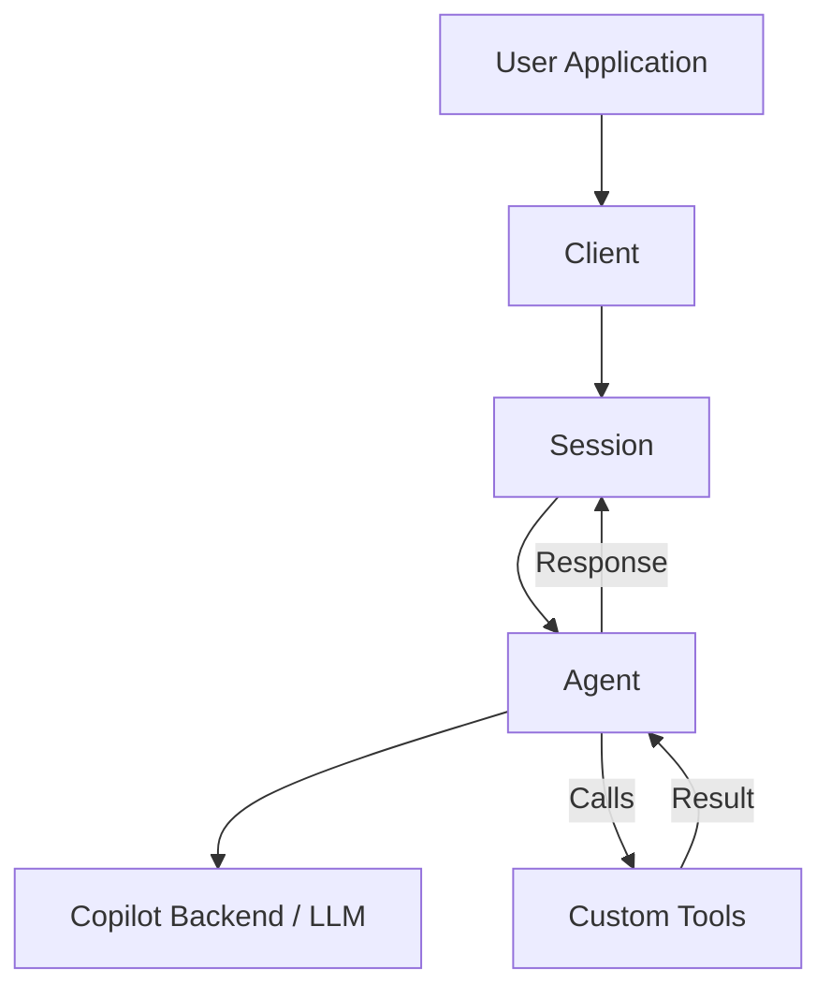

# GitHub Copilot SDK (Technical Preview)

The **GitHub Copilot SDK** allows developers to embed the powerful agentic capabilities of the GitHub Copilot CLI directly into their own applications. It provides programmatic access to the same engine that powers Copilot in the terminal, enabling you to build custom agents, tools, and workflows.

> [!NOTE]
> The GitHub Copilot SDK is currently in **Technical Preview**. APIs and features are subject to change.

## Key Features

- **Agentic Workflows**: Build applications where Copilot can plan and execute multi-step tasks.
- **Tool Use**: Define custom tools (Python functions) that the agent can invoke to interact with your specific domain or external APIs.
- **Memory & Context**: Supports multi-turn conversations with persistent context, allowing the agent to "remember" previous interactions.
- **Multi-Model Support**: Access various models available through GitHub Copilot (e.g., GPT-4o, Claude 3.5 Sonnet).
- **GitHub Integration**: Built-in authentication and integration with GitHub's ecosystem.
- **MCP Integration**: seamless integration with the Model Context Protocol (MCP) to connect to external data and tools.

## Practical Use Cases

The Copilot SDK enables building specialized agents that go beyond generic chat. Here are powerful ways to use it:

### 1. **Custom CLI DevOps Assistants**

- **Goal**: Simplify complex infrastructure tasks using natural language.
- **How**: Create an agent with tools wrapping `kubectl`, `aws`, or `terraform` commands.
- **Example**: User types *"Scale the payment service to 5 replicas"*. The agent confirms the current state (using a tool) and executes the `kubectl scale` command (via a tool).
- **Key Features**: `tools`, `permissions` (for safety), `hooks` (for auditing).

### 2. **Repo-Specific "Onboarding Buddy"**

- **Goal**: Help new engineers understand a complex legacy codebase.
- **How**: Feed architecture docs and key file maps into the session context relative to the user's current directory.
- **Example**: *"Where is the auth logic handled?"* -> Agent analyzes the specific files in your workspace and points to `src/auth/` with an explanation of the flow.
- **Key Features**: `attachments`, `infinite_sessions` (to maintain context).

### 3. **Automated Structured Data Extraction**

- **Goal**: Convert unstructured logs, error reports, or legacy code into machine-readable JSON.
- **How**: Use prompt engineering to enforce a specific JSON schema output.
- **Example**: Feed a messy crash log into the agent. It outputs a clean JSON object with `{ "error_type": "NullPtr", "location": "main.py:42", "severity": "High" }` which triggers a Jira ticket via an API tool.
- **Key Features**: `response_format` (or prompt engineering), `attachments`.

### 4. **Intelligent Code Refactoring & Migration**

- **Goal**: Mass-refactor code patterns that regex/linters can't catch.
- **How**: An agent that reads a file, understands semantic intent, and writes the refactored version.
- **Example**: *"Convert all raw SQL queries in this file to use our new ORM builder pattern."*
- **Key Features**: `tools` (read/write files), `streaming` (for real-time progress).

### 5. **Interactive Educational Tutors**

- **Goal**: Teach coding concepts by analyzing the user's actual code in real-time.
- **How**: An agent that watches file changes and offers hints when the user gets stuck.
- **Example**: A Python tutor that detects an infinite loop in the user's script and explains *why* it will fail before they run it.
- **Key Features**: `hooks` (monitor file access), `user_input` (ask quizzes).

---

## Architecture

The SDK revolves around a few core concepts:

1. **Client**: The entry point for interacting with the SDK. It handles authentication and connection to the Copilot backend.
2. **Session**: Represents a conversation or interaction context. All messages and state are scoped to a session.
3. **Agent**: The AI entity that processes user input, plans actions, calls tools, and generates responses.



## Installation

The SDK is available as a Python package.

```bash
pip install github-copilot-sdk
```

### Prerequisites

- **GitHub Copilot Subscription**: You must have an active GitHub Copilot subscription.
- **Environment Variables**:
  - `GITHUB_TOKEN`: A valid GitHub Personal Access Token (PAT) with Copilot chat permissions is required to authenticate.

    ```bash
    export GITHUB_TOKEN="your_token_here"
    ```

## Core Concepts

### 1. Agents and Planning

Unlike simple chat completions, the Copilot SDK uses an "agentic" approach. When given a task, the agent can:

- **Think**: Analyze the request and plan a sequence of steps.
- **Act**: Call available tools to gather information or perform actions.
- **Observe**: Read the output of those tools.
- **Responde**: Synthesize the final answer for the user.

### 2. Tools

Tools are the hands of the agent. You can define any Python function as a tool.

```python
from copilot import tool

@tool
def get_weather(city: str) -> str:
    """Get the weather for a specific city."""
    # Custom logic here
    return f"The weather in {city} is sunny."
```

### 3. Structured Output

You can force the agent to return data in a specific JSON structure, which is crucial for integrating AI into programmatic workflows where you need reliable machine-readable output.

### 4. Streaming

For real-time user experiences, the SDK supports streaming responses, allowing you to display the agent's "thought process" and partial answers as they differ.

## Best Practices

- **Tool Design**: Keep tools focused and atomic. A tool should do one thing well. Provide clear, descriptive docstrings as these are used by the agent to understand when to call the tool.
- **System Prompts**: While the SDK handles the heavy lifting, providing a clear "persona" or system prompt to the agent can significantly improve performance for specific domains.
- **Error Handling**: Always wrap tool execution in try-except blocks (as shown in the examples) to prevent the agent from crashing due to external API failures. The agent can often recover if you return the error message as a string.

## Next Steps

Explore the examples in the `examples/` directory to see these concepts in action:

- **`hello_world.py`**: Basic setup and simple interaction.
- **`custom_tools_agent.py`**: How to define and use custom tools.
- **`multi_turn_agent.py`**: Managing conversation history.
- **`structured_output_agent.py`**: Extracting JSON data.
- **`streaming_agent.py`**: Handling real-time output.

## Troubleshooting

### Protocol Version Mismatch

If you see `RuntimeError: SDK protocol version mismatch`, it means your GitHub Copilot CLI is outdated.

**Solution 1: Update Extension**

```bash
gh extension upgrade gh-copilot
```

**Solution 2: Manual CLI Installation (Advanced)**
If the extension update doesn't work, install the standalone CLI via npm and point the SDK to it:

1. **Install CLI**:

    ```bash
    npm install -g @githubnext/github-copilot-cli
    ```

2. **Set Environment Variable**:

    ```bash
    export COPILOT_CLI_PATH=$(which github-copilot-cli)
    ```

3. **Authenticate Standalone CLI**:
   The standalone CLI requires separate authentication.

## Troubleshooting & Learnings

### 1. Protocol Version Mismatch

**Symptom**: `RuntimeError: SDK protocol version mismatch` or `ValueError: Missing required fields... protocolVersion=None`.
**Cause**: The `github-copilot-sdk` (v0.1.20+) is stricter than the current `gh copilot` extension (v1.2.0) which acts as the server. The extension does not send the `protocolVersion` field.
**Solution**: This documentation assumes the SDK has been patched to:

1. Default `protocolVersion` to `1` in `copilot/types.py`.
2. Expect `SDK_PROTOCOL_VERSION = 1` in `copilot/sdk_protocol_version.py`.

### 2. Authentication Timeouts

**Symptom**: `TimeoutError` when connecting, especially with manual `COPILOT_CLI_PATH`.
**Cause**: The standalone `github-copilot-cli` (npm) requires separate authentication via `github-copilot-cli auth`. This service may be flaky or down.
**Solution**: Use the default `gh copilot` extension (aliased as `copilot` in your path) by unsetting `COPILOT_CLI_PATH`. Ensure `gh auth status` shows you are logged in.

### 3. Tool Definitions

**Lesson**: The SDK does NOT provide a simple `@tool` decorator. You must use `@define_tool` from `copilot` and strictly type your arguments using Pydantic models (subclasses of `BaseModel`).

### 4. Sending Messages

**Lesson**: `session.send()` expects a dictionary `{"prompt": "message"}`, not a raw string. Using a string will cause a `TypeError`. Use `await session.send_and_wait(...)` for simple request-response flows.
