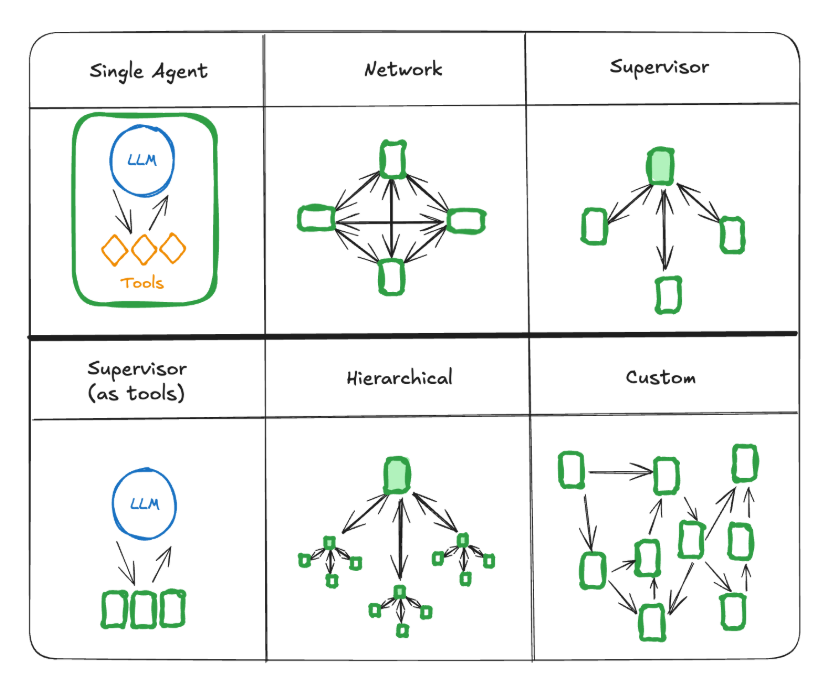

# LangGraph

An agent consists of three components: a LLM (Large Language Model), a set of tools it can use and a prompt that provides instructions on how to use the tools to complete a task. LangGraph is a framework for building and managing complex agent workflows using directed graphs.

## Key Features

- **Memory Integration**: LangGraph integrates with various memory systems to store and retrieve information during agent execution. Native support for short-term (seesion-based) and long-term (persistent) memory, enabling stateful behaviors in chatbots and agents.

- **Human-in-the-loop control**: Execution can pause indefinitely to await human feedback - unlike websocket-based solutions limited to real-time interactions. This enables asycnhronous approval, correction, or intervention at any point in the workflow.

- **Streaming support**: Real-time streaming of agent state, model tokens, tool outputs, or combined streams.

- **Deployment tooling**: Includes infrastructure-free deployment tools. LangGraph platform supports testing, debuging, and deployment.

- **Studio**: A visual IDE for inspecting and debugging workflows.

Agent can be executed in two modes:

1. **Synchronous**: The entire graph is executed in a single run, and the final output is returned once all nodes have completed their tasks. Using **_.invoke()_** or **_.stream()_** method.

2. **Asynchronous**: The graph execution can be paused and resumed, allowing for human-in-the-loop interactions or waiting for external events. Using **_await_** **_.ainvoke()_** or **_async for_** with **_.astream()_**.

### Input Format

Agent input must be a dictionary with a messages key. Supported formats are:

- String {"messages": "Hello"} — Interpreted as a HumanMessage
- Message dictionary {"messages": {"role": "user", "content": "Hello"}}
- List of messages {"messages": [{"role": "user", "content": "Hello"}]}
- With custom state {"messages": [{"role": "user", "content": "Hello"}], "user_name": "Alice"} — If using a custom state_schema

Messages are automatically converted into LangChain's internal message format.

### Output Format

Agent ouput is a dictionary containing:

- messages: A list of all messages exchanged during execution (user input, assistant replies, tool invocations).
- Optionally, structured_response if structured output is configured.
- If using a custom state_schema, additional keys corresponding to your defined fields may also be present in the output. These can hold updated state values from tool execution or prompt logic

## Graphs

- LangGraph models agent workflows as directed graphs. Main components:

  - **State**: A shared data structure that represents the current snapshot of your application. It can be any type, but is typically using a shared state schema.
  - **Nodes**: Represent tasks or actions in the workflow. Fucntions that encode t - **Nodes**: Represent tasks or actions in the workflow. Fucntions that encode the logic of your agents. They receive the current state as input, perform computations, and emit updates to the state.
  - **Edges**: Define the relationships and flow between nodes. Functions that determine which Node to execute next based on the current state. They can also modify the state before passing it to the next Node.
  - **Context**: Stores information that persists across nodes, allowing for stateful workflows.

    In short: nodes do the work, edges tell what to do next.

- LangGraph's underlying graph algorithm used message passing to define a general program. A **super-step** can be considered a single iteration of the algorithm, where each node processes its input and produces output.

  - Nodes that run in parallel are part of same super-step.
  - Nodes that run sequentially are part of different super-steps.

- At the start of graph execution, all nodes begin in an **_inactive_** state. As the graph executes, nodes transition to **_active_**.
  The graph execution terminates when all nodes are **_inactive_** and no message are in transit.

## State

The state consists of the schema of the graph as well as reducer functions which specify how to apply updates to the state.
The schema og the State will be the input schema to all Nodes and Edges in the graph, and can be either a TypedDict or a Pydantic model.

## MCP

Model Context Protocol is a open protocol that standardizes how application provided tools and context to language models. Langgraph agents can use tools defined on MCP servers through the **langchain-mcp-dapters** library.

```python

from langchain_mcp_adapters.client import MultiServerMCPClient
from langgraph.prebuilt import create_react_agent

client = MultiServerMCPClient(
    {
        "math": {
            "command": "python",
            # Replace with absolute path to your math_server.py file
            "args": ["/path/to/math_server.py"],
            "transport": "stdio",
        },
        "weather": {
            # Ensure you start your weather server on port 8000
            "url": "http://localhost:8000/mcp",
            "transport": "streamable_http",
        }
    }
)
tools = await client.get_tools()
agent = create_react_agent(
    "anthropic:claude-3-7-sonnet-latest",
    tools
)
math_response = await agent.ainvoke(
    {"messages": [{"role": "user", "content": "what's (3 + 5) x 12?"}]}
)
weather_response = await agent.ainvoke(
    {"messages": [{"role": "user", "content": "what is the weather in nyc?"}]}
)

```

## Multi-agent systems

An agent is a system that uses an LLM to decide the control flow of an application. The primary benefits of using multi-agent systems are:

- **Modularity**: Each agent can be designed to handle specific tasks or domains, making it easier to manage and update individual components without affecting the entire system.

- **Specialization**: Different agents can be specialized for different tasks, allowing for more efficient and effective problem-solving.

- **Control**: You can explicitly control how agents communicate (as apposed to relying on function calling)



There are several ways to connect agents in a multi-agent system:

- **Network**: each agent can communicate with every other agent. Any agent can decide which other agent to call next.
- **Supervisor**: each agent communicates with a single supervisor agent. Supervisor agent makes decisions on which agent should be called next.
- **Supervisor (tool-calling)**: this is a special case of supervisor architecture. Individual agents can be represented as tools. In this case, a supervisor agent uses a tool-calling LLM to decide which of the agent tools to call, as well as the arguments to pass to those agents.
- **Hierarchical**: you can define a multi-agent system with a supervisor of supervisors. This is a generalization of the supervisor architecture and allows for more complex control flows.
- **Custom multi-agent workflow**: each agent communicates with only a subset of agents. Parts of the flow are deterministic, and only some agents can decide which other agents to call next.

### Handsoff

A common pattern in multi-agent interactions is handoffs, where one agent hands off control to another. Handoffs allow you to specify:

- **destination**: target agent to navigate to (e.g., name of the node to go to)
- **payload**: information to pass to that agent (e.g., state update)

To implement handoffs in LangGraph, agent nodes can return **Command** object that allows you to combine both control flow and state updates in a single response.

```python
def agent(state) -> Command[Literal["agent", "another_agent"]]:
    # the condition for routing/halting can be anything, e.g. LLM tool call / structured output, etc.
    goto = get_next_agent(...)  # 'agent' / 'another_agent'
    return Command(
        # Specify which agent to call next
        goto=goto,
        # Update the graph state
        update={"my_state_key": "my_state_value"}
    )
```

In a more complex scenario where each agent node is itself a graph(i.e., a subgraph), you can use the same Command pattern to implement handoffs between subgraphs.

```python
def some_node_inside_alice(state):
    return Command(
        goto="bob",
        update={"my_state_key": "my_state_value"},
        # specify which graph to navigate to (defaults to the current graph)
        graph=Command.PARENT,
    )
```

### Communication and state management

A common, generic way for agents to communicate is via a list of messages.

## Tools

For some use cases, its require to interface directly with external systems - such as APIs, databases or file systems - using structured input. In this scenarios, tool calling enables models to generate requests that conform to a specified input schema.

Tool calling is typically conditional. Based on the user input, the model decides whether to call a tool, which tool to call, and what arguments to pass. After the tool is called, the model can use the tool's output to generate a final response.
