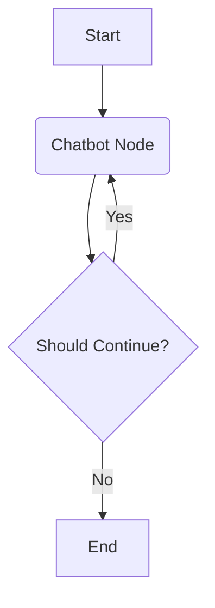

# Module 1: Core Concepts

LangGraph is a framework for building stateful, multi-actor applications with LLMs. It is built on three pillars: **State**, **Nodes**, and **Edges**.



## 1. The State

The state is the "memory" of your application. It is a shared data structure that persists between node executions.

### Basic State

In its simplest form, it's a `TypedDict`. Note that by default, **updates to the state overwrite existing keys**.

```python
from typing import TypedDict

class SimpleState(TypedDict):
    input: str
    output: str
```

### Reducers (`Annotated`)

For things like chat history, you don't want to overwrite the list of messages every time a node runs—you want to **append** to it. You use `Annotated` with a reducer function.

```python
from typing import Annotated
from langgraph.graph.message import add_messages

class ChatState(TypedDict):
    # The `add_messages` reducer handles de-duplication and appending
    messages: Annotated[list, add_messages]
```

## 2. Nodes

Nodes are standard Python functions. They:

1. Receive the current `State` as input.
2. Do work (call LLM, run tool, etc.).
3. Return a dictionary with **state updates**.

```python
def chatbot(state: ChatState):
    user_input = state["messages"][-1]
    # ... logic ...
    return {"messages": [response]} # This updates 'messages' via the reducer
```

## 3. Edges

Edges define the routing logic.

* **`START` Node**: The entry point. You must draw an edge from `START` to your first node.
* **`END` Node**: The exit point. When a node points to `END`, the graph execution stops.
* **Conditional Edges**: Dynamic routing. "If tool called, go to ToolNode, else go to END".

```python
from langgraph.graph import START, END

builder.add_edge(START, "chatbot")
builder.add_conditional_edges("chatbot", should_continue)
```

## 4. Compilation (`.compile()`)

Using `builder.compile()` turns your graph definition into a `CompiledGraph` (a `Runnable`).

* **Validation**: It checks for orphan nodes or missing entry points.
* **Checkpointer**: You can pass a `checkpointer` here to enable persistence (memory).
* **Interrupts**: You can configure `interrupt_before=["tool_node"]` for Human-in-the-Loop.

## 5. Visualization

You can visualize the graph structure to debug your flow.

```python
from IPython.display import Image, display

display(Image(graph.get_graph().draw_mermaid_png()))
```

This renders a flowchart showing nodes and edges, helping you confirm the logic before running.
