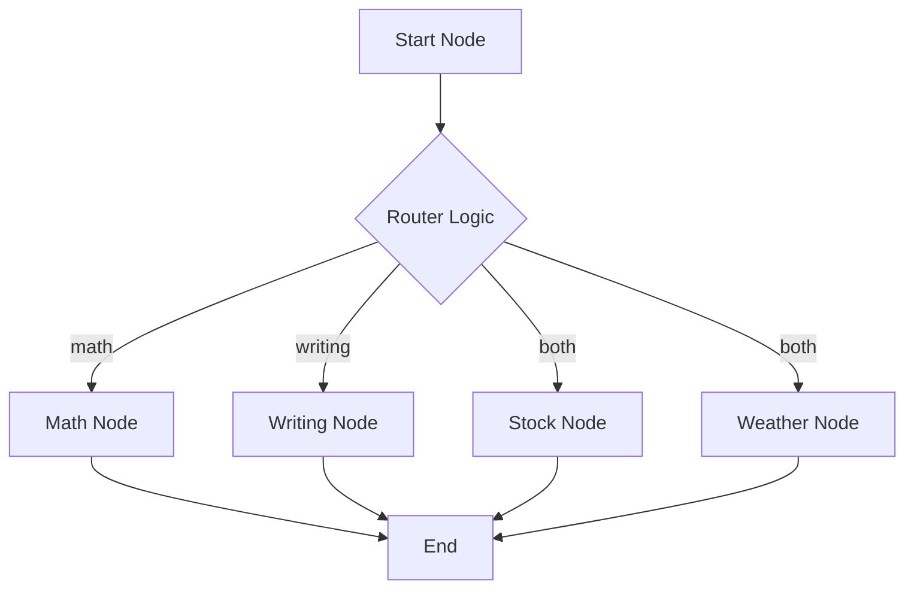

# Module 2: Conditional Logic & Branching

Graph topology isn't static. **Conditional Edges** allow your agent to decide "Where do I go next?" based on the current state.



## 1. `add_conditional_edges`

The core function signatures is:

```python
builder.add_conditional_edges(
    source="start_node",
    path=routing_function,
    path_map={"decision_a": "node_a", "decision_b": "node_b"}  # Optional but recommended
)
```

**Why `path_map`?** It's explicit. If your `routing_function` returns "calculate", `path_map` ensures it maps correctly to "calculator_node".

## 2. Structured Routing (Recommended)

Don't rely on string parsing ("if 'yes' in response"). Use **Structured Output** (Pydantic) to guarantee valid decisions.

```python
from pydantic import BaseModel, Literal

class Route(BaseModel):
    destination: Literal["weather", "stock_market", "general"]

def router(state) -> Route:
    # Force the LLM to return valid JSON matching the schema
    return llm.with_structured_output(Route).invoke(...)

def route_logic(state):
    # The state now cleanly contains the decision
    return state["destination"]
```

## 3. Parallel Execution (Fan-out)

Conditional edges can return a **list** of nodes to run multiple branches in parallel.

```python
def parallel_router(state):
    # Retrieve both stock prices and weather at the same time
    return ["stock_node", "weather_node"]
```

LangGraph will execute both nodes (assuming they are in the same superstep) and merge their state updates.

## 4. Dynamic Sorting (Map-Reduce)

You can even route to the *same* node multiple times with different inputs (advanced), typically using `Send` objects in the "Map-Reduce" pattern (covered in Advanced Patterns).
