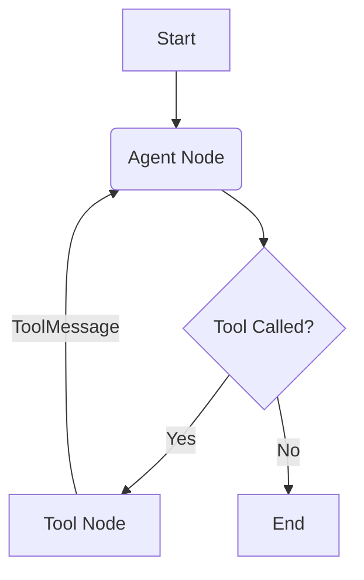

# Module 3: Tool Use (Building Agents)

Tool calling (Function Calling) is the bridge between LLMs and external systems.



## 1. Defining Tools

### Simple Decorator

```python
from langchain_core.tools import tool

@tool
def search(query: str):
    """Search the web for the query."""
    return f"Results for {query}"
```

### Pydantic Args (Recommended)

For complex inputs, explicitly define the schema using Pydantic.

```python
from pydantic import BaseModel, Field

class SearchInput(BaseModel):
    query: str = Field(description="The search term")
    max_results: int = Field(default=5)

@tool("web_search", args_schema=SearchInput)
def search(query: str, max_results: int):
    ...
```

## 2. The ToolNode & ToolMessage

LangGraph's `ToolNode` automates the execution.

1. It inspects the last `AIMessage`.
2. If `tool_calls` are present, it runs the matching functions.
3. It appends a `ToolMessage` to the state for **each** call.

> **Crucial**: The `ToolMessage` must have a `tool_call_id` matching the ID generated by the LLM. `ToolNode` handles this automatically.

## 3. Parallel Tool Calling

Most modern models (GPT-4, Claude 3) support **parallel tool calls**.

* The LLM might request: `[search("weather nyc"), search("stock AAPL")]`.
* `ToolNode` executes them using a `ThreadPoolExecutor` (or `asyncio.gather` if async).
* Multiple `ToolMessage`s are added to the state in one go.

## 4. Error Handling

What if a tool crashes?

* By default, `ToolNode` raises the exception, stopping the graph.
* **Best Practice**: Catch errors inside the tool and return a string like `"Error: Database unavailable"`. This allows the agent to self-correct or apologize to the user.
