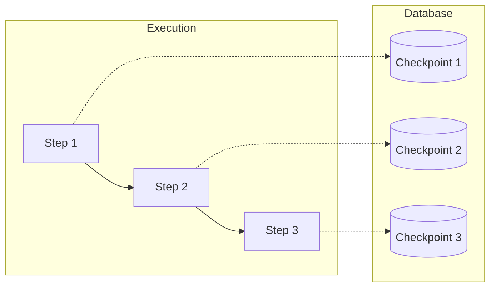

# Module 4: Persistence (Memory & Time Travel)

LangGraph's persistence layer is much more than just saving chat history. It enables **Time Travel**—the ability to inspect, rewind, and edit the state of an agent at any point in time.



## 1. Checkpointers

A `Checkpointer` saves the graph state at every step.

```python
from langgraph.checkpoint.memory import MemorySaver
# OR from langgraph.checkpoint.sqlite import SqliteSaver

checkpointer = MemorySaver()
graph = builder.compile(checkpointer=checkpointer)
```

## 2. Threads and Config

State is isolated by `thread_id`. You must pass this in the configuration.

```python
config = {"configurable": {"thread_id": "conversation_1"}}
graph.invoke(input_data, config=config)
```

## 3. Getting State

You can inspect the current (or past) state of a thread.

```python
# Get the latest state
snapshot = graph.get_state(config)
print(snapshot.values)  # The actual state dict
print(snapshot.next)    # What node is next?
```

## 4. Time Travel

You can view the history of execution.

```python
# List all saved checkpoints
history = list(graph.get_state_history(config))
for snapshot in history:
    print(snapshot.created_at, snapshot.values)
```

## 5. Editing State (The "Human Intervention")

This is the most powerful feature. You can **modify** the state of a thread and then resume execution from there.

### Example: Fixing a mistake

Did the agent take the wrong path? You can manually update the state to "pretend" the agent took the right path.

```python
# 1. Update the state (behaves like a reducer)
graph.update_state(config, {"input": "Corrected Value"})

# 2. Resume execution (it will run the NEXT node with the NEW state)
graph.invoke(None, config=config)
```

### Example: Forking

You can even create a new branch of history by updating the state at a *past* checkpoint using the `checkpoint_id`.
