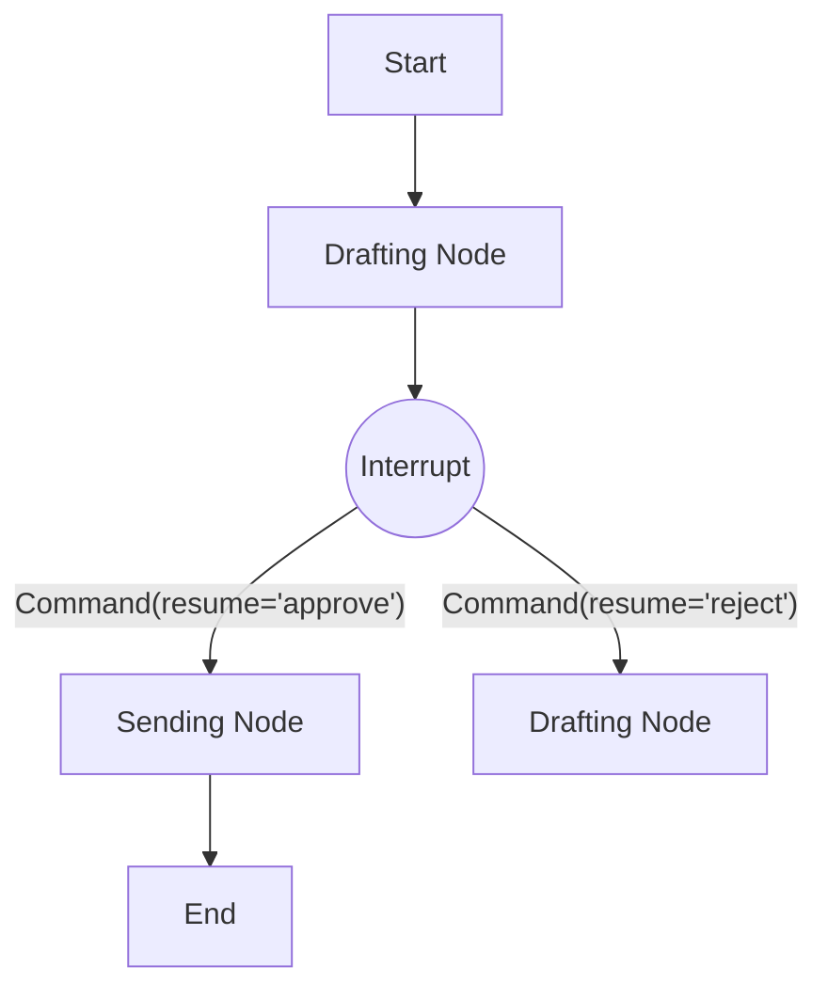

# Module 5: Human-in-the-Loop (HITL)

HITL allows your agents to pause for approval, feedback, or correction.



## 1. Breakpoints

You define where to pause during compilation.

```python
# Pause BEFORE entering specific nodes
graph = builder.compile(
    checkpointer=memory,
    interrupt_before=["approve_transaction"]
)

# Pause AFTER a node finishes
graph = builder.compile(
    checkpointer=memory,
    interrupt_after=["research_node"]
)
```

## 2. Handling the Interrupt

When the graph hits a breakpoint, it suspends execution and saves the state.

1. **Run**: `graph.invoke(..., config=config)` raises a `GraphInterrupt` (or just stops if using async/streaming safe methods).
2. **Inspect**: Check `graph.get_state(config).next` to see you are paused before "approve_transaction".

## 3. Resuming with `Command`

The modern way to resume is using the `Command` object to injection information.

### Simple Resume (Approve)

```python
from langgraph.types import Command

# Resume execution, effectively "unpausing"
graph.invoke(Command(resume="Approved"), config=config)
```

The node that was interrupted needs to handle this value if it expects one, or you can just resume if no value is needed.

### Reject / Edit State

If the human rejects the action, you might want to modify the state and force the agent to try again.

```python
# 1. Update state (e.g., provide user feedback)
graph.update_state(config, {"feedback": "Too expensive, find cheaper options"})

# 2. Resume (potentially steering to a different node)
graph.invoke(Command(resume="Rejected"), config=config)
```

## 4. Dynamic Breakpoints

You can also raise `NodeInterrupt` from *inside* a node to dynamically pause based on data (e.g., "confidence < 0.8").
