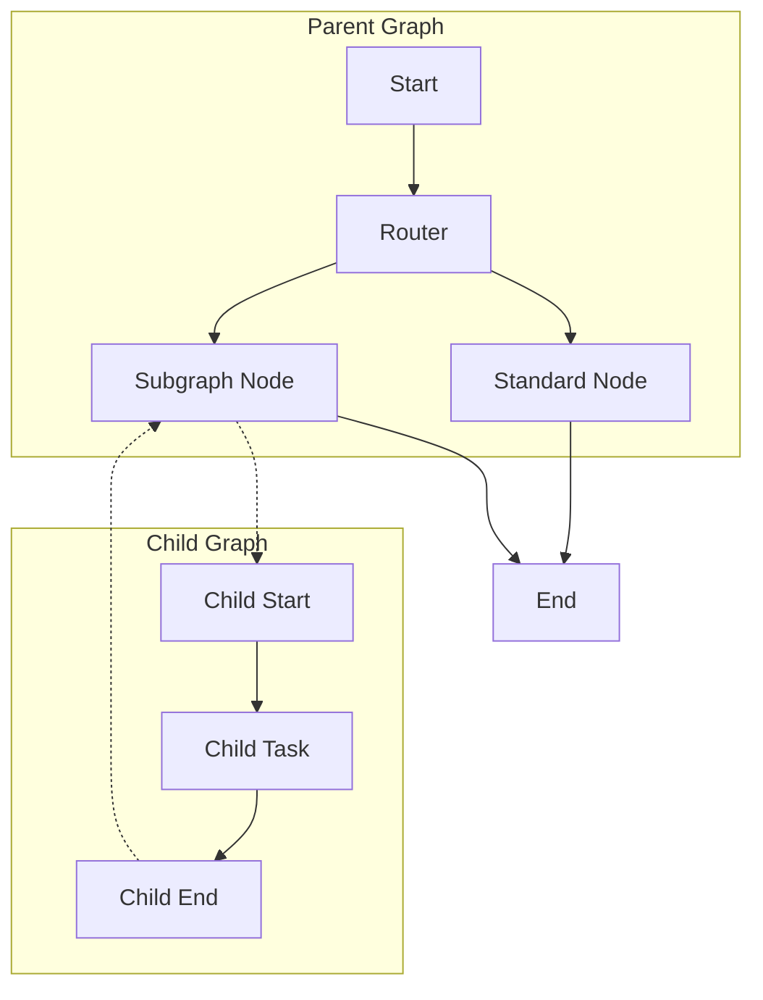
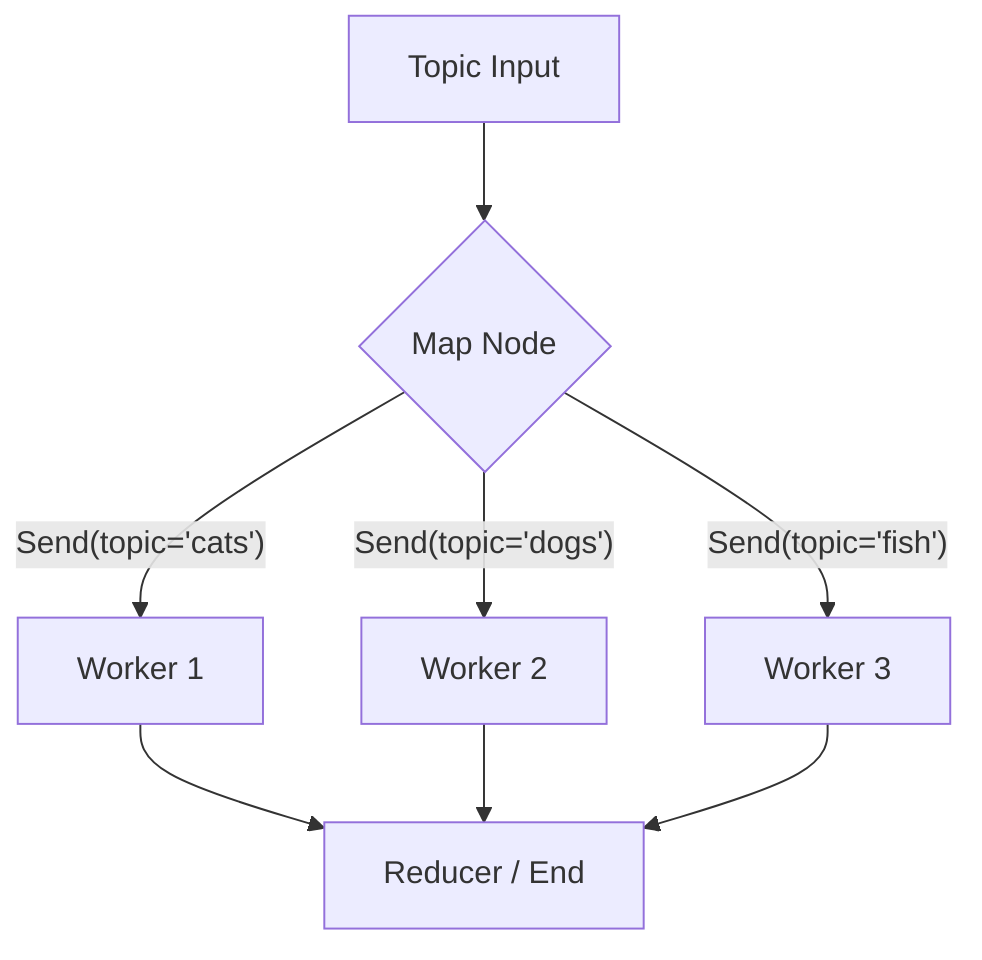

# Module 6: Advanced Patterns & Multi-Agent Systems

## 1. Subgraphs (Hierarchical Agents)

For complex apps, you can treat a graph as a node within another graph.



### Code Example

```python
# 1. Define the Subgraph
sub_builder = StateGraph(SubState)
sub_builder.add_node("sub_task", sub_node)
subgraph = sub_builder.compile()

# 2. Add to Parent Graph
builder.add_node("my_subgraph", subgraph)
```

**State Management**:

* If parent and child schemas match, state passes through automatically.
* If they differ, you write a wrapper function to transform state into the subgraph inputs and back out.

## 2. Map-Reduce (Parallelization)

When you need to process a list of items in parallel (e.g., "Research 5 different companies"), use the `Send` API.



### Code Example

```python
from langgraph.constants import Send

def continue_to_jokes(state: State):
    return [
        Send("generate_joke", {"topic": "cats"}),
        Send("generate_joke", {"topic": "dogs"})
    ]

graph.add_conditional_edges("node_a", continue_to_jokes)
```

**Map**: The router yields multiple `Send` objects.
**Reduce**: The graph waits for all branches to finish before the next synchronized step (if needed) or simply updates the shared state asynchronously.

## 3. The Supervisor Pattern

A single "Boss" LLM decides which worker (or subgraph) to call next.

* **Pros**: Centralized control, easy to reason about.
* **Cons**: The supervisor can become a bottleneck or get confused if there are too many workers.
