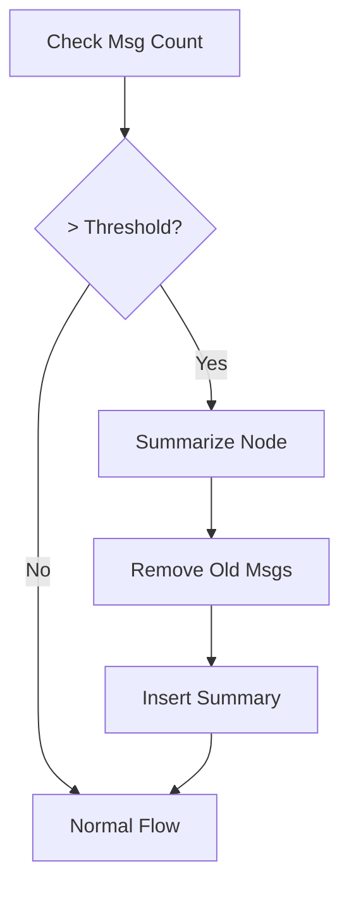

# Module 7: Memory Management

Memory is what allows an agent to maintain coherence over time.

## 1. Types of Memory

### Short-Term Memory (State)

* **What it is**: The `messages` list in your graph state.
* **Storage**: Handled by LangGraph Checkpointers (SQLite, Postgres).
* **Limitation**: Grows indefinitely, eventually hitting context window limits (and costing more).

### Long-Term Memory (External)

* **What it is**: User profiles, past conversation summaries, or document knowledge.
* **Storage**: Vector Databases (Pinecone, Chroma) or traditional DBs.
* **Usage**: You must explicitely **retrieve** this and add it to the state (RAG).

## 2. Managing Short-Term Memory

When the state gets too large, you need strategies to prune it.

### A. Filtering

Only pass the last N messages to the LLM, even if the state retains all of them.

```python
# In your node
messages = state["messages"][-10:] # Last 10
response = llm.invoke(messages)
```

### B. Summarization

Replace older messages with a summary to free up space.



1. **Trigger**: Check if `len(state["messages"]) > 50`.
2. **Summarize**: Ask an LLM to "Summarize these 40 lines".
3. **Prune**: Use `RemoveMessage` to delete the old ones.
4. **Insert**: Add a `SystemMessage(content="Summary: ...")`.

## 3. `RemoveMessage` Logic

To delete messages from the appended list:

```python
from langchain_core.messages import RemoveMessage

def prune_node(state):
    # Find IDs of messages to remove
    ids_to_remove = [m.id for m in state["messages"][:-5]]
    return {"messages": [RemoveMessage(id=i) for i in ids_to_remove]}
```
