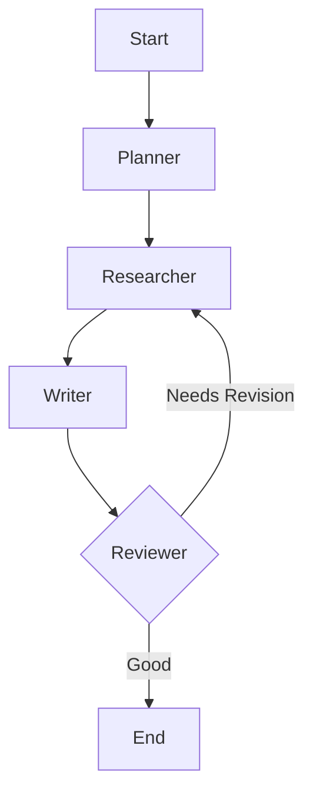

# Module 13: Deep Research (Agentic Patterns)

For complex queries like "Write a report on the latest AI trends in 2025", a single LLM call is insufficient. You need a multi-step workflow. A common pattern (popularized by Stanford's STORM) is **Planner -> Researcher -> Writer -> Reviewer**.

## The Workflow



1. **Planner**: Breaks the vague user request into specific search queries.
2. **Researcher**: Executes these queries (using web search tools) and summarizes the findings.
3. **Writer**: Takes the research notes and writes a first draft.
4. **Reviewer** (Optional): critiques the draft. If it's missing info, it sends the flow back to the **Researcher**.

## State Design

To support this, your `State` needs to hold more than just messages.

```python
class ResearchState(TypedDict):
    task: str              # Original user request
    plan: list[str]        # List of search queries
    content: list[str]     # Gathered information
    draft: str            # Final report
    critique: str         # Reviewer feedback
    revision_count: int   # To prevent infinite loops
```

## Cycles and Graphs

This is where LangGraph shines. You can define a cycle:

```
Planner -> Research -> Write -> Review -> (Decision)
                                  |         |
                                  |         v
                                  <----- Research
```

If the Reviewer says "Good", you go to END. If "Bad", you go back to Research.
