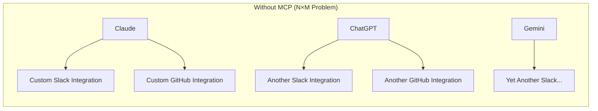
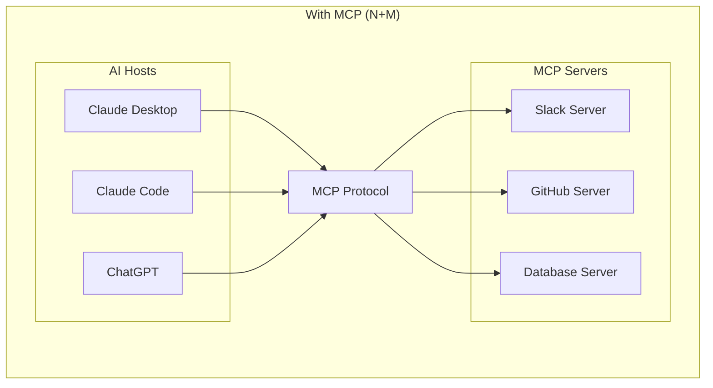
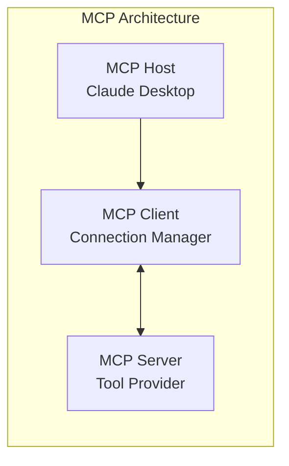
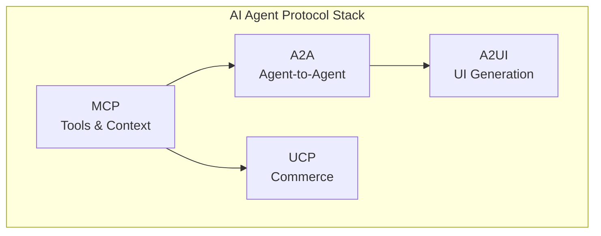

# MCP (Model Context Protocol)

MCP is an open protocol that standardizes how AI applications **connect to external data sources and tools**. It solves the "N×M integration problem" by providing a universal interface.

> [!NOTE]
> **Created by**: Anthropic (November 2024)  
> **Now**: Open-source under Agentic AI Foundation (AAIF)  
> **Adopted by**: OpenAI, Google DeepMind, and major AI platforms

## The Problem

Every AI application needs to connect to external systems:



**Result**: Every AI model needs custom integrations for every tool = exponential complexity.

## The Solution: MCP

MCP provides a **universal protocol** for AI-to-tool communication:



**Result**: Build one MCP server, connect to all AI applications.

## Key Characteristics

| Feature | Description |
|---------|-------------|
| **Open Standard** | Apache 2.0 license, community-driven |
| **JSON-RPC 2.0** | Standard request/response protocol |
| **Three Primitives** | Tools, Resources, Prompts |
| **Two Transports** | Stdio (local), HTTP (remote) |
| **Bidirectional** | Server and client can initiate |

## What MCP Enables

| Use Case | Example |
|----------|---------|
| **Personal AI** | Agent accesses Google Calendar + Notion |
| **Code Generation** | Claude Code uses Figma designs |
| **Enterprise** | Chatbots query multiple databases |
| **Creative** | AI creates 3D designs in Blender |

## Core Concepts at a Glance

### Participants



| Participant | Role | Example |
|-------------|------|---------|
| **Host** | AI application | Claude Desktop, VS Code |
| **Client** | Connection manager | Built into host |
| **Server** | Tool/data provider | Slack, GitHub, local files |

### Primitives

| Primitive | Purpose | Direction |
|-----------|---------|-----------|
| **Tools** | Functions the AI can call | Server → AI |
| **Resources** | Data the AI can read | Server → AI |
| **Prompts** | Templates for interaction | Server → AI |

### Example: Tool Call

```json
{
    "jsonrpc": "2.0",
    "method": "tools/call",
    "params": {
        "name": "send_slack_message",
        "arguments": {
            "channel": "#general",
            "message": "Hello from AI!"
        }
    },
    "id": 1
}
```

## Transport Options

| Transport | Use Case | Characteristics |
|-----------|----------|-----------------|
| **Stdio** | Local processes | Fast, no network |
| **HTTP + SSE** | Remote servers | Streaming support |

## Protocol Relationships



- **MCP**: Connect AI to tools and data
- **A2A**: Connect AI agents to each other
- **A2UI**: Render UI from AI responses
- **UCP**: Commerce-specific operations

## Quick Start

```bash
# Install MCP SDK
pip install mcp

# Run a simple server
python my_mcp_server.py
```

## Next Steps

| Document | Description |
|----------|-------------|
| [01_architecture.md](./01_architecture.md) | Host, Client, Server details |
| [02_primitives.md](./02_primitives.md) | Tools, Resources, Prompts |
| [03_transports.md](./03_transports.md) | Stdio, HTTP, SSE |
| [04_building_servers.md](./04_building_servers.md) | Server implementation |
| [05_pros_and_cons.md](./05_pros_and_cons.md) | Analysis |
