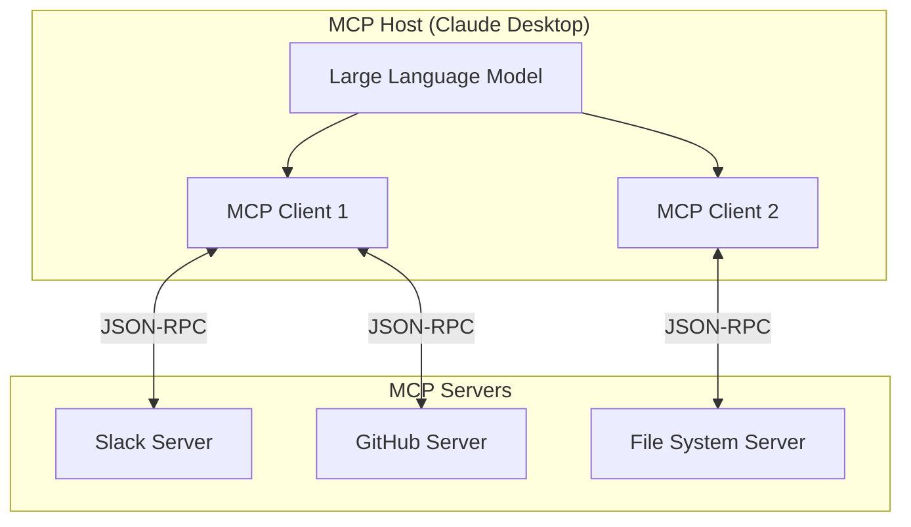
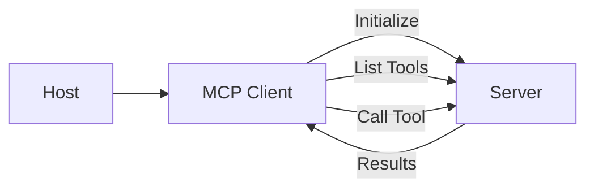
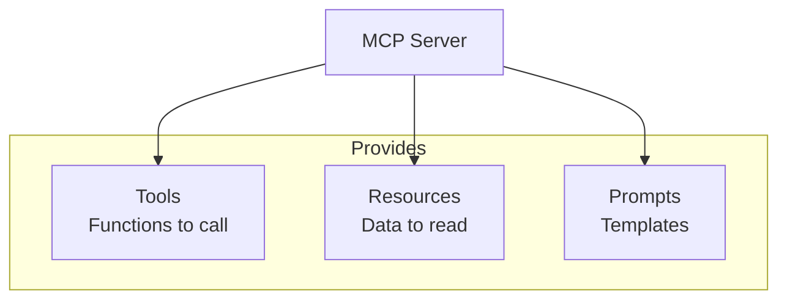
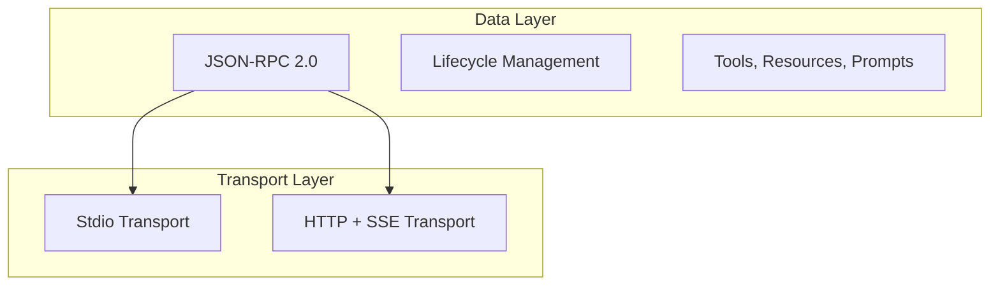
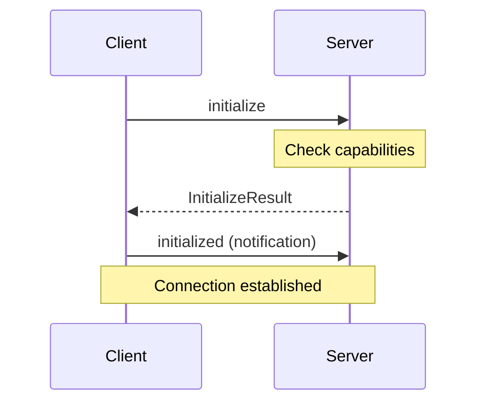
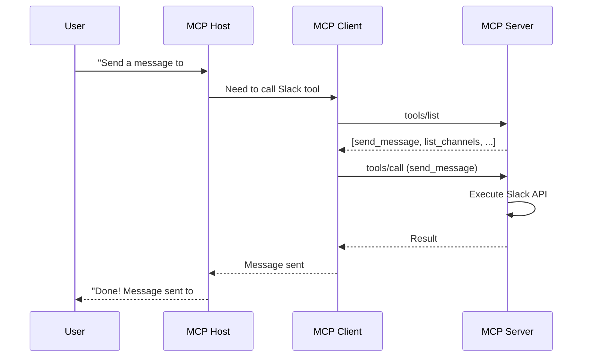

# MCP Architecture

MCP uses a **client-server architecture** organized into two layers: data and transport.

## Architecture Overview



---

## Participants

### MCP Host

The **Host** is the AI application that coordinates everything.

| Responsibility | Example |
|----------------|---------|
| Contains the LLM | Claude, GPT-4 |
| Manages MCP clients | Connection lifecycle |
| Routes tool calls | Decides which server to call |
| Presents results | Shows data to user |

**Examples**: Claude Desktop, Claude Code, VS Code with Copilot

### MCP Client

The **Client** maintains connections to MCP servers.



| Responsibility | Description |
|----------------|-------------|
| Connection management | Connect, reconnect, disconnect |
| Capability negotiation | What does server support? |
| Message routing | Send requests, receive responses |
| Error handling | Timeouts, retries |

### MCP Server

The **Server** provides tools, resources, and prompts.



**Examples**:

- [Sentry MCP Server](https://docs.sentry.io/product/sentry-mcp/)
- [Filesystem Server](https://github.com/modelcontextprotocol/servers/tree/main/src/filesystem)
- Custom business servers

---

## Layers

MCP has two protocol layers:



### Data Layer

Built on **JSON-RPC 2.0**, the data layer handles:

| Component | Purpose |
|-----------|---------|
| **Lifecycle** | Initialize, negotiate, terminate |
| **Server Features** | Tools, Resources, Prompts |
| **Client Features** | Sampling, logging |
| **Utilities** | Notifications, progress |

#### Request Format

```json
{
    "jsonrpc": "2.0",
    "method": "tools/list",
    "params": {},
    "id": 1
}
```

#### Response Format

```json
{
    "jsonrpc": "2.0",
    "result": {
        "tools": [
            {
                "name": "send_email",
                "description": "Send an email",
                "inputSchema": {...}
            }
        ]
    },
    "id": 1
}
```

### Transport Layer

| Transport | Description | Use Case |
|-----------|-------------|----------|
| **Stdio** | Standard I/O streams | Local processes |
| **HTTP + SSE** | HTTP POST + Server-Sent Events | Remote servers |

---

## Lifecycle

### Connection Initialization



### Initialize Request

```json
{
    "jsonrpc": "2.0",
    "method": "initialize",
    "params": {
        "protocolVersion": "2024-11-05",
        "capabilities": {
            "tools": {},
            "resources": {}
        },
        "clientInfo": {
            "name": "Claude Desktop",
            "version": "1.0.0"
        }
    },
    "id": 1
}
```

### Initialize Response

```json
{
    "jsonrpc": "2.0",
    "result": {
        "protocolVersion": "2024-11-05",
        "capabilities": {
            "tools": {"listChanged": true},
            "resources": {"subscribe": true}
        },
        "serverInfo": {
            "name": "Slack MCP Server",
            "version": "1.0.0"
        }
    },
    "id": 1
}
```

---

## Capability Negotiation

Both client and server declare what they support:

### Server Capabilities

| Capability | Description |
|------------|-------------|
| `tools` | Server provides tools |
| `tools.listChanged` | Server notifies when tools change |
| `resources` | Server provides resources |
| `resources.subscribe` | Client can subscribe to changes |
| `prompts` | Server provides prompts |

### Client Capabilities

| Capability | Description |
|------------|-------------|
| `sampling` | Client can sample from LLM |
| `roots` | Client provides filesystem roots |

---

## Message Flow Example



---

## Summary

| Component | Role |
|-----------|------|
| **Host** | AI app (Claude Desktop) |
| **Client** | Connection manager |
| **Server** | Tool/data provider |
| **Data Layer** | JSON-RPC messages |
| **Transport** | Stdio or HTTP |

> [!TIP]
> For local tools (file access, CLI), use **Stdio transport**. For remote services (APIs, databases), use **HTTP transport**.
