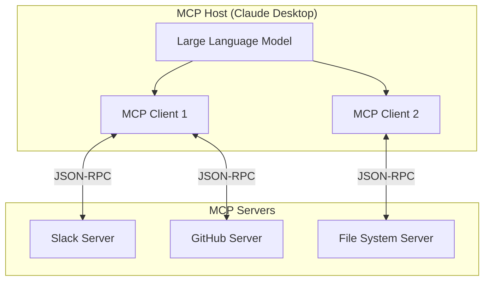
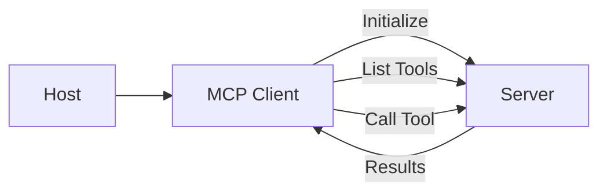
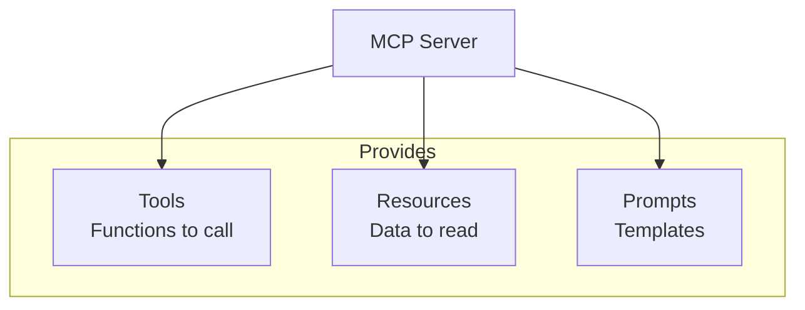
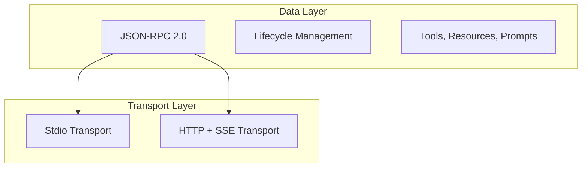
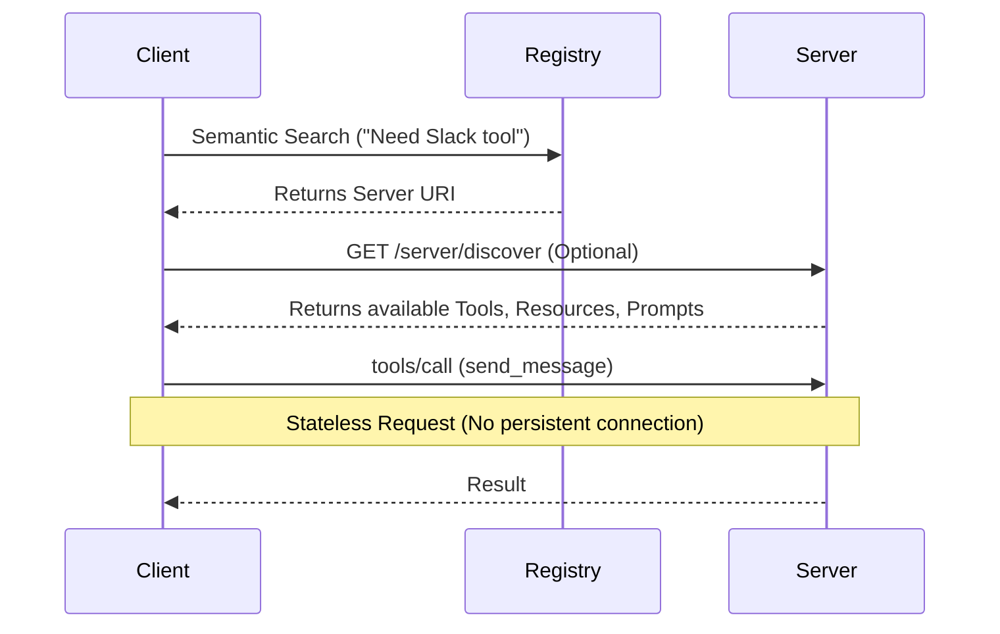
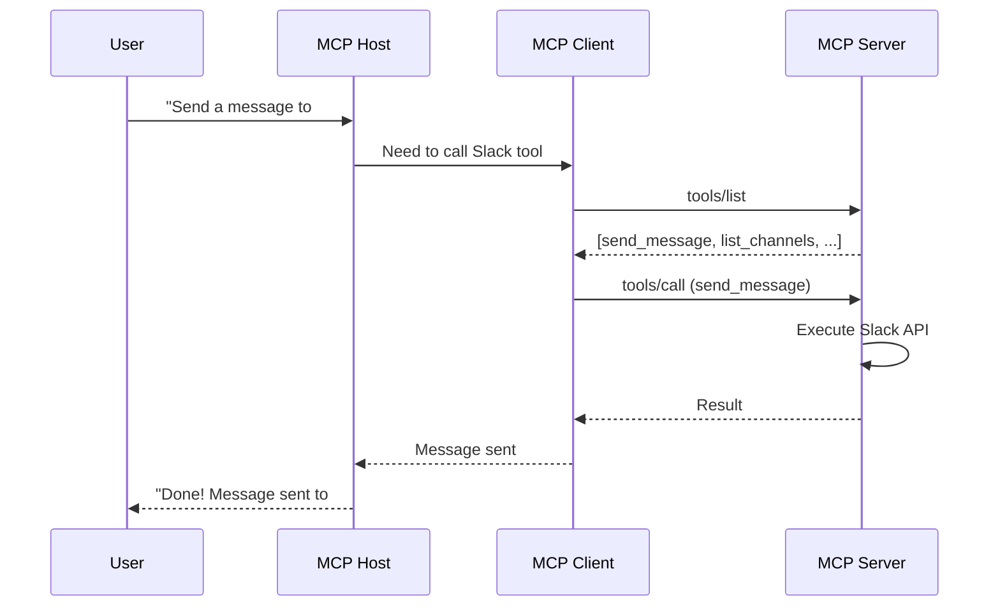

# MCP Architecture

MCP uses a **client-server architecture** organized into two layers: data and transport.

## Architecture Overview


```mermaid
graph TB
    subgraph "MCP Host (Claude Desktop)"
        LLM[Large Language Model]
        Client1[MCP Client 1]
        Client2[MCP Client 2]
    end
    
    subgraph "MCP Servers"
        Server1[Slack Server]
        Server2[GitHub Server]
        Server3[File System Server]
    end
    
    LLM --> Client1
    LLM --> Client2
    Client1 <-->|JSON-RPC| Server1
    Client1 <-->|JSON-RPC| Server2
    Client2 <-->|JSON-RPC| Server3
```

---

## Participants

### MCP Host

The **Host** is the AI application that coordinates everything.

| Responsibility | Example |
|----------------|---------|
| Contains the LLM | Claude, GPT-4 |
| Manages MCP clients | Connection lifecycle |
| Routes tool calls | Decides which server to call |
| Presents results | Shows data to user |

**Examples**: Claude Desktop, Claude Code, VS Code with Copilot

### MCP Client

The **Client** maintains connections to MCP servers.


```mermaid
graph LR
    Host[Host] --> Client[MCP Client]
    Client --> |Initialize| Server
    Client --> |List Tools| Server
    Client --> |Call Tool| Server
    Server --> |Results| Client
```

| Responsibility | Description |
|----------------|-------------|
| Connection management | Connect, reconnect, disconnect |
| Capability negotiation | What does server support? |
| Message routing | Send requests, receive responses |
| Error handling | Timeouts, retries |

### MCP Server

The **Server** provides tools, resources, and prompts.


```mermaid
graph TB
    Server[MCP Server]
    
    subgraph "Provides"
        T[Tools<br/>Functions to call]
        R[Resources<br/>Data to read]
        P[Prompts<br/>Templates]
    end
    
    Server --> T
    Server --> R
    Server --> P
```

**Examples**:

- [Sentry MCP Server](https://docs.sentry.io/product/sentry-mcp/)
- [Filesystem Server](https://github.com/modelcontextprotocol/servers/tree/main/src/filesystem)
- Custom business servers

---

## Layers

MCP has two protocol layers:


```mermaid
graph TB
    subgraph "Data Layer"
        JSONRPC[JSON-RPC 2.0]
        Lifecycle[Lifecycle Management]
        Primitives[Tools, Resources, Prompts]
    end
    
    subgraph "Transport Layer"
        Stdio[Stdio Transport]
        HTTP[HTTP + SSE Transport]
    end
    
    JSONRPC --> Stdio
    JSONRPC --> HTTP
```

### Data Layer

Built on **JSON-RPC 2.0**, the data layer handles:

| Component | Purpose |
|-----------|---------|
| **Lifecycle** | Initialize, negotiate, terminate |
| **Server Features** | Tools, Resources, Prompts |
| **Client Features** | Sampling, logging |
| **Utilities** | Notifications, progress |

#### Request Format

```json
{
    "jsonrpc": "2.0",
    "method": "tools/list",
    "params": {},
    "id": 1
}
```

#### Response Format

```json
{
    "jsonrpc": "2.0",
    "result": {
        "tools": [
            {
                "name": "send_email",
                "description": "Send an email",
                "inputSchema": {...}
            }
        ]
    },
    "id": 1
}
```

### Transport Layer

| Transport | Description | Use Case |
|-----------|-------------|----------|
| **Stdio** | Standard I/O streams | Local processes |
| **HTTP + SSE** | HTTP POST + Server-Sent Events | Remote servers |

---

## Lifecycle and Capability Discovery

> [!NOTE]  
> As of the **2026-07-28 update**, MCP transitioned to a **stateless request/response model**. The legacy stateful handshake (e.g., `initialize`, `initialized`, `Mcp-Session-Id`) has been removed in favor of self-describing requests and on-demand discovery.

### On-Demand Discovery

Because connections are stateless, capability negotiation is no longer an upfront handshake. Instead, it relies on **Progressive Discovery**:

1. **Self-Describing Requests:** Every request is inherently self-describing.
2. **The `server/discover` Endpoint:** Clients can call this endpoint at any time to fetch the server's available capabilities. 


```mermaid
sequenceDiagram
    participant Client
    participant Registry
    participant Server
    
    Client->>Registry: Semantic Search ("Need Slack tool")
    Registry-->>Client: Returns Server URI
    
    Client->>Server: GET /server/discover (Optional)
    Server-->>Client: Returns available Tools, Resources, Prompts
    
    Client->>Server: tools/call (send_message)
    Note over Client,Server: Stateless Request (No persistent connection)
    Server-->>Client: Result
```

### Server Capabilities (Discovered On-Demand)

When queried, a server can reveal:

| Capability | Description |
|------------|-------------|
| `tools` | Server provides deterministic functions |
| `resources` | Server provides data or skill instructions (`SKILL.md`) |
| `prompts` | Server provides prompt templates |

This progressive approach prevents overwhelming the LLM's context window by only surfacing capabilities when the agent's intent dictates it.

---

## Message Flow Example


```mermaid
sequenceDiagram
    participant User
    participant Host as MCP Host
    participant Client as MCP Client
    participant Server as MCP Server
    
    User->>Host: "Send a message to #general"
    Host->>Client: Need to call Slack tool
    
    Client->>Server: tools/list
    Server-->>Client: [send_message, list_channels, ...]
    
    Client->>Server: tools/call (send_message)
    Server->>Server: Execute Slack API
    Server-->>Client: Result
    
    Client-->>Host: Message sent
    Host-->>User: "Done! Message sent to #general"
```

---

## Summary

| Component | Role |
|-----------|------|
| **Host** | AI app (Claude Desktop) |
| **Client** | Connection manager |
| **Server** | Tool/data provider |
| **Data Layer** | JSON-RPC messages |
| **Transport** | Stdio or HTTP |

> [!TIP]
> For local tools (file access, CLI), use **Stdio transport**. For remote services (APIs, databases), use **HTTP transport**.
