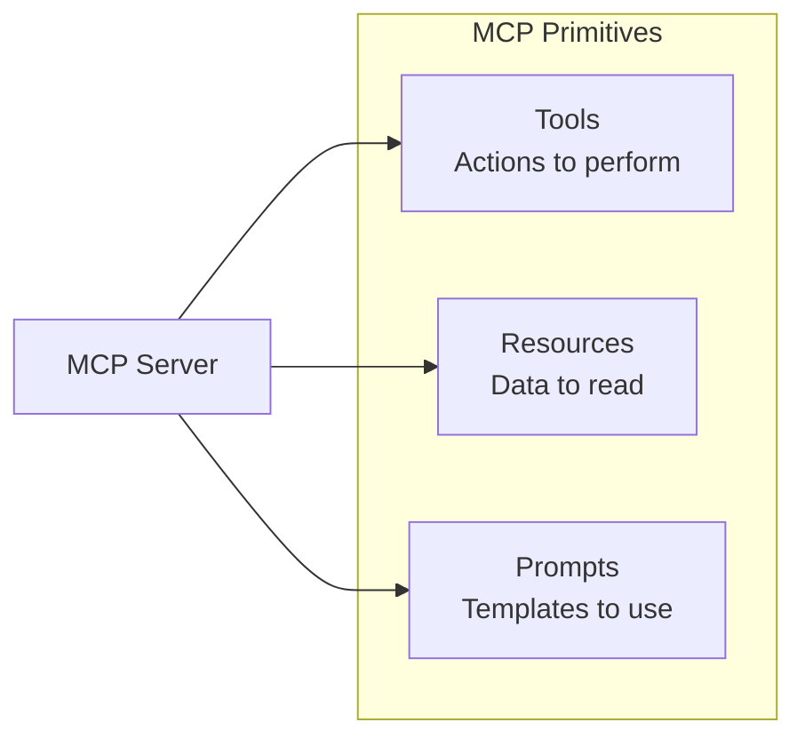
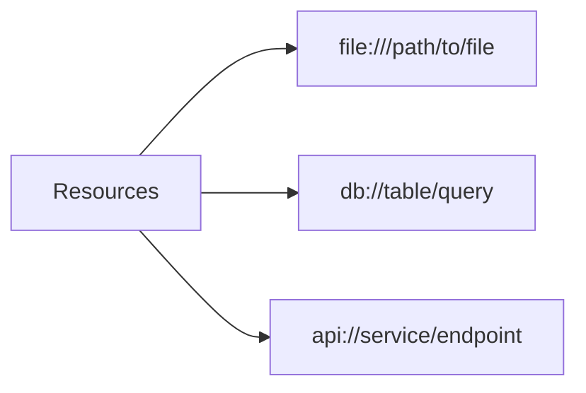
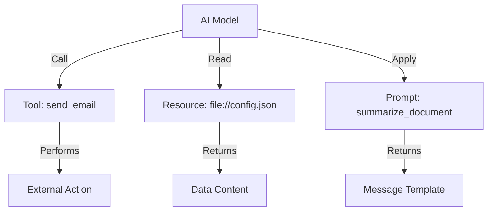

# MCP Primitives

MCP servers expose three types of primitives to AI applications: **Tools**, **Resources**, and **Prompts**.

## Overview



| Primitive | Purpose | Example |
|-----------|---------|---------|
| **Tools**     | Functions the AI can call | `send_email`, `query_database` |
| **Resources** | Data the AI can read      | Files, API responses           |
| **Prompts**   | Reusable templates        | "Summarize this document"      |

---

## 1. Tools

**Tools** are functions that an AI model can call to perform actions.

### Tool Definition

```json
{
    "name": "send_slack_message",
    "description": "Send a message to a Slack channel",
    "inputSchema": {
        "type": "object",
        "properties": {
            "channel": {
                "type": "string",
                "description": "Channel name (e.g., #general)"
            },
            "message": {
                "type": "string",
                "description": "Message content"
            }
        },
        "required": ["channel", "message"]
    }
}
```

### Listing Tools

**Request:**

```json
{
    "jsonrpc": "2.0",
    "method": "tools/list",
    "params": {},
    "id": 1
}
```

**Response:**

```json
{
    "jsonrpc": "2.0",
    "result": {
        "tools": [
            {
                "name": "send_slack_message",
                "description": "Send a message to Slack",
                "inputSchema": {...}
            },
            {
                "name": "list_channels",
                "description": "List available Slack channels",
                "inputSchema": {...}
            }
        ]
    },
    "id": 1
}
```

### Calling Tools

**Request:**

```json
{
    "jsonrpc": "2.0",
    "method": "tools/call",
    "params": {
        "name": "send_slack_message",
        "arguments": {
            "channel": "#general",
            "message": "Hello from AI!"
        }
    },
    "id": 2
}
```

**Response:**

```json
{
    "jsonrpc": "2.0",
    "result": {
        "content": [
            {
                "type": "text",
                "text": "Message sent successfully to #general"
            }
        ]
    },
    "id": 2
}
```

### Tool Result Types

| Type       | Content                 |
|------------|-------------------------|
| `text`     | Plain text response     |
| `image`    | Base64-encoded image    |
| `resource` | Reference to a resource |

---

## 2. Resources

**Resources** are data that an AI model can read. They're identified by URIs.

### Resource Types



### Listing Resources

**Request:**

```json
{
    "jsonrpc": "2.0",
    "method": "resources/list",
    "params": {},
    "id": 1
}
```

**Response:**

```json
{
    "jsonrpc": "2.0",
    "result": {
        "resources": [
            {
                "uri": "file:///Users/me/project/README.md",
                "name": "Project README",
                "mimeType": "text/markdown"
            },
            {
                "uri": "db://users/recent",
                "name": "Recent Users",
                "mimeType": "application/json"
            }
        ]
    },
    "id": 1
}
```

### Reading Resources

**Request:**

```json
{
    "jsonrpc": "2.0",
    "method": "resources/read",
    "params": {
        "uri": "file:///Users/me/project/README.md"
    },
    "id": 2
}
```

**Response:**

```json
{
    "jsonrpc": "2.0",
    "result": {
        "contents": [
            {
                "uri": "file:///Users/me/project/README.md",
                "mimeType": "text/markdown",
                "text": "# My Project\n\nThis is a..."
            }
        ]
    },
    "id": 2
}
```

### Resource Subscriptions

Clients can subscribe to resource changes:

```json
{
    "jsonrpc": "2.0",
    "method": "resources/subscribe",
    "params": {
        "uri": "file:///Users/me/project/config.json"
    },
    "id": 3
}
```

When the resource changes, server sends notification:

```json
{
    "jsonrpc": "2.0",
    "method": "notifications/resources/updated",
    "params": {
        "uri": "file:///Users/me/project/config.json"
    }
}
```

---

## 3. Prompts

**Prompts** are reusable templates that guide AI interactions.

### Prompt Definition

```json
{
    "name": "summarize_document",
    "description": "Summarize a document with configurable length",
    "arguments": [
        {
            "name": "document_uri",
            "description": "URI of document to summarize",
            "required": true
        },
        {
            "name": "length",
            "description": "Summary length: short, medium, long",
            "required": false
        }
    ]
}
```

### Listing Prompts

**Response:**

```json
{
    "jsonrpc": "2.0",
    "result": {
        "prompts": [
            {
                "name": "summarize_document",
                "description": "Summarize a document"
            },
            {
                "name": "code_review",
                "description": "Review code for issues"
            }
        ]
    },
    "id": 1
}
```

### Getting a Prompt

**Request:**

```json
{
    "jsonrpc": "2.0",
    "method": "prompts/get",
    "params": {
        "name": "summarize_document",
        "arguments": {
            "document_uri": "file:///report.pdf",
            "length": "short"
        }
    },
    "id": 2
}
```

**Response:**

```json
{
    "jsonrpc": "2.0",
    "result": {
        "messages": [
            {
                "role": "user",
                "content": {
                    "type": "text",
                    "text": "Please provide a short summary of the following document:"
                }
            },
            {
                "role": "user",
                "content": {
                    "type": "resource",
                    "resource": {
                        "uri": "file:///report.pdf",
                        "mimeType": "application/pdf"
                    }
                }
            }
        ]
    },
    "id": 2
}
```

---

## Primitive Comparison

| Aspect | Tools | Resources | Prompts |
|--------|-------|-----------|---------|
| **Purpose**   | Execute actions            | Read data       | Guide interaction |
| **Direction** | Client → Server → External | Client ← Server | Client ← Server   |
| **Examples**  | Send email, query DB       | Files, API data | Templates         |
| **Stateful**  | Can modify state           | Read-only       | Read-only         |

---

## Summary



> [!TIP]
> Use **Tools** for actions, **Resources** for data access, and **Prompts** for reusable AI instructions.

---

## 4. MCP Apps (UI)

MCP also supports **MCP Apps** (also known as MCP-UI), which allows tools to specify a user interface. This is done by linking a **Tool** to a **Resource** containing HTML/JS via a `_meta` tag.

For more details, see [MCP Apps](./06_mcp_app.md).
