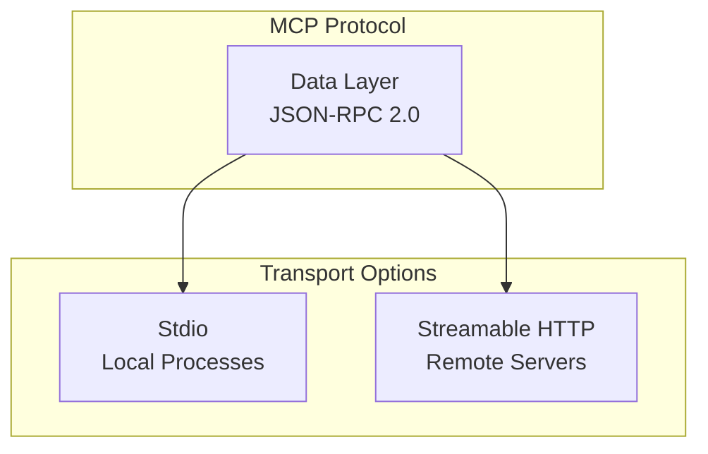
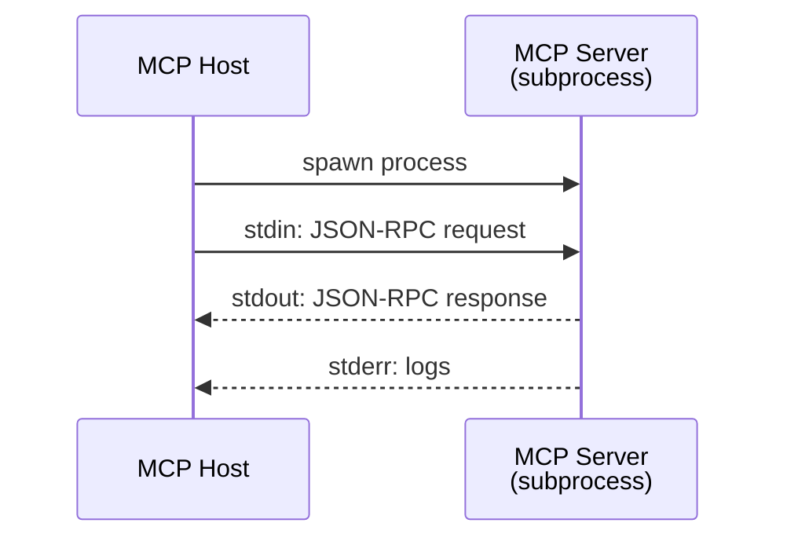
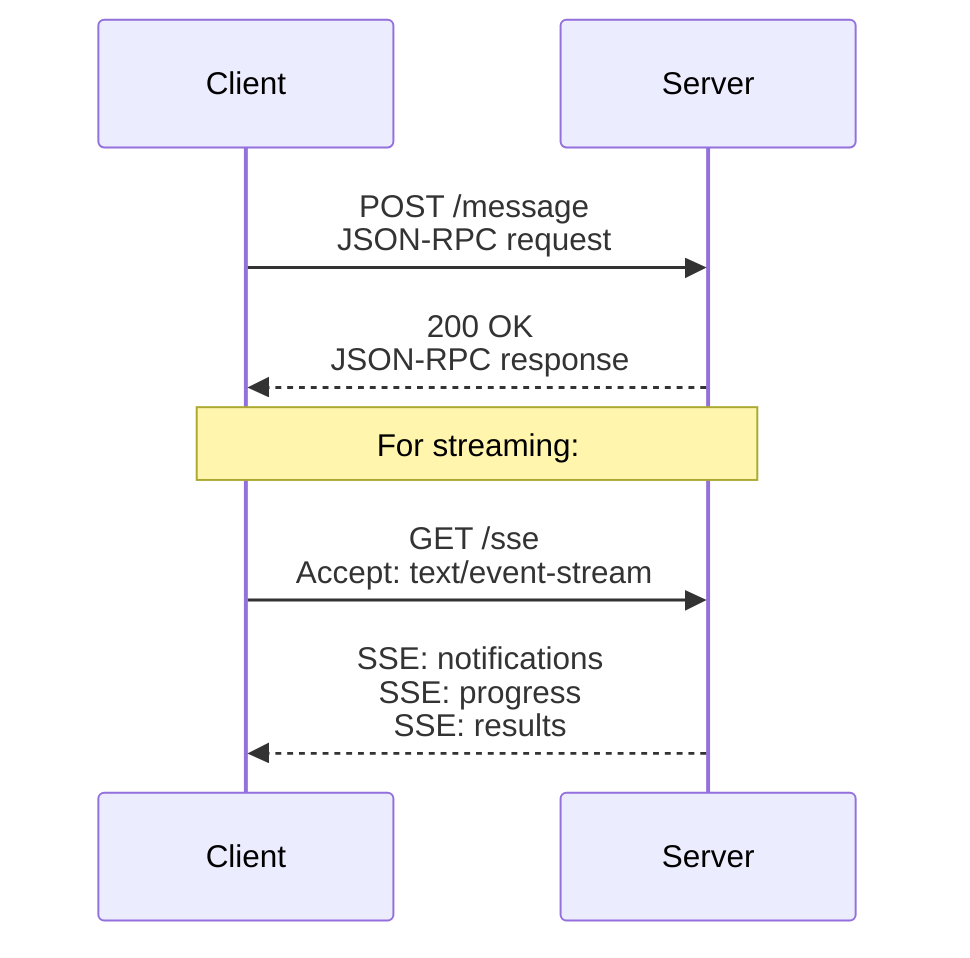
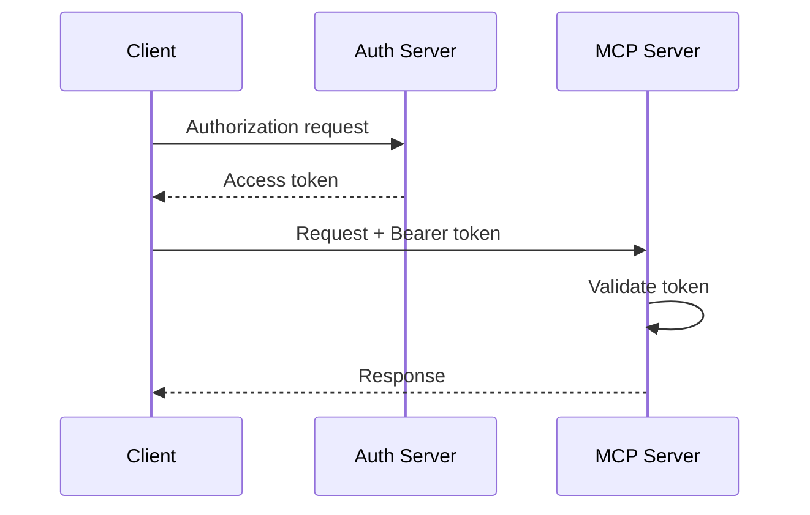
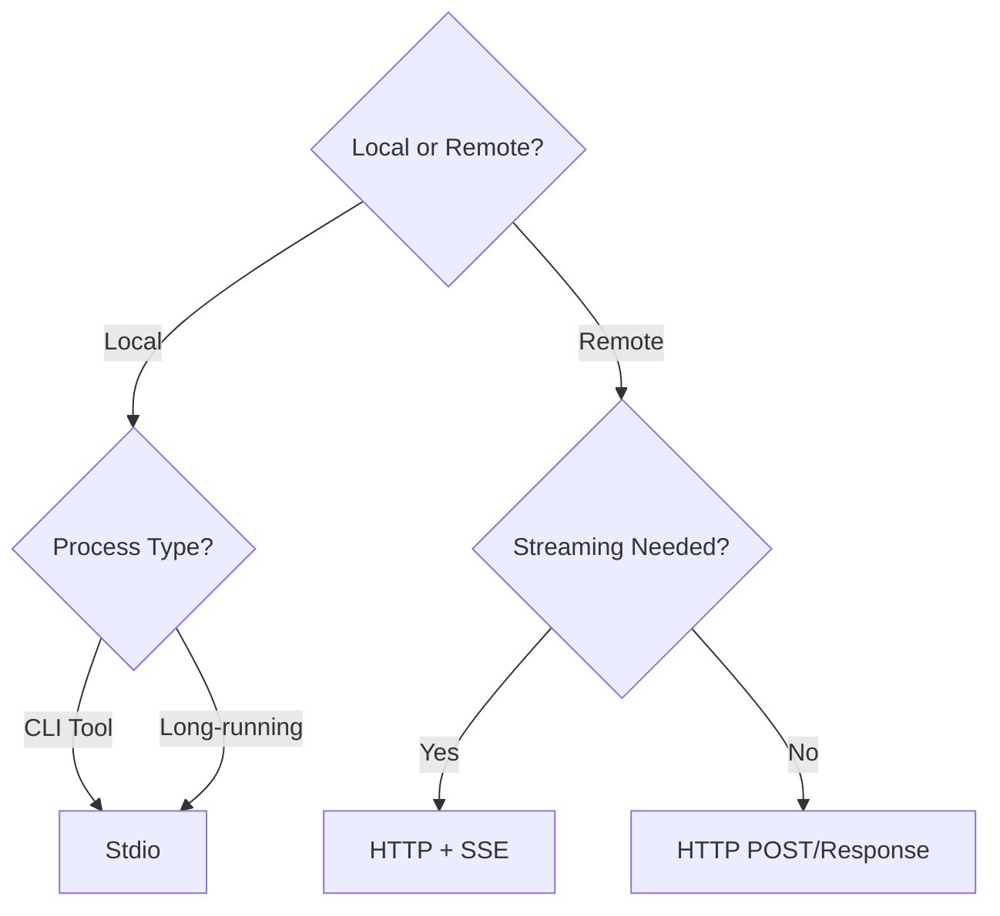

# MCP Transports

MCP supports multiple transport mechanisms for client-server communication.

## Overview



| Transport | Use Case | Performance |
|-----------|----------|-------------|
| **Stdio** | Local tools, CLI | Fastest |
| **Streamable HTTP** | Remote servers, APIs | Network latency |

---

## 1. Stdio Transport

Standard input/output streams for **local process communication**.

### How It Works



### Characteristics

| Aspect | Value |
|--------|-------|
| **Latency** | Minimal (no network) |
| **Security** | Process isolation |
| **Use Case** | Local file access, CLI tools |
| **Message Framing** | Newline-delimited JSON |

### Configuration Example

```json
{
    "mcpServers": {
        "filesystem": {
            "command": "npx",
            "args": ["-y", "@modelcontextprotocol/server-filesystem", "/Users/me/projects"]
        },
        "git": {
            "command": "python",
            "args": ["/path/to/git_server.py"]
        }
    }
}
```

### Message Format

Messages are newline-delimited JSON:

```
{"jsonrpc":"2.0","method":"tools/list","params":{},"id":1}\n
{"jsonrpc":"2.0","result":{"tools":[...]},"id":1}\n
```

---

## 2. Streamable HTTP Transport

HTTP with **Server-Sent Events (SSE)** for streaming responses.

### How It Works



### Characteristics

| Aspect | Value |
|--------|-------|
| **Latency** | Network-dependent |
| **Security** | TLS, Bearer tokens |
| **Use Case** | Remote APIs, cloud services |
| **Streaming** | SSE for real-time updates |

### Endpoints

| Endpoint | Method | Purpose |
|----------|--------|---------|
| `/message` | POST | Send JSON-RPC request |
| `/sse` | GET | Subscribe to server events |

### Request Example

```http
POST /message HTTP/1.1
Host: mcp.example.com
Content-Type: application/json
Authorization: Bearer <token>

{
    "jsonrpc": "2.0",
    "method": "tools/call",
    "params": {
        "name": "search_database",
        "arguments": {"query": "users"}
    },
    "id": 1
}
```

### SSE Stream Example

```http
GET /sse HTTP/1.1
Host: mcp.example.com
Accept: text/event-stream
Authorization: Bearer <token>
```

```
event: message
data: {"jsonrpc":"2.0","method":"notifications/progress","params":{"progress":50}}

event: message
data: {"jsonrpc":"2.0","result":{"content":[...]},"id":1}
```

---

## Authentication

### HTTP Transport Auth

| Method | Header | Use Case |
|--------|--------|----------|
| **Bearer Token** | `Authorization: Bearer <token>` | OAuth tokens |
| **API Key** | `X-API-Key: <key>` | Simple auth |
| **Custom** | Custom headers | Enterprise SSO |

### OAuth 2.0 Flow



---

## Transport Selection Guide



| Scenario | Recommended Transport |
|----------|----------------------|
| Local file access | Stdio |
| Git operations | Stdio |
| Database queries | Stdio (local) or HTTP (remote) |
| Cloud API | HTTP + SSE |
| Real-time data | HTTP + SSE |

---

## Transport Comparison

| Feature | Stdio | HTTP + SSE |
|---------|-------|------------|
| **Setup** | Spawn process | HTTP client |
| **Latency** | ~0ms | Network RTT |
| **Streaming** | stdout | SSE |
| **Auth** | N/A (local) | Bearer, API key |
| **Firewall** | No issues | Port access |
| **Scalability** | 1:1 | N:1 possible |

---

## Implementation Notes

### Stdio Server (Python)

```python
import sys
import json

def handle_request(request):
    # Process JSON-RPC request
    return {"jsonrpc": "2.0", "result": {...}, "id": request["id"]}

# Read from stdin, write to stdout
for line in sys.stdin:
    request = json.loads(line)
    response = handle_request(request)
    print(json.dumps(response), flush=True)
```

### HTTP Server (Python)

```python
from flask import Flask, request, Response

app = Flask(__name__)

@app.route("/message", methods=["POST"])
def message():
    rpc_request = request.json
    result = handle_request(rpc_request)
    return result

@app.route("/sse")
def sse():
    def generate():
        while True:
            yield f"event: message\ndata: {json.dumps(notification)}\n\n"
    return Response(generate(), mimetype="text/event-stream")
```

---

## Summary

| Transport | Best For | Complexity |
|-----------|----------|------------|
| **Stdio** | Local tools, fast | Low |
| **HTTP + SSE** | Remote, streaming | Medium |

> [!TIP]
> Start with **Stdio** for development. Migrate to **HTTP** when you need remote access or scaling.
