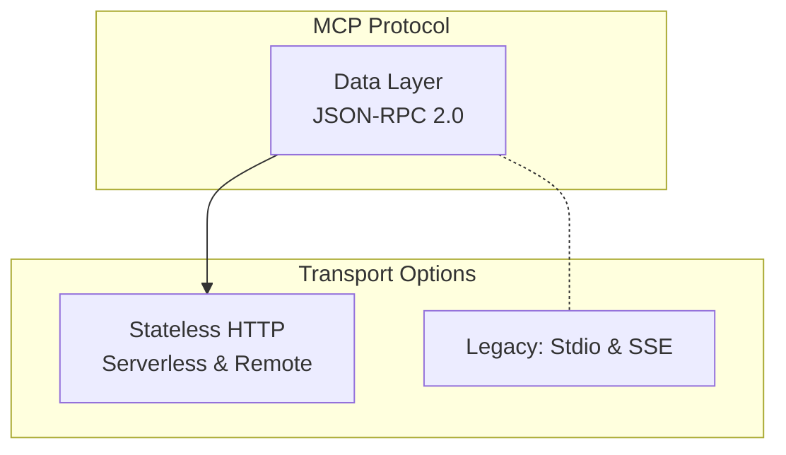
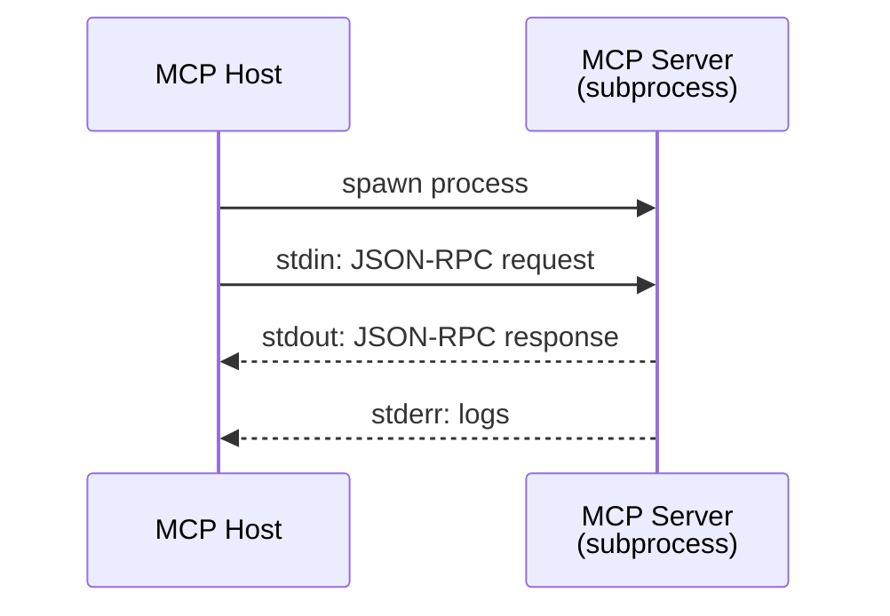
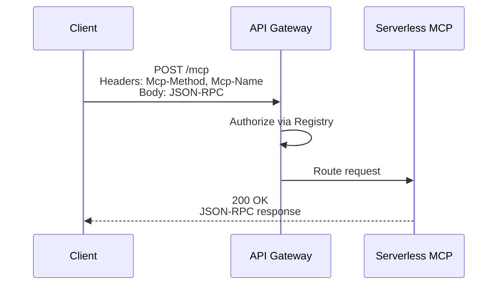
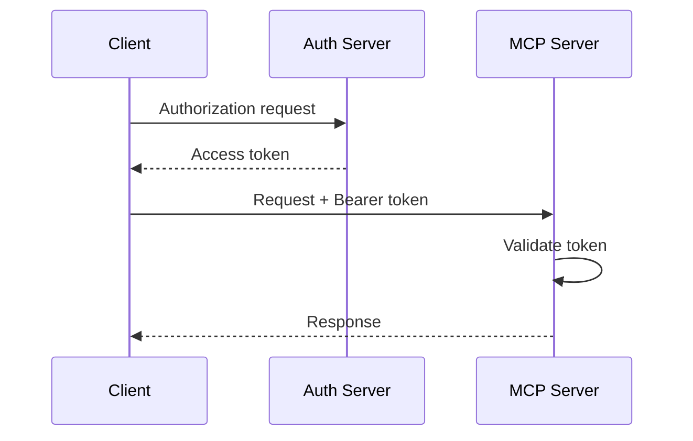
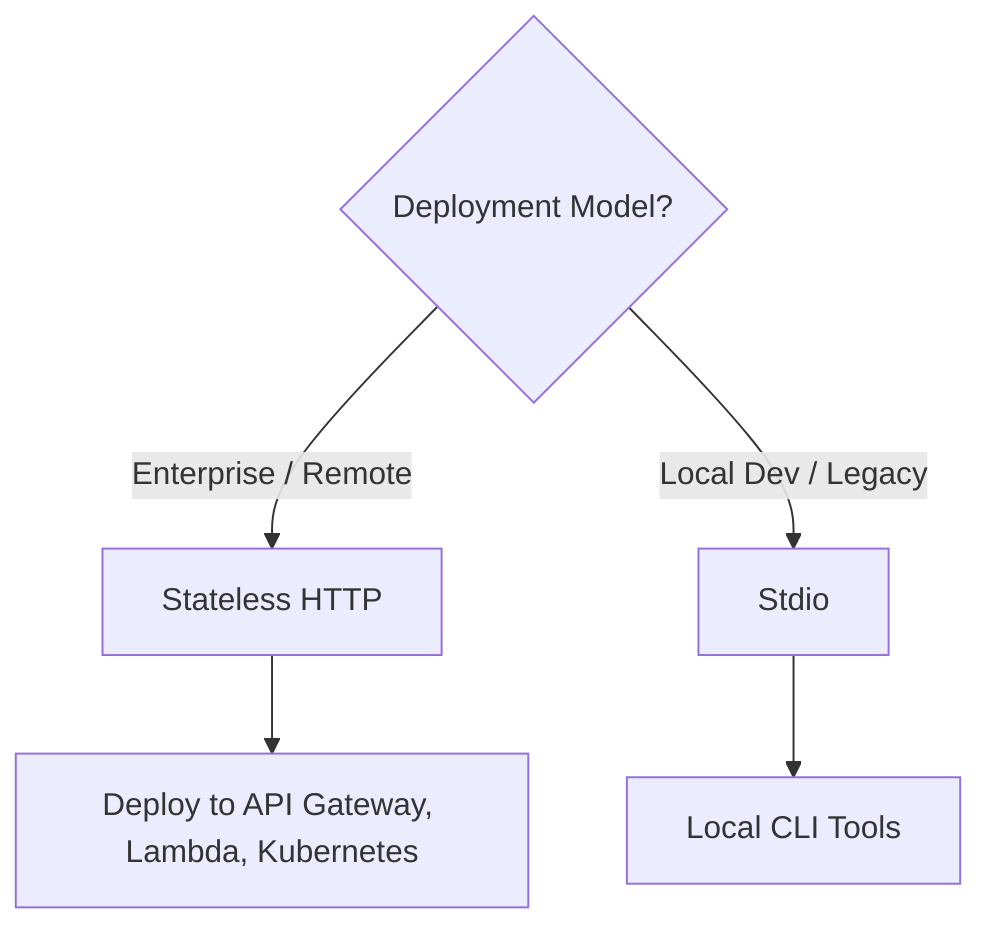

# MCP Transports

MCP supports multiple transport mechanisms for client-server communication.

## Overview

> [!IMPORTANT]  
> Following the **2026-07-28 specification release**, MCP shifted fundamentally to a **stateless request/response protocol**. The older, stateful transports (Stdio streams and HTTP with SSE) have been largely replaced by stateless HTTP utilizing Header-Based Routing.


```mermaid
graph TB
    subgraph "MCP Protocol"
        Data[Data Layer<br/>JSON-RPC 2.0]
    end
    
    subgraph "Transport Options"
        StatelessHTTP[Stateless HTTP<br/>Serverless & Remote]
        Legacy[Legacy: Stdio & SSE]
    end
    
    Data --> StatelessHTTP
    Data -.- Legacy
```

| Transport | Use Case | Lifecycle |
|-----------|----------|-------------|
| **Stateless HTTP** | Default for enterprise, Serverless (Lambda, Cloudflare) | Request/Response (No session) |
| **Stdio** | Local CLI tools (Legacy/Specific) | Stateful Process Stream |
| **HTTP + SSE** | Streaming (Legacy) | Stateful Connection |

---

## 1. Stdio Transport

Standard input/output streams for **local process communication**.

### How It Works


```mermaid
sequenceDiagram
    participant Host as MCP Host
    participant Server as MCP Server<br/>(subprocess)
    
    Host->>Server: spawn process
    Host->>Server: stdin: JSON-RPC request
    Server-->>Host: stdout: JSON-RPC response
    Server-->>Host: stderr: logs
```

### Characteristics

| Aspect | Value |
|--------|-------|
| **Latency** | Minimal (no network) |
| **Security** | Process isolation |
| **Use Case** | Local file access, CLI tools |
| **Message Framing** | Newline-delimited JSON |

### Configuration Example

```json
{
    "mcpServers": {
        "filesystem": {
            "command": "npx",
            "args": ["-y", "@modelcontextprotocol/server-filesystem", "/Users/me/projects"]
        },
        "git": {
            "command": "python",
            "args": ["/path/to/git_server.py"]
        }
    }
}
```

### Message Format

Messages are newline-delimited JSON:

```
{"jsonrpc":"2.0","method":"tools/list","params":{},"id":1}\n
{"jsonrpc":"2.0","result":{"tools":[...]},"id":1}\n
```

---

## 2. Stateless HTTP Transport (Modern Standard)

With the removal of persistent sessions, HTTP is utilized in a pure stateless request/response fashion. This is crucial for enterprise deployments, allowing MCP servers to run on auto-scaling infrastructure (like AWS Lambda or Kubernetes) without maintaining sticky sessions.

### Header-Based Routing

A key feature of the modern stateless transport is **Header-Based Routing**. Metadata is passed via headers, allowing API Gateways and load balancers to route and authorize traffic *before* it hits the MCP application logic.

* `Mcp-Method`: Specifies the JSON-RPC method (e.g., `tools/call`).
* `Mcp-Name`: Specifies the target (e.g., the tool name).

### How It Works


```mermaid
sequenceDiagram
    participant Client
    participant Gateway as API Gateway
    participant Server as Serverless MCP
    
    Client->>Gateway: POST /mcp<br/>Headers: Mcp-Method, Mcp-Name<br/>Body: JSON-RPC
    Gateway->>Gateway: Authorize via Registry
    Gateway->>Server: Route request
    Server-->>Client: 200 OK<br/>JSON-RPC response
```

### Characteristics

| Aspect | Value |
|--------|-------|
| **Lifecycle** | Stateless Request/Response (No Session ID) |
| **Complex Flows** | Uses **Multi Round-Trip Requests (MRTR)** instead of streams |
| **Security** | TLS, Gateways, Header-based RBAC |
| **Use Case** | Enterprise standard, Serverless functions |

### Request Example

```http
POST /message HTTP/1.1
Host: mcp.example.com
Content-Type: application/json
Authorization: Bearer <token>

{
    "jsonrpc": "2.0",
    "method": "tools/call",
    "params": {
        "name": "search_database",
        "arguments": {"query": "users"}
    },
    "id": 1
}
```

### SSE Stream Example

```http
GET /sse HTTP/1.1
Host: mcp.example.com
Accept: text/event-stream
Authorization: Bearer <token>
```

```
event: message
data: {"jsonrpc":"2.0","method":"notifications/progress","params":{"progress":50}}

event: message
data: {"jsonrpc":"2.0","result":{"content":[...]},"id":1}
```

---

## Authentication

### HTTP Transport Auth

| Method | Header | Use Case |
|--------|--------|----------|
| **Bearer Token** | `Authorization: Bearer <token>` | OAuth tokens |
| **API Key** | `X-API-Key: <key>` | Simple auth |
| **Custom** | Custom headers | Enterprise SSO |

### OAuth 2.0 Flow


```mermaid
sequenceDiagram
    participant Client
    participant Auth as Auth Server
    participant MCP as MCP Server
    
    Client->>Auth: Authorization request
    Auth-->>Client: Access token
    
    Client->>MCP: Request + Bearer token
    MCP->>MCP: Validate token
    MCP-->>Client: Response
```

---

## Transport Selection Guide


```mermaid
graph TD
    A{Deployment Model?}
    A -->|Enterprise / Remote| B[Stateless HTTP]
    A -->|Local Dev / Legacy| C[Stdio]
    
    B --> D[Deploy to API Gateway, Lambda, Kubernetes]
    C --> E[Local CLI Tools]
```

| Scenario | Recommended Transport |
|----------|----------------------|
| Enterprise Skills & Registries | Stateless HTTP (Header-based routing) |
| Serverless / Auto-scaling environments | Stateless HTTP |
| Simple Local File Access (Dev only) | Stdio |
| Real-time complex flows | Stateless HTTP with Multi Round-Trip Requests (MRTR) |

---

## Transport Comparison

| Feature | Stdio | HTTP + SSE |
|---------|-------|------------|
| **Setup** | Spawn process | HTTP client |
| **Latency** | ~0ms | Network RTT |
| **Streaming** | stdout | SSE |
| **Auth** | N/A (local) | Bearer, API key |
| **Firewall** | No issues | Port access |
| **Scalability** | 1:1 | N:1 possible |

---

## Implementation Notes

### Stdio Server (Python)

```python
import sys
import json

def handle_request(request):
    # Process JSON-RPC request
    return {"jsonrpc": "2.0", "result": {...}, "id": request["id"]}

# Read from stdin, write to stdout
for line in sys.stdin:
    request = json.loads(line)
    response = handle_request(request)
    print(json.dumps(response), flush=True)
```

### HTTP Server (Python)

```python
from flask import Flask, request, Response

app = Flask(__name__)

@app.route("/message", methods=["POST"])
def message():
    rpc_request = request.json
    result = handle_request(rpc_request)
    return result

@app.route("/sse")
def sse():
    def generate():
        while True:
            yield f"event: message\ndata: {json.dumps(notification)}\n\n"
    return Response(generate(), mimetype="text/event-stream")
```

---

## Summary

| Transport | Best For | Lifecycle |
|-----------|----------|------------|
| **Stateless HTTP** | Enterprise, Serverless, Agent Skill Delivery | Stateless |
| **Stdio (Legacy)** | Local, isolated CLI tools | Stateful |

> [!TIP]
> Default to **Stateless HTTP** for all new enterprise MCP servers to ensure compatibility with modern Agentic discovery registries, API gateways, and scalable infrastructure.
