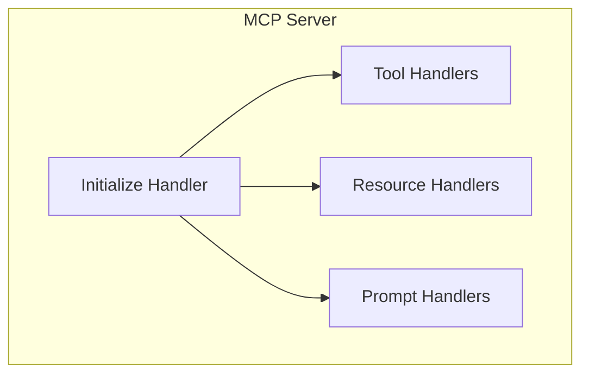

# Building MCP Servers

A practical guide to implementing MCP servers in Python.

## Quick Start

```python
from mcp.server import Server
from mcp.server.models import Tool
import mcp.types as types

# Create server
app = Server("my-server")

# Define a tool
@app.list_tools()
async def list_tools():
    return [
        Tool(
            name="hello",
            description="Say hello",
            inputSchema={
                "type": "object",
                "properties": {
                    "name": {"type": "string"}
                }
            }
        )
    ]

# Handle tool calls
@app.call_tool()
async def call_tool(name: str, arguments: dict):
    if name == "hello":
        return types.TextContent(
            type="text",
            text=f"Hello, {arguments.get('name', 'World')}!"
        )

# Run with stdio transport
if __name__ == "__main__":
    import mcp.server.stdio
    mcp.server.stdio.run(app)
```

---

## Server Structure



### Core Components

| Component | Purpose |
|-----------|---------|
| `Server` | Main server instance |
| `@list_tools` | Return available tools |
| `@call_tool` | Execute tool calls |
| `@list_resources` | Return available resources |
| `@read_resource` | Read resource content |
| `@list_prompts` | Return available prompts |
| `@get_prompt` | Get prompt content |

---

## Implementing Tools

### Basic Tool

```python
@app.list_tools()
async def list_tools():
    return [
        Tool(
            name="get_weather",
            description="Get current weather for a city",
            inputSchema={
                "type": "object",
                "properties": {
                    "city": {
                        "type": "string",
                        "description": "City name"
                    },
                    "units": {
                        "type": "string",
                        "enum": ["celsius", "fahrenheit"],
                        "default": "celsius"
                    }
                },
                "required": ["city"]
            }
        )
    ]

@app.call_tool()
async def call_tool(name: str, arguments: dict):
    if name == "get_weather":
        city = arguments["city"]
        units = arguments.get("units", "celsius")
        
        # Simulate weather API call
        weather = fetch_weather(city, units)
        
        return types.TextContent(
            type="text",
            text=f"Weather in {city}: {weather['temp']}°, {weather['condition']}"
        )
```

### Tool with Multiple Result Types

```python
@app.call_tool()
async def call_tool(name: str, arguments: dict):
    if name == "generate_chart":
        # Return image
        image_data = generate_chart(arguments)
        return types.ImageContent(
            type="image",
            data=base64.b64encode(image_data).decode(),
            mimeType="image/png"
        )
    
    elif name == "list_files":
        # Return multiple text items
        files = list_directory(arguments["path"])
        return [
            types.TextContent(type="text", text=f)
            for f in files
        ]
```

---

## Implementing Resources

### File Resources

```python
@app.list_resources()
async def list_resources():
    return [
        types.Resource(
            uri="file:///project/config.json",
            name="Project Config",
            mimeType="application/json"
        ),
        types.Resource(
            uri="file:///project/README.md",
            name="README",
            mimeType="text/markdown"
        )
    ]

@app.read_resource()
async def read_resource(uri: str):
    if uri.startswith("file://"):
        path = uri[7:]  # Remove file://
        with open(path, "r") as f:
            content = f.read()
        
        return types.TextResourceContents(
            uri=uri,
            mimeType="text/plain",
            text=content
        )
```

### Dynamic Resources

```python
@app.list_resources()
async def list_resources():
    # List database tables as resources
    tables = get_database_tables()
    return [
        types.Resource(
            uri=f"db://table/{table}",
            name=f"Table: {table}",
            mimeType="application/json"
        )
        for table in tables
    ]

@app.read_resource()
async def read_resource(uri: str):
    if uri.startswith("db://table/"):
        table = uri.split("/")[-1]
        data = query_table(table)
        return types.TextResourceContents(
            uri=uri,
            mimeType="application/json",
            text=json.dumps(data)
        )
```

---

## Implementing Prompts

```python
@app.list_prompts()
async def list_prompts():
    return [
        types.Prompt(
            name="code_review",
            description="Review code for issues and improvements",
            arguments=[
                types.PromptArgument(
                    name="language",
                    description="Programming language",
                    required=True
                ),
                types.PromptArgument(
                    name="focus",
                    description="Review focus: security, performance, style",
                    required=False
                )
            ]
        )
    ]

@app.get_prompt()
async def get_prompt(name: str, arguments: dict):
    if name == "code_review":
        language = arguments["language"]
        focus = arguments.get("focus", "general")
        
        return types.GetPromptResult(
            messages=[
                types.PromptMessage(
                    role="user",
                    content=types.TextContent(
                        type="text",
                        text=f"Please review the following {language} code. "
                             f"Focus on {focus} aspects. "
                             f"Provide specific, actionable feedback."
                    )
                )
            ]
        )
```

---

## Error Handling

```python
from mcp.server.models import McpError

@app.call_tool()
async def call_tool(name: str, arguments: dict):
    try:
        if name == "query_database":
            result = execute_query(arguments["sql"])
            return types.TextContent(type="text", text=json.dumps(result))
    
    except ConnectionError:
        raise McpError(
            code=-32000,
            message="Database connection failed"
        )
    
    except PermissionError:
        raise McpError(
            code=-32001,
            message="Insufficient permissions for this operation"
        )
```

---

## Notifications & Progress

### Sending Notifications

```python
@app.call_tool()
async def call_tool(name: str, arguments: dict):
    if name == "long_running_task":
        # Notify progress
        await app.send_notification(
            "notifications/progress",
            {"progress": 0, "total": 100}
        )
        
        for i in range(100):
            # Do work
            process_chunk(i)
            
            await app.send_notification(
                "notifications/progress",
                {"progress": i + 1, "total": 100}
            )
        
        return types.TextContent(type="text", text="Done!")
```

---

## Running the Server

### Stdio (Local)

```python
if __name__ == "__main__":
    import mcp.server.stdio
    mcp.server.stdio.run(app)
```

**Client configuration:**

```json
{
    "mcpServers": {
        "my-server": {
            "command": "python",
            "args": ["my_server.py"]
        }
    }
}
```

### HTTP (Remote)

```python
if __name__ == "__main__":
    from mcp.server.http import run_http
    run_http(app, host="0.0.0.0", port=8080)
```

---

## Complete Example

```python
"""
Complete MCP Server Example
Provides: Weather tools, file resources, prompts
"""

from mcp.server import Server
from mcp.server.models import Tool
import mcp.types as types
import json

app = Server("weather-files-server")

# ============= TOOLS =============

@app.list_tools()
async def list_tools():
    return [
        Tool(
            name="get_weather",
            description="Get weather for a city",
            inputSchema={
                "type": "object",
                "properties": {
                    "city": {"type": "string"}
                },
                "required": ["city"]
            }
        )
    ]

@app.call_tool()
async def call_tool(name: str, arguments: dict):
    if name == "get_weather":
        # Simulated weather
        return types.TextContent(
            type="text",
            text=f"Weather in {arguments['city']}: 22°C, Sunny"
        )

# ============= RESOURCES =============

@app.list_resources()
async def list_resources():
    return [
        types.Resource(
            uri="config://app",
            name="App Configuration",
            mimeType="application/json"
        )
    ]

@app.read_resource()
async def read_resource(uri: str):
    if uri == "config://app":
        config = {"debug": False, "version": "1.0.0"}
        return types.TextResourceContents(
            uri=uri,
            mimeType="application/json",
            text=json.dumps(config)
        )

# ============= PROMPTS =============

@app.list_prompts()
async def list_prompts():
    return [
        types.Prompt(
            name="travel_plan",
            description="Create a travel itinerary",
            arguments=[
                types.PromptArgument(name="destination", required=True)
            ]
        )
    ]

@app.get_prompt()
async def get_prompt(name: str, arguments: dict):
    if name == "travel_plan":
        return types.GetPromptResult(
            messages=[
                types.PromptMessage(
                    role="user",
                    content=types.TextContent(
                        type="text",
                        text=f"Plan a 3-day trip to {arguments['destination']}"
                    )
                )
            ]
        )

# ============= RUN =============

if __name__ == "__main__":
    import mcp.server.stdio
    mcp.server.stdio.run(app)
```

---

## Summary

| Step | Action |
|------|--------|
| 1 | Create `Server` instance |
| 2 | Define `@list_tools`, `@call_tool` |
| 3 | Define `@list_resources`, `@read_resource` |
| 4 | Define `@list_prompts`, `@get_prompt` |
| 5 | Run with stdio or HTTP |

> [!TIP]
> Use the [MCP Inspector](https://github.com/modelcontextprotocol/inspector) to test your server during development.
