# MCP: Pros and Cons

A balanced analysis of MCP's strengths, limitations, and when to use it.

## At a Glance

```mermaid
graph LR
    subgraph "Strengths"
        A[🌐 Universal Standard]
        B[🔌 Ecosystem]
        C[🛡️ Security Model]
        D[📦 Three Primitives]
    end
    
    subgraph "Challenges"
        E[🆕 Evolving Spec]
        F[🔧 Server Required]
        G[📊 No State Mgmt]
        H[🚀 Adoption Curve]
    end
```

---

## ✅ Pros (Advantages)

### 🌐 1. Universal Standard

MCP is **the emerging standard** for AI-to-tool integration.

| Adopters | Status |
|----------|--------|
| **Anthropic** | Creator, Claude Desktop |
| **OpenAI** | ChatGPT Desktop, API |
| **Google** | DeepMind integration |
| **VS Code** | Copilot support |

**Why it matters**: Build once, connect to all major AI platforms.

---

### 🔌 2. Growing Ecosystem

Large library of existing MCP servers.

| Category | Examples |
|----------|----------|
| **Dev Tools** | GitHub, Git, Sentry |
| **Productivity** | Slack, Notion, Google Drive |
| **Data** | PostgreSQL, MongoDB |
| **Cloud** | AWS, GCP, Azure |

**Official servers**: [github.com/modelcontextprotocol/servers](https://github.com/modelcontextprotocol/servers)

---

### 🛡️ 3. Strong Security Model

MCP enforces **user-in-the-loop** for dangerous operations.

| Security Feature | Description |
|------------------|-------------|
| Tool confirmation | User approves before execution |
| Resource scoping | Explicit access grants |
| OAuth support | Standard auth for HTTP |

---

### 📦 4. Three Clear Primitives

**Tools**, **Resources**, **Prompts** cover all integration needs.

| Need | Primitive |
|------|-----------|
| Execute actions | Tools |
| Read data | Resources |
| Guide interaction | Prompts |

Simple mental model, comprehensive coverage.

---

### ⚡ 5. Performance Options

Two transports for different needs.

| Transport | Latency | Use Case |
|-----------|---------|----------|
| Stdio | ~0ms | Local tools |
| HTTP | Network | Remote APIs |

---

### 🔧 6. Developer-Friendly

- **SDKs**: Python, TypeScript, Kotlin, C#
- **Inspector**: Debug tool for development
- **JSON-RPC**: Standard, well-understood protocol

---

## ❌ Cons (Disadvantages)

### 🆕 1. Evolving Specification

MCP is actively developed; breaking changes possible.

| Version | Date | Changes |
|---------|------|---------|
| 2024-10-07 | Oct 2024 | Initial |
| 2024-11-05 | Nov 2024 | Capability negotiation |
| 2025-XX-XX | TBD | Streaming improvements |

**Mitigation**: Pin to specific protocol version.

---

### 🔧 2. Server Implementation Required

You must build/deploy an MCP server for each integration.

| Option | Effort |
|--------|--------|
| Use existing server | Low |
| Build custom server | Medium-High |
| Maintain server | Ongoing |

**Mitigation**: Use community servers when available.

---

### 📊 3. No Built-in State Management

MCP is **stateless** — servers don't remember between calls.

**Mitigation**: Implement state in your server if needed.

---

### 🚀 4. Adoption Curve

Not all AI platforms support MCP yet.

| Platform | MCP Support |
|----------|-------------|
| Claude | ✅ Full |
| ChatGPT | ✅ Desktop |
| Gemini | 🔄 Coming |
| Others | ❓ Varies |

**Mitigation**: Focus on Claude/ChatGPT for now.

---

### 🔄 5. No Agent-to-Agent

MCP connects **AI to tools**, not **AI to AI**.

**Solution**: Use A2A protocol for agent-to-agent communication.

---

### 📡 6. Transport Limitations

| Limitation | Impact |
|------------|--------|
| Stdio local-only | Can't scale remotely |
| HTTP needs server | Deployment overhead |
| No WebSocket | Limited bidirectional |

---

## Decision Matrix

| Scenario | Use MCP? |
|----------|----------|
| AI needs to call APIs | ✅ Yes |
| AI needs file access | ✅ Yes |
| AI needs database | ✅ Yes |
| Agent-to-agent chat | ❌ Use A2A |
| Commerce checkout | ❌ Use UCP |
| Dynamic UI | ❌ Use A2UI |

---

## MCP vs Alternatives

| Approach | Pros | Cons |
|----------|------|------|
| **MCP** | Standard, ecosystem | Server needed |
| **Function calling** | Built-in | No standard |
| **Custom APIs** | Full control | N×M problem |
| **Plugins** | Easy for users | Platform-specific |

---

## Adoption Strategy

| Phase | Action | Timeline |
|-------|--------|----------|
| 1 | Use community servers | Week 1 |
| 2 | Build for your tools | Weeks 2-4 |
| 3 | Open-source, contribute | Ongoing |

---

## Summary

| Aspect | Assessment |
|--------|------------|
| **Maturity** | Production-ready |
| **Ecosystem** | Large and growing |
| **Security** | Strong |
| **Complexity** | Medium |
| **Adoption** | Major platforms |
| **Recommendation** | Use for AI-to-tool integration |

> [!TIP]
> MCP is the **de facto standard** for connecting AI to external tools. If you're building AI applications that need tool access, MCP should be your first choice.
