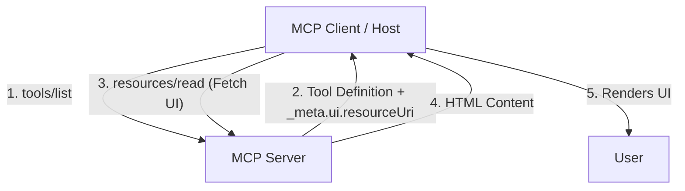

# MCP Apps (MCP-UI)

MCP Apps (formerly MCP-UI) is a protocol extension that allows MCP servers to provide rich, interactive User Interfaces (UI) for their tools. Instead of relying solely on text-based interactions, an AI model can display a graphical interface—like a form, dashboard, or interactive chart—directly within the host application.

## Overview

The core idea is simple: A **Tool** can declare that it has an associated **Resource** which contains a UI definition (HTML/JS). The Host Application (e.g., Claude Desktop or a custom client) can fetch this resource and render it in a safe, sandboxed environment (usually an iframe).



## How It Works

### 1. The Tool Definition

When a server lists its tools, it can include a special `_meta` property in the tool definition. This property contains a `ui` object with a `resourceUri` field.

```json
{
  "name": "create_ticket",
  "description": "Create a new support ticket",
  "inputSchema": { ... },
  "_meta": {
    "ui": {
      "resourceUri": "internal://ui/create_ticket"
    }
  }
}
```

### 2. The UI Resource

The URI specified in `_meta.ui.resourceUri` points to a standard MCP **Resource**. When the client requests this resource, the server returns the HTML content for the UI.

**Request:**

```json
{
  "method": "resources/read",
  "params": {
    "uri": "internal://ui/create_ticket"
  }
}
```

**Response:**

```json
{
  "result": {
    "contents": [{
      "uri": "internal://ui/create_ticket",
      "mimeType": "text/html",
      "text": "<!DOCTYPE html><html><body><form>...</form></body></html>"
    }]
  }
}
```

### 3. Rendering and Communication

The host application renders the returned HTML. This UI can interact with the host using a standardized JavaScript API (often provided by libraries like `@mcp-ui/client`).

The UI can:

* **Trigger Actions**: Ask the host to execute the tool associated with the UI.
* **Read State**: Access data from the server.
* **Update Context**: Send information back to the chat context.

## Security Model

Security is critical because the host is executing code provided by the server.

1. **Sandboxing**: UIs are typically rendered in an `iframe` with strict `sandbox` attributes to prevent access to the host's DOM or cookies.
2. **Permissions**: The UI cannot arbitrarily access the host's system. It must communicate through the standard MCP message passing bridge.
3. **Content Security Policy (CSP)**: Hosts often enforce strict CSPs to limit what the loaded UI can fetch (e.g., preventing external API calls unless whitelisted).

## Example Workflow: "Interactive Form"

1. **User**: "I need to open a refund ticket."
2. **LLM**: Decides to use the `open_refund_ticket` tool. It sees there is a `_meta.ui.resourceUri`.
3. **Host**: Instead of just calling the tool with JSON arguments, the Host fetches the UI resource.
4. **Host**: Renders a "Refund Request Form" to the user.
5. **User**: Fills out the form (Order ID, Reason) interactively.
6. **UI**: Javascript in the form sends the data back to the Host.
7. **Host**: Calls the actual `tools/call` method on the server with the user-provided data.

## Why Use MCP Apps?

* **Better UX**: Complex inputs (dates, colors, file uploads) are hard to specify in text. A UI is much better.
* **Safety**: Users can review structured data visually before an extensive action is taken.
* **Rich Output**: Tools can return data that is visualized as charts or tables, not just text.

---

> [!TIP]
> Use standard web technologies (HTML/CSS/JS) to build your UIs. Keep them lightweight and focused on the specific task of the tool.
