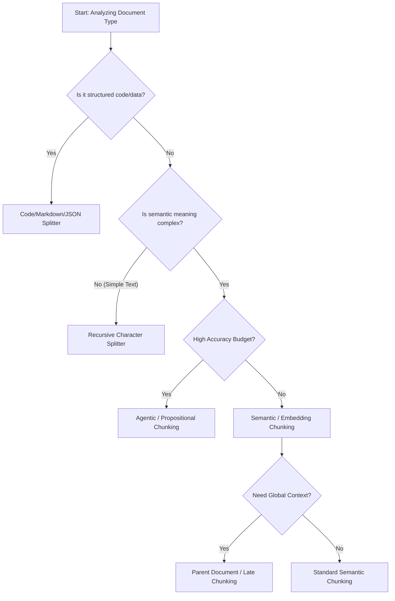

# RAG Chunking Strategies: The Comprehensive Guide

**Chunking** is the process of breaking down large documents into smaller, manageable pieces (chunks) for retrieval. It is the **foundation** of your RAG pipeline.

> "Bad chunking leads to bad retrieval, no matter how good your embedding model is."

If a chunk is too small, it lacks context. If it's too large, it contains noise. If it splits a sentence in half, semantic meaning is lost.

## Strategy Selection Flowchart



---

## 1. Character-Based Chunking (The Baseline)

These methods split text based on character counts or specific separators.

### 1.1 Fixed-Size Chunking

The simplest method. Split text into chunks of N characters with M overlap.

* **Pros**: Fast, cheap, predictable.
* **Cons**: Cuts sentences in half; ignores semantic boundaries.

```python
# LangChain Example
from langchain.text_splitter import CharacterTextSplitter

text = "..."
splitter = CharacterTextSplitter(chunk_size=1000, chunk_overlap=200, separator="\n")
docs = splitter.create_documents([text])
```

### 1.2 Recursive Character Chunking (Recommended Default)

Splits on a list of separators in order (Priority: Paragraphs `\n\n` -> Sentences `\n` -> Words ` `). It tries to keep related text (paragraphs) together.

* **When to use**: General generic text documents.

```python
# LangChain Example
from langchain.text_splitter import RecursiveCharacterTextSplitter

splitter = RecursiveCharacterTextSplitter(
    separators=["\n\n", "\n", " ", ""],
    chunk_size=512,
    chunk_overlap=50
)
docs = splitter.create_documents([text])
```

---

## 2. Document-Specific & Structured Chunking

Respects the syntax of the file format used.

### 2.1 Markdown Chunking

Splits based on Markdown headers (`#`, `##`, `###`). The header content is usually added as metadata to the chunk to preserve context.

* **Pros**: Retains the hierarchy of the document.
* **When to use**: Documentation, Wikis, Obsidian vaults.

```python
from langchain.text_splitter import MarkdownHeaderTextSplitter

markdown_document = "# Section 1 \n Content... \n ## Subsection \n More content..."
headers_to_split_on = [("#", "Header 1"), ("##", "Header 2")]

splitter = MarkdownHeaderTextSplitter(headers_to_split_on=headers_to_split_on)
splits = splitter.split_text(markdown_document)
# Result: Chunk content is "More content...", Metadata is {"Header 1": "Section 1", "Header 2": "Subsection"}
```

### 2.2 Code Chunking

Splits code based on language syntax (Classes, Functions) rather than arbitrary lines.

* **Supported**: Python, JS, Java, Lua, etc.
* **When to use**: Codebase RAG, Copilots.

```python
from langchain.text_splitter import RecursiveCharacterTextSplitter, Language

python_code = "def function_a():\n    pass\n\nclass MyClass:\n    pass"
converter = RecursiveCharacterTextSplitter.from_language(
    Language.PYTHON, chunk_size=510, chunk_overlap=0
)
docs = converter.create_documents([python_code])
```

---

## 3. Semantic Chunking (The "Meaning" Way)

Instead of counting characters, we calculate **cosine similarity** between consecutive sentences. If similarity drops below a threshold (a topic shift), a new chunk is started.

* **Pros**: Very high coherence chunks.
* **Cons**: Slower (requires embedding inference during chunking).
* **Libraries**: `LangChain Experimental`, `LlamaIndex`, `Chonkie`.

```python
# LangChain Experimental Example
from langchain_experimental.text_splitter import SemanticChunker
from langchain_openai import OpenAIEmbeddings

embeddings = OpenAIEmbeddings()
splitter = SemanticChunker(embeddings, breakpoint_threshold_type="percentile")
docs = splitter.create_documents([text])
```

---

## 4. Agentic & Propositional Chunking (The Expert Way)

### 4.1 Propositional Chunking

Decomposes complex sentences into "atomic propositions" (simple independent statements) using an LLM.

* **Example**: "Google, founded by Larry Page, announced Gemini."
  * *Prop 1*: "Google was founded by Larry Page."
  * *Prop 2*: "Google announced Gemini."
* **Pros**: Excellent for dense inputs where multiple facts are packed into one sentence.
* **Cons**: Expensive pre-processing.

### 4.2 Agentic Chunking

Treats document processing as a task. An LLM reads the stream and decides "Start new chunk here" or "Keep adding to this chunk".

* **When to use**: High-stakes use cases (Legal, Medical) where automated heuristics fail.

---

## 5. Hierarchical / Parent Document Retrieval (Small-to-Big)

A **Retrieval Strategy** tied to chunking. You split documents into small chunks for *indexing* (better matching), but retrieve the *parent* (larger chunk) or full document for *generation*.

* **Concept**:
    1. **Parent**: Large chunk (e.g., 2000 tokens).
    2. **Child**: Small chunks (e.g., 200 tokens) derived from the Parent.
    3. **Index**: Embed the Children.
    4. **Retrieve**: Match Child -> Return Parent.

```python
# LangChain Example: Parent Document Retriever
from langchain.retrievers import ParentDocumentRetriever
from langchain.storage import InMemoryStore
# Note: You need a VectorStore and a DocumentStore (InMemory/Redis)

retriever = ParentDocumentRetriever(
    vectorstore=vectorstore,
    docstore=store,
    child_splitter=child_splitter, # Small chunks
    parent_splitter=parent_splitter # Large chunks
)
```

---

## 6. Late Chunking (Context-Aware)

A novel approach (popularized by Jina AI).

* **Problem**: Standard chunking breaks context *before* embedding.
* **Solution**: Run the embedding model's transformer over the **entire** text (up to 8k tokens) first to get token-level embeddings (capturing global context). *Then* pool/average the token embeddings into chunk embeddings.
* **Result**: The chunk "he agreed" knows "he" refers to "The CEO" mentioned 500 words ago because they were embedded together in the attention mask.

---

## 7. Multimodal & Complex PDF Chunking

Real-world documents are not just text. They have images, tables, and multi-column layouts. Standard text splitting FAILS here because it ignores layout and visual information.

### The "PDF Trap"

If you extract text blindly from a PDF:

* **Tables** become garbage strings.
* **Images** are lost.
* **Multi-column text** gets read across lines instead of down columns.

### Strategy A: Multi-Vector / Summary Indexing (The "Describe It" Approach)

Isolate images and tables. Use an **LVLM (Large Vision Language Model)** like GPT-4o or Claude 3.5 Sonnet to describe them. Embed the *description*.

1. **Extract elements**: Use tools like `Unstructured` or `LlamaParse` to separate text, tables, and images.
2. **Summarize**: Pass images/tables to an LLM -> "This is a bar chart showing Q3 revenue growth."
3. **Embed**: Embed the text summary.
4. **Retrieve**: When the summary is matched, return the **original image** or raw partial of the PDF.

### Strategy B: Native Multimodal (ColPali)

Don't chunk text. Chunk *images*.

* **ColPali** (ColBERT + PaliGemma) treats the *screenshot* of the PDF page as the chunk.
* It embeds the visual pixel patches.
* **Pros**: Perfectly understands "The chart slightly to the right of the header".
* **Cons**: Heavier index size (storing visual embeddings).

---

## 8. Testing & Evaluation: How to Verify?

How do you know if your chunking is working? You test it.

### 8.1 The "Goldilocks" Visual Test

Pick 10 random chunks and read them.

* **Too Small**: Do they feel like random sentence fragments?
* **Too Big**: Do they contain multiple unrelated topics?
* **Just Right**: can you answer a question based *solely* on this chunk?

### 8.2 Quantitative Metrics (Ragas / DeepEval)

Use frameworks like **Ragas** or **DeepEval** to compute scores.

* **Context Recall**: Is the answer to the user's question actually present in the retrieved chunks? (If low, your chunks might be splitting the answer).
* **Context Precision**: How much of the chunk is useful vs noise? (If low, chunks are too big).

### 8.3 Semantic Coherence Test

Embed your chunks and visualize them using **UMAP** or **t-SNE**.

* **Good Chunking**: Distinct clusters of related chunks (Topic A clusters together, Topic B clusters together).
* **Bad Chunking**: A messy "cloud" where everything overlaps.

---

## 9. Libraries & Ecosystem

Which tool should you use?

| Library | Strengths | Best For |
| :--- | :--- | :--- |
| **LangChain** | Massive ecosystem, supports everything (Text, Code, Markdown, Semantic). | General purpose RAG. |
| **LlamaIndex** | Excellent node/hierarchical management. Best for complex docs. | "Small-to-Big" retrieval, creating Knowledge Graphs. |
| **Chonkie** | Lightweight, incredibly fast, minimal focus. | Production pipelines needing speed. |
| **Unstructured.io** | The King of parsing (PDF tables, PPTX, Images). | Messy raw files (PDFs, Scanned docs). |
| **Semantic Router** | Focused on routing but has good semantic splitters. | Advanced control flow. |

## Summary Recommendation Matrix

| Scenario | Recommended Strategy |
| :--- | :--- |
| **General Knowledge Base** | **Recursive Character** (512/50) |
| **Coding Assistant** | **Language Specific** (Python/JS Splitters) |
| **Technical Manuals** | **Markdown / Header Splitter** (Preserve structure) |
| **Messy / Dense Facts** | **Propositional Chunking** (Clean up data first) |
| **Long Context Needs** | **Parent Document Retriever** (Search small, read big) |
| **Nuanced Narrative** | **Semantic Chunking** or **Late Chunking** |
