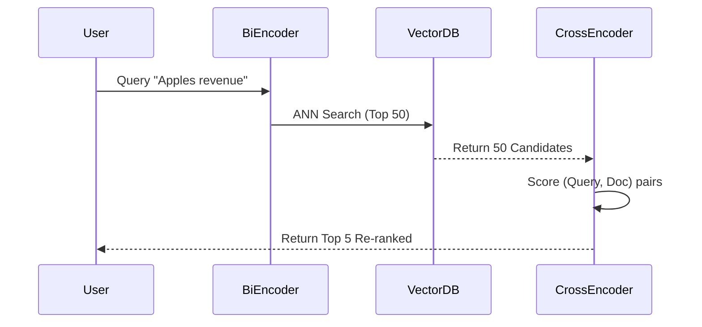

# RAG Retrieval Strategies: The Comprehensive Guide

Retrieval is the "R" in RAG. If the LLM doesn't get the right context, no amount of prompt engineering can save it.

> "Garbage Retrieval In, Garbage Generation Out."

This document details retrieval strategies from basic to expert, with **code examples** and **selection guides**.

## 1. Foundations: Sparse vs. Dense Deployment

### Selection Visualizer

```mermaid
flowchart TD
    A[Start] --> B{Exact Keyword Match needed?}
    B -- Yes (SKUs, Names) --> C[Hybrid Search (BM25 + Vector)]
    B -- No --> D{Complex Query?}
    D -- Yes --> E[Query Decomposition / Multi-Query]
    D -- No --> F[Standard Dense Retrieval]
    F --> G{High Precision Required?}
    G -- Yes --> H[Re-ranking (Cross-Encoder)]
    G -- No --> I[Standard Cosine Similarity]
```

### 1.1 Sparse (BM25) vs Dense (Vector)

* **Sparse (BM25)**: Matches keywords. Fast, interpretable. Good for specific names ("Product ID 555-ABC").
* **Dense (Embeddings)**: Matches meaning. Good for synonyms ("car" matches "automobile").

---

## 2. Advanced Strategies

### 2.1 Hybrid Search (The Standard)

Combine BM25 and Vector Search using **Reciprocal Rank Fusion (RRF)**.

* **Why**: BM25 catches the keywords, Vectors catch the meaning.
* **Code Example (LangChain)**:

```python
from langchain.retrievers import EnsembleRetriever
from langchain_community.retrievers import BM25Retriever

# bm25_retriever = ... (created from docs)
# vector_retriever = ... (created from vectorstore)

ensemble_retriever = EnsembleRetriever(
    retrievers=[bm25_retriever, vector_retriever],
    weights=[0.5, 0.5] # Equal weight to keyword and semantic
)
docs = ensemble_retriever.invoke("apple iphone sales")
```

### 2.2 Re-ranking (The Precision Booster)

Retrieve a large set (e.g., 50) using cheap vector search, then sort the top results using a **Cross-Encoder**.



* **Code Example**:

```python
from langchain.retrievers import ContextualCompressionRetriever
from langchain.retrievers.document_compressors import CrossEncoderReranker
from langchain_community.cross_encoders import HuggingFaceCrossEncoder

model = HuggingFaceCrossEncoder(model_name="BAAI/bge-reranker-base")
compressor = CrossEncoderReranker(model=model, top_n=5)
retriever = ContextualCompressionRetriever(
    base_compressor=compressor, base_retriever=base_vector_retriever
)
```

### 2.3 Query Transformations (Multi-Query / HyDE)

The user often asks bad questions. Fix them before searching.

* **Multi-Query**: Generate 3 variations of the question.
* **HyDE**: Hallucinate an answer, then search for that answer.

```python
from langchain.retrievers.multi_query import MultiQueryRetriever
from langchain_openai import ChatOpenAI

retriever = MultiQueryRetriever.from_llm(
    retriever=vector_retriever, llm=ChatOpenAI()
)
# Generates: "What is Apple's revenue?", "Apple 2024 financial results", etc.
```

### 2.4 Contextual Retrieval (Anthropic Strategy)

**Problem**: Chunks lose context. "It grew by 5%" is useless if you don't know "It" is "Google".
**Solution**: Prepend context ("This chunk is from Google's 2023 report...") to the text *before* embedding.

---

## 3. Expert Strategies

### 3.1 GraphRAG (Global Context)

Uses a Knowledge Graph to answer "global" questions like "What are the common themes?" which vector search fails at.

* **Method**: Summary of communities (clusters of nodes).

### 3.2 Agentic / Self-Correcting RAG

The Retrieval system is an agent that can loop.

1. **Retrieve**.
2. **Grade**: Is this document relevant? (LLM as Judge).
3. **Correct**:
    * *Yes*: Generate answer.
    * *No*: Rewrite query and search again.
    * *Still No*: Search the Web.

---

## 4. Testing & Evaluation Metrics

How do you measure success?

| Metric | Definition | Good For |
| :--- | :--- | :--- |
| **Hit Rate @ K** | Is the correct document present in the top K results? | Initial recall check. |
| **MRR (Mean Reciprocal Rank)** | How high up is the first correct result? (1 = 1st, 0.5 = 2nd). | Search ranking quality. |
| **NDCG** | Considers the *order* and *relevance grade* of all results. | Gold standard for ranking. |
| **Context Recall** | (LLM-based) Does the retrieved context contain the answer? | End-to-end RAG quality. |

---

## 5. Libraries & Ecosystem

| Tool | Type | Best For |
| :--- | :--- | :--- |
| **Pinecone / Weaviate / Qdrant** | Vector Database | Storing millions of vectors. Scalability. |
| **Chroma / FAISS** | Local Vector DB | Prototyping, privacy, or small-scale ( < 100k docs). |
| **RankGauss / BGE-Reranker** | Re-ranking Model | Plugging into the re-ranking stage. |
| **Ragas / DeepEval / TruLens** | Evaluation | Measuring Hit Rate, Context Precision. |
| **LangChain / LlamaIndex** | Orchestration | Glue code to connect DBs, Embeddings, and LLMs. |

---

## 6. Multimodal Retrieval (Beyond Text)

The world isn't just text. RAG must handle **Images**, **Video**, and **Audio**.

### 6.1 Image Retrieval (CLIP / SigLIP)

Standard dense retrieval works because "dog" and "canine" are close in vector space. **CLIP (Contrastive Language-Image Pre-training)** aligns **Text** and **Images** in the *same* vector space.

* **Mechanism**: A query "Two dogs playing in snow" will have a vector very close to an *image* of two dogs in snow.
* **Embeddings**:
  * **OpenAI CLIP**: The standard.
  * **SigLIP (Google)**: Better performance/precision.
* **Workflow**:
    1. Embed all images in your DB (Vector X).
    2. Embed user text query (Vector Y).
    3. Find images where Cosine(X, Y) is high.

### 6.2 Video Retrieval (Temporal Understanding)

Video is just a sequence of images + audio.

* **Naive Approach**: Extract 1 frame every second -> Embed with CLIP.
* **Advanced (TwelveLabs / Marengo)**: Use models that understand *time*. "A man jumps *after* the car explodes". Frame-level embeddings can't capture the "after".

### 6.3 Audio Retrieval

* **Transcription First (Whisper)**: Convert Audio -> Text -> Standard Text RAG. (Most common/reliable).
* **Direct Audio (CLAP)**: Contrastive Language-Audio Pretraining. Search for "steps on gravel" and find sound effects matching that sound, without text.

---

## 7. Critic Review: The State of Retrieval

*A critical look at where we stand today.*

* **Vector Search is NOT Magic**: It creates a false sense of security. It fails miserably at:
  * **Negation**: "Show me phones that are NOT Apple". Vector search will show you Apple phones because "Apple" is the most semantically relevant word.
  * **Exact Match**: SKU lookups or precise SQL-like filters.
  * **Structured Reasoning**: "Compare the revenue growth of X vs Y". Vectors can't do math.
* **The "Context Window" Fallacy**: "Why RAG? Just put 1M tokens in Gemini 1.5".
  * **Cost**: Input tokens are expensive.
  * **Latency**: Waiting 30s for a prompt to process is bad UX.
  * **Lost in the Middle**: Even with 1M context, attention mechanisms degrade. RAG is still needed for *selection*.
* **Multimodal is Immature**: Image retrieval is great, but *reasoning* across video frames is still expensive and slow. Most "Video RAG" is just "Keyframe RAG".

## Summary Recommendation Matrix

| Scenario | Strategy |
| :--- | :--- |
| **Standard Baseline** | **Dense Retrieval** |
| **Specific Keywords** | **Hybrid (BM25 + Dense)** |
| **High Accuracy Needed** | **Hybrid + Re-ranking** |
| **Vague User Questions** | **Multi-Query + Hybrid** |
| **Global/Summarization** | **GraphRAG** |
