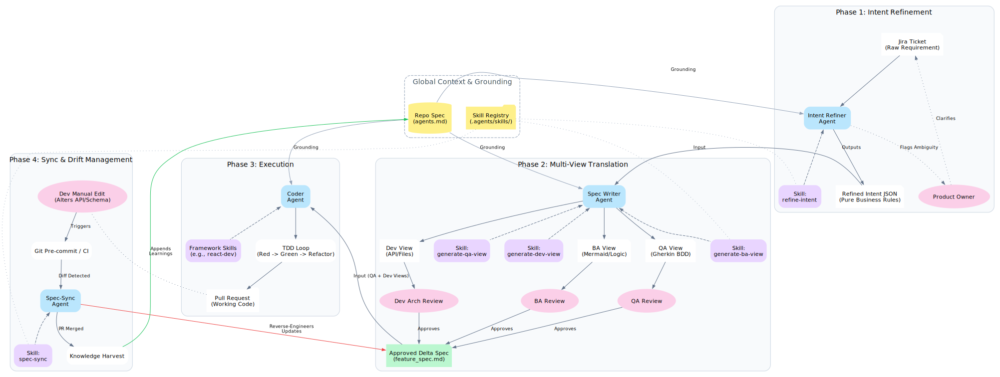

# Spec-Driven Development (SDD) in an AI Era

## Table of Contents

* [1. Core Philosophy](#1-core-philosophy)
* [2. SDD Architecture Diagram](#2-sdd-architecture-diagram)
* [3. Phase 1: Intent Refinement (The Ingestion Layer)](#3-phase-1-intent-refinement-the-ingestion-layer)
* [4. Phase 2: Multi-View Spec Generation (The Translation Layer)](#4-phase-2-multi-view-spec-generation-the-translation-layer)
* [5. Phase 3: Code Generation (The Execution Layer)](#5-phase-3-code-generation-the-execution-layer)
* [6. Phase 4: Managing State Drift (The Synchronization Layer)](#6-phase-4-managing-state-drift-the-synchronization-layer)
* [7. The Multi-View Spec Template (Delta Spec)](#7-the-multi-view-spec-template-delta-spec)
* [8. The Repo Spec Template (Global Context)](#8-the-repo-spec-template-global-context)
* [9. Implementation Action Plan (Next Steps)](#9-implementation-action-plan-next-steps)

---

## 1. Core Philosophy

The market is currently flooded with complex AI orchestrators and tools. This framework rejects complexity and mandates **strict simplicity and clarity**.

**THE PRIME DIRECTIVE:** SDD MANDATES a unified, single-source-of-truth understanding of any given change that is equally accessible to both human personnel (BAs, QAs, Devs) and AI Agents (Code Generators). Grounded context (like `agents.md` and specialized AI Skills) MUST be leveraged to explicitly eliminate hallucination and guarantee that the final output perfectly aligns with business constraints.

Below, we detail this workflow to the nth level using a **first-principles approach**.

**MANDATORY BOUNDARY RULE:** A Delta Spec SHALL NOT span multiple repositories. It is strictly bounded to a single repository context. If a business requirement demands full-stack changes across disparate codebases (e.g., a frontend UI and a backend microservice), the Intent Refiner Agent MUST decompose the master ticket into distinct, isolated Delta Specs per repository. Failing to enforce this boundary guarantees context pollution and non-deterministic code generation.

## 2. SDD Architecture Diagram

---

## 3. Phase 1: Intent Refinement (The Ingestion Layer)

**FIRST PRINCIPLE:** Raw human input (e.g., a Jira ticket or user request) is strictly UNTRUSTED and inherently ambiguous. To build a deterministic system, this input MUST be transformed into unambiguous, machine-verifiable intent *before* any specification or code is generated.

### The Mechanics

* **The Trigger:** An automated webhook fires when a Jira ticket transitions to a "Ready for Spec" state, or a user explicitly calls the `refine-intent` agent skill.
* **The Actor:** "Intent Refiner" Agent.
* **The Grounding Process:**
    1. The Agent parses the raw text of the ticket (Summary, Description, Acceptance Criteria).
    2. The Agent cross-references this against the global `Repo Spec` (`agents.md`) and the current state of the codebase.
    3. The Agent searches for two things: **Contradictions** (e.g., "The ticket asks for a new microservice, but `agents.md` mandates a monolith architecture for this domain") and **Ambiguities** (e.g., "What happens to existing records if the new constraint is applied?").
* **The Output Artifact:** A structured JSON or structured Markdown document called `Refined_Intent`. It strips away prescriptive technical solutions and leaves only pure business requirements.
* **The Feedback Loop:** If the Agent detects unresolvable ambiguities, it SHALL NOT guess. It MUST halt the pipeline immediately and push specific questions back to the Product Owner/BA (e.g., via a Jira comment). The pipeline remains strictly blocked until human clarification is explicitly provided.

---

## 4. Phase 2: Multi-View Spec Generation (The Translation Layer)

**FIRST PRINCIPLE:** A single source of truth MUST be projected through role-specific cognitive lenses. Forcing a Developer, a QA, and a BA to parse a monolithic 20-page Markdown document guarantees "Markdown Fatigue" and missed requirements.

### The Mechanics

* **The Trigger:** Approval of the `Refined_Intent` document.
* **The Actor:** "Spec Writer" Agent, utilizing specialized persona skills (`generate-ba-view`, `generate-qa-view`, `generate-dev-view`).

### View 1: The BA View (Intent & Logic)

* **Goal:** Allow the Business Analyst to quickly verify the flow of logic.
* **Artifact Format:** A concise bulleted list of state changes, accompanied by a Mermaid.js flowchart or state-machine diagram.
* **Human Review:** The BA visually confirms the decision tree. Diagrams are processed cognitively much faster than prose.

### View 2: The QA View (Validation & Executable Spec)

* **Goal:** Provide the explicit criteria for success. This is the most critical artifact, as it becomes the test suite.
* **Artifact Format:** BDD/Gherkin tables (Given/When/Then).
* **Human Review Protocol (The Anti-Complacency Gate):** QA assumes the role of "Intent Verifier." The human MUST NOT blindly approve the AI's scenarios. They are explicitly mandated to answer the prompt: *"Identify at least one edge case this AI missed."* This enforces rigorous cognitive review.

### View 3: The Dev View (Architecture & Contracts)

* **Goal:** Give the developer the exact technical scaffolding required to fulfill the logic.
* **Artifact Format:** An `implementation_plan.md` style document detailing:
  * `[NEW]`, `[MODIFY]`, `[DELETE]` file lists.
  * API contract signatures (e.g., OpenAPI fragments).
  * Database schema delta scripts.
* **Human Review:** The Developer reviews *only* the proposed technical changes, verifying they fit the existing architecture without wading through the business backstory.

---

## 5. Phase 3: Code Generation (The Execution Layer)

**FIRST PRINCIPLE:** Code SHALL NOT drive architecture. Code is strictly a deterministic side-effect of a perfectly defined spec.

### The Mechanics

* **The Trigger:** Explicit human approval of the Multi-View Spec is a MANDATORY prerequisite.
* **The Actor:** "Coder" Agent equipped with framework-specific skills (e.g., `react-developer`, `java-spring-expert`).
* **The TDD Loop (Test-Driven Development):**
    1. The Agent translates the QA View (Gherkin) into failing test skeletons. **MANDATORY EXECUTION PROTOCOL:** A QA View is entirely useless if it remains plain text. The Coder Agent MUST implement the exact test 'glue code' mapping to the Gherkin steps. Depending on the nature of the change, this requires leveraging specific testing skills (e.g., Playwright for UI validation, REST-assured/Jest for API contracts). The pipeline SHALL NOT pass unless these generated scenarios are actively executed and assert green.
    2. The Agent executes the tests (they fail).
    3. The Agent uses the Dev View (Technical Plan) to implement the actual code changes.
    4. The Agent runs the tests again. It iterates on the code until the tests generated from the QA View pass.
* **The Output Artifact:** A Pull Request (PR) where the code is guaranteed to satisfy the Executable Spec.

---

## 6. Phase 4: Managing State Drift (The Synchronization Layer)

**FIRST PRINCIPLE:** Truth MUST remain singular. If the codebase deviates from the Spec, the pipeline MUST explicitly fail or trigger an automated self-healing loop. A stale Spec is strictly worse than having no Spec at all.

To manage this, we define two types of Specs:

1. **The Repo Spec (Global):** Permanent rules (`agents.md`).
2. **The Delta Spec (Feature):** The Multi-View Spec generated for a specific change. It is ephemeral and expires when the feature goes live.

### The Mechanics of "Spec-Sync"

* **The Problem:** During Phase 3 (Execution), a Developer realizes the API contract proposed in the Dev View won't work and manually changes it in the code. Now the Spec and Code are out of sync.
* **The Trigger:** A strict CI pipeline gate or pre-commit hook.
* **The AST Diffing Mandate:** To remain truly spec-driven, confidence in the Spec-Sync process must be absolute. Feeding raw `git diffs` into an LLM for massive refactors guarantees context-window blowout and hallucination. Therefore, the pipeline MUST parse the diff using an Abstract Syntax Tree (AST) analyzer (e.g., `tree-sitter`). Only the structural, semantic contract changes (e.g., "Method signature modified from `int` to `string`", "Database column `user_id` added") SHALL be passed to the Spec-Sync Agent. Raw implementation details are strictly filtered out.
* **The Actor:** "Spec-Sync" Agent Skill.
* **Bi-Directional Updates:**
  * If a developer alters an API signature or adds a new database column not in the Spec, the Spec-Sync Agent pauses the build.
  * It reverse-engineers the intent behind the code change.
  * It automatically proposes an update to the Dev View and QA View of the Delta Spec to reflect reality.
  * *Human Verification:* The BA/QA must approve this reverse-engineered update to ensure the developer didn't inadvertently break a business rule to solve a technical problem.
* **Expiry & Harvesting:** Once the PR is merged and deployed, the Delta Spec is archived. Any systemic architectural learnings or new patterns introduced by this feature are automatically extracted by an agent and appended to the permanent `Repo Spec` (`agents.md`).

---

## 7. The Multi-View Spec Template (Delta Spec)

While the global `agents.md` serves as the Repo Spec, each feature requires a **Delta Spec**. To prevent markdown fatigue while keeping everything version-controlled, the Delta Spec should be a single Markdown file (`{feature_name}_spec.md`) structured into three strict sections.

Agents MUST generate this exact format, and humans SHALL review *only* their designated section to prevent cognitive overload.

### Section 1: The Business View (For BA & Product)

This section strips away technical jargon and focuses entirely on user flows and logic.

* **Intent Summary:** 2-3 sentences max on what is being achieved.
* **Mermaid Flowchart:** A visual representation of the state machine or user journey.
* **Business Rules:** A bulleted list of strict rules (e.g., "A user cannot checkout with an empty cart").
* **Non-Functional Requirements (NFRs):** NFRs are treated with the exact same severity as business rules. This section MUST explicitly define performance, security, accessibility, and compliance constraints (e.g., "API endpoints SHALL respond in < 200ms under load", "All UI components MUST be strictly WCAG AA compliant").
* **Out of Scope:** Explicitly stating what is *not* included.

### Section 2: The Validation View (For QA)

This section acts as the **Executable Specification**. It is written strictly in Gherkin (BDD) format so it can be parsed by test frameworks and understood by QA.

* **Scenarios (Given/When/Then):** Exhaustive edge-case definitions.

  * *Example:* `Given the user is logged in, When they click 'Buy', Then the cart empties.`

### Section 3: The Technical View (For Dev)

This section is the architectural blueprint. It defines *how* the business logic will be implemented within the constraints of `agents.md`.

* **File Manifest:** Lists of `[NEW]`, `[MODIFY]`, and `[DELETE]` files.
* **API Contracts:** OpenAPI snippets or definitions for any new endpoints.
* **Schema Deltas:** Database migration scripts or entity changes.
* **Dependencies:** Any new packages or dependencies required.

---

## 8. The Repo Spec Template (Global Context)

While the Delta Spec defines *what* is changing, the **Repo Spec** (typically `agents.md` or `.agents/AGENTS.md`) defines the boundary conditions of the repository itself. For complex, legacy, or highly-custom codebases, this artifact is the single most important tool to control AI hallucination.

The Repo Spec MUST be strictly structured to inject high-density context into the LLM, neutralizing its tendency to hallucinate:

### 1. Architecture & Stack

* **Tech Stack:** Exact versions of languages and frameworks (e.g., `Java 21`, `Spring Boot 3.2`, `React 18`). Prevents the AI from hallucinating deprecated or incompatible syntax.
* **Core Patterns:** Defines the architectural style (e.g., CQRS, Event-Driven, standard MVC).

### 2. The Code Map (Directory Structure)

A strict mapping of where things belong so the Agent knows where to place new files or search for existing ones without guessing.

* *Example:* `src/main/java/com/app/domain` -> Core business logic, NO framework dependencies allowed here.
* *Example:* `src/main/java/com/app/infrastructure` -> Database adapters and external API clients.

### 3. External Boundaries & Integrations

The application rarely exists in isolation. Documenting external dependencies prevents the AI from hallucinating a new database table when it should be publishing to a message queue.

* **Databases:** List the allowed datastores and their primary uses (e.g., PostgreSQL for relational data, Redis for caching).
* **Message Queues:** Define the event broker and topics (e.g., "Use Kafka topic `user.events` for all state changes").
* **Microservices/APIs:** List known upstream/downstream services and where to find their API contracts.

### 4. Testing Standards

Explicit instructions on how code must be verified to ensure the Agent writes tests that actually compile in your pipeline.

* *Example:* "Use Jest for unit tests. All database calls must be mocked using our custom `MockDBHelper`."

### 5. Known Gotchas & Legacy Constraints (Crucial for Bug Repos)

A running list of "Tribal Knowledge" that a human senior developer would warn a junior developer about.

* *Example:* "WARNING: Do not query the `legacy_users` table directly. Always use the `UserMigrationService` wrapper."
* *Example:* "All timestamp fields must be handled in UTC; the database driver will automatically convert them, do not manually shift timezones in the application layer."

---

## 9. Implementation Action Plan (Next Steps)

To transition this philosophy into a working system, the following artifacts and tools need to be created:

### 1. The Templates & Global Grounding

* [x] **Create Standardized Templates**: Detail out the strict boilerplate structures for the `RepoSpecTemplate.md` and `DeltaSpecTemplate.md` to ensure standardization across all projects.
* [ ] **Draft `agents.md`**: Instantiate the Repo Spec Template for this specific repository to provide global grounding.

### 2. The Ingestion Layer Skills

* [x] **Create `refine-intent` Skill**: Write the prompt instructing an LLM to take a raw ticket, cross-reference `agents.md`, identify contradictions, and format the `Refined_Intent` artifact.
* [ ] **Configure Ingestion Trigger**: Setup a Jira webhook or a local CLI command to fetch a ticket and pass it to the `refine-intent` skill.

### 3. The Translation Layer Skills

* [ ] **Create `generate-ba-view` Skill**: Write the prompt to output state machines and Mermaid.js diagrams from the `Refined_Intent`.
* [ ] **Create `generate-qa-view` Skill**: Write the prompt to generate exhaustive Gherkin (Given/When/Then) scenarios, forcing the Agent to consider edge cases.
* [ ] **Create `generate-dev-view` Skill**: Write the prompt to translate business logic into specific API contracts, database schema changes, and `[NEW]/[MODIFY]` file lists based on `agents.md`.

### 4. The Synchronization Layer

* [ ] **Create `spec-sync` Skill**: Write the prompt that takes a git diff and reverse-engineers the intent back into an updated Delta Spec.
* [ ] **Configure Sync Trigger**: Implement a pre-commit hook or CI step that triggers the `spec-sync` skill if a Developer modifies a contract defined in the Delta Spec.
