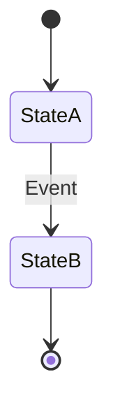

# [Feature Name] - Delta Spec

> **Purpose:** This document represents the Multi-View Spec for a specific Jira ticket or feature. It expires once the feature is deployed to production.

---

## 1. The Business View (For BA & Product)
> **Goal:** Validate the user journey and logic without technical jargon.

### Intent Summary
[2-3 sentence summary of the business goal]

### Logic Flow


### Business Rules
*   [Rule 1: e.g., "A user cannot proceed to checkout with an empty cart."]
*   [Rule 2]

### Non-Functional Requirements (NFRs)
*   [e.g., Performance: "API must respond in < 200ms"]
*   [e.g., Compliance: "UI must be WCAG AA compliant"]

### Out of Scope
*   [What is explicitly NOT being built in this ticket]

---

## 2. The Validation View (For QA)
> **Goal:** The Executable Specification. Define exhaustive edge-cases in BDD format.

### Scenario: [Scenario Name]
*   **Given** [Initial context]
*   **When** [Action occurs]
*   **Then** [Observable outcome]

### Scenario: [Edge Case Scenario]
*   **Given** [...]
*   **When** [...]
*   **Then** [...]

---

## 3. The Technical View (For Dev)
> **Goal:** The architectural blueprint conforming to `agents.md`.

### File Manifest
*   `[NEW]` `path/to/new_file.ext` - [Brief reason]
*   `[MODIFY]` `path/to/existing_file.ext` - [Brief reason]

### API Contracts
```yaml
# [OpenAPI/gRPC snippet here if applicable]
```

### Schema Deltas
```sql
-- [SQL Migration scripts or Entity changes here if applicable]
```

### New Dependencies
*   [Package Name] - [Reason]
