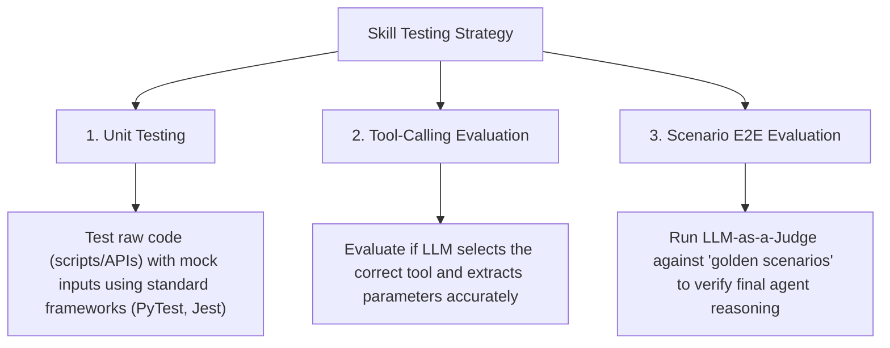
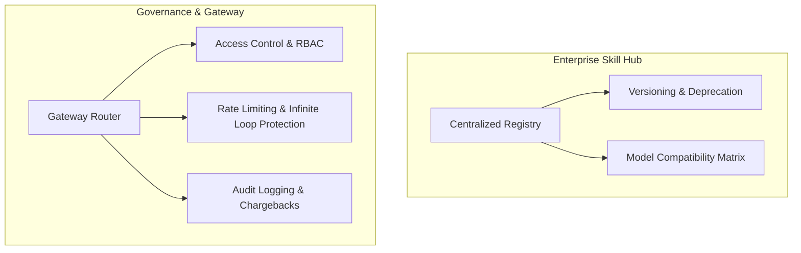

# AI Agent Skills: Enterprise Guide

This document covers the fundamentals of AI Agent **Skills** (also known as Tools or Functions), architectural Non-Functional Requirements (NFRs), and a technical deep dive into **Testing**, **Observability**, and **Enterprise Operations**.

---

## Part I: Core Concepts

### 1. What is an Agent Skill?

An **Agent Skill** is a modular package of capability that enables an LLM (Large Language Model) to interact with the external world, retrieve real-time information, or perform deterministic operations.

While LLMs are exceptional at pattern matching, reasoning, and generating text, they are fundamentally limited by:

* **Static training data** (no access to real-time information).
* **Lack of execution capabilities** (cannot run code, read files, or call APIs).
* **Poor mathematical/logical computation** (predicting the next token is not the same as computing a math formula).

A skill bridges this gap by acting as a translator between natural language reasoning and code execution.

#### The Anatomy of a Skill

Every skill has a dual structure:

```mermaid
┌────────────────────────────────────────────────────────┐
│                      AGENTS SKILL                      │
├──────────────────────────┬─────────────────────────────┤
│   1. Tool Definition     │   2. Execution Logic        │
│   (For the LLM)          │   (For the Runtime Engine)  │
├──────────────────────────┼─────────────────────────────┤
│  • Natural language      │  • The actual code/script   │
│    description           │    (Python, Bash, JS, etc.) │
│  • JSON Schema parameters│  • Calls APIs, reads files  │
│  • Helps LLM reason      │  • Returns stdout/JSON to   │
│    *when* to use it      │    the LLM                  │
└──────────────────────────┴─────────────────────────────┘
```

### 2. Benefits of Agent Skills

1. **Deterministic Accuracy:** Offloads calculation or data manipulation to reliable, structured code.
2. **Real-time Integration:** Enables agents to query live databases, fetch weather, check server statuses, or read current git histories.
3. **Actionability:** Empowers the agent to perform write operations (e.g., creating files, committing code, sending notifications, executing builds).
4. **Modularity & Reusability:** Once written, a skill can be plugged into any agent (e.g., a "GitHub search" skill can be shared by a triage agent and a coding assistant).

### 3. When to Use vs. When NOT to Use

Evaluating whether to package logic as a skill is a key architectural decision.

#### Use a Skill when

* **Real-time info is needed:** Fetching current stocks, logs, weather, or user account states.
* **Deterministic actions are required:** Adding integers, parsing a complex CSV, running unit tests, or compiling code.
* **State changes are necessary:** Writing a document, triggering a Jenkins build, sending a Slack message, or updating a database.
* **Data exceeds context windows:** Performing a database search instead of dumping the whole database into the prompt.

#### Do NOT use a Skill when

* **LLM reasoning is sufficient:** Writing a creative email, summarizing a document, or classifying text sentiment.
* **Overhead is too high:** Writing a skill for a simple lookup that can be embedded directly in the system prompt.
* **The output is highly subjective:** Grading essay quality or choosing design aesthetics.

---

## Part II: Skill Design & Architecture (NFRs & Edge Cases)

Building skills that work perfectly in testing is easy; building skills that survive in production requires strict adherence to several Non-Functional Requirements (NFRs) and architectural nuances.

### 4. Output Validation & Context Window Management

* **The Problem:** Developers validate input schemas strictly, but often ignore the output. If a skill like `search_database` returns a 50MB JSON payload, it will crash the agent's context window.
* **The Solution:**
  * **Output Schema Validation:** Just like input (Zod/Pydantic), enforce a strict schema on the skill's *return* payload to ensure the LLM receives predictable data structures.
  * **Truncation & Pagination:** Skills must summarize, paginate, or truncate massive datasets (e.g., returning the top $N$ database rows rather than a full table dump).

### 5. LLM-Optimized Error Handling (Semantic Self-Correction)

* **The Problem:** Returning raw system errors (e.g., `NullPointerException at line 42` or `HTTP 500`) gives the LLM no actionable context. The agent will either hallucinate a fix or enter an infinite loop trying the exact same call again.
* **The Solution:** Skills must catch their own exceptions and return **Semantic Error Hints**. For example: `{"status": "error", "message": "User ID not found. The ID must be alphanumeric. Did you mean to search by email?"}`. This teaches the LLM *how* to correct its mistake on the next turn.

### 6. Synchronous vs. Asynchronous Invocation (The Job Pattern)

* **The Problem:** Agent frameworks generally invoke skills synchronously. If a skill triggers a 20-minute CI/CD pipeline, the LLM HTTP connection will time out.
* **The Solution:** The Agent Runtime must dictate the execution mode.
  * **Short tasks:** Execute synchronously.
  * **Long tasks:** The skill must implement the **Async Job Pattern**. The skill returns an immediate acknowledgment: `{"job_id": 1234, "status": "running"}`. The agent is then provided a secondary `check_job_status` skill, allowing it to "sleep" and poll the job later, freeing up the runtime thread.

### 7. Idempotency & Stateless Execution

* **The Problem:** Network drops or agent confusion can cause the LLM to invoke the exact same tool payload twice (e.g., calling `refund_payment` twice). Furthermore, in an enterprise environment, a single popular skill endpoint might be invoked by 1,000 different agent sessions concurrently.
* **The Solution:**
  * **Strict Idempotency:** Any skill that performs a Write, Update, or Delete operation must be idempotent. Repeating the exact payload must yield a safe "already processed" response without duplicate state changes.
  * **Statelessness & Thread Safety:** Execution scripts must be 100% stateless. If the skill uses local scratchpads or container mounts, they must use ephemeral, isolated storage per execution (or unique temp directories) to prevent cross-session data leakage.

### 8. Latency Budgets & Fail-Fast Mechanics

* **The Problem:** The latency of an agent loop is the sum of LLM Think Time + Skill Execution Time. Slow skills degrade the user experience exponentially.
* **The Solution:** Enforce strict execution timeouts on skills (e.g., `< 2 seconds`). If a downstream dependency hangs, the skill should "fail fast" and return a timeout error to the LLM immediately rather than hanging the entire agent thread.

### 9. Data Privacy & PII Filtering

* **The Problem:** When an agent invokes a skill to fetch data (e.g., `get_user_profile`), the raw response is injected back into the LLM prompt. If the LLM is hosted externally (e.g., OpenAI, Anthropic), this creates massive data egress compliance risks.
* **The Solution:** Skills must act as a **PII filter**, proactively masking or redacting sensitive fields (SSN, credit cards, plaintext passwords) *before* the JSON payload is ever returned to the agent's observation window.

---

## Part III: The Skill Lifecycle (Enterprise Operations)

### 10. Testing Strategy

Testing skills is unique because they merge **non-deterministic reasoning** with **deterministic code**.



* **A. Unit Testing (Deterministic Layer):** Verify that the underlying script or API works exactly as expected when given valid inputs. Use standard testing frameworks (e.g., PyTest for Python, JUnit for Java). Mock external HTTP requests or filesystem modifications to keep tests hermetic and fast.
* **B. Tool-Calling & Parameter Extraction (LLM Selection Layer):** Ensure the LLM correctly triggers the skill and parses parameters by running evaluation datasets (prompts vs. expected tool schemas).
* **C. End-to-End Evaluation (System Layer):** Verify the agent reaches the correct final resolution using the skill. Keep a repository of "Golden Scenarios". Run the agent, intercept the conversation trace, and use a stronger model (e.g., Gemini 1.5 Pro) as an evaluator to score the final output based on correctness, structure, and style guidelines.
* **D. Managing Non-Deterministic Variables & Model Drift:**
  * **Statistical (Monte Carlo) Testing:** Run the same test prompts multiple times (e.g., $N=10$) with the temperature set to production levels to track Pass Rate %.
  * **Semantic Description Drift Testing:** On any modification to `SKILL.md`, trigger a regression build using an evaluation dataset of Positive and Negative cases.
  * **Cross-Model Regression Matrix:** Run the tool-calling eval suite against a matrix of target models in CI before upgrading the production model variant.

### 11. Security & The Execution Boundary

Executing scripts on behalf of an LLM introduces **extreme risk**. Since user input controls the prompt, attackers can use **Prompt Injection** to force the agent to run unauthorized commands.

* **A. Sandboxed Execution (Isolation):**

> [!IMPORTANT]
> Never run agent-executed scripts directly on production host machines.

High-risk skills must be executed in deeply restricted, ephemeral environments (MicroVMs/Containers). They should operate on the Principle of Least Privilege, strictly limiting the scope of what sub-tools or downstream APIs the skill is authorized to hit.

* **B. Input Validation & Parameter Guardrails:** Use libraries like Pydantic (Python) or Zod (TypeScript) to enforce strict argument schemas. If a skill invokes shell commands, validate against strict regex blocklists to prevent shell metacharacter injection.
* **C. Human-in-the-Loop (HITL):** The agent proposes high-risk actions (e.g., mutating databases, sending emails) and pauses. Execution requires an explicit approval payload from a human operator.

### 12. Observability & Tracing

When an agent fails, tracing the root cause is difficult. Did the model select the wrong tool? Did the script run out of memory? Did the tool output confuse the model?

* **A. Hierarchical Tracing:** Use frameworks like **OpenInference**, **Langfuse**, **LangSmith**, or **Phoenix (Arize)** to record the System Prompt, Reasoning Span, Tool Call Span, Observation Span, and Cost/Latency.
* **B. Host & Subprocess Monitoring:** Monitor subprocess lifespans to ensure scripts do not enter infinite loops, and limit max RAM/CPU allocated to avoid Denial of Service (DoS).
* **C. Production Observability (Handling Anomalies):**
  * **Real-time Loop Detection:** Implement sliding-window session monitoring to catch agent tool-call loops and force fallback responses.
  * **Out-of-Distribution (OOD) Guardrails:** Place semantic filters at the ingestion gateway to block prompt injections or irrelevant requests.
  * **Continuous Feedback Loop (Failing Forward):** Export traces of failed sessions, anonymize them, and automatically append them to the E2E Golden Scenarios test suite to prevent recurring failures.

### 13. Enterprise Management of Agent Skills

Managing skills at an enterprise scale transitions them from "experimental scripts" to **production-grade software assets**. This requires a structured governance framework similar to traditional API Management (APIM).



* **A. Centralized Skill Registry & Catalog:** A single dashboard where developers search, view, and reuse existing skills, tracking metadata like API SLAs, LoB ownership, and cost.
* **B. Versioning & LLM Compatibility:** Managing API/Logic Versioning (SemVer) alongside Prompt/Description Versioning (as language tweaks can break agents). Must also track Model Compatibility Profiles.
* **C. Access Control & Governance (RBAC):** Defining which agents/users can invoke specific skills and dynamically injecting credentials at runtime via Enterprise Secrets Managers.
* **D. Billing, Chargebacks, & Gateway Protections:** Using API Gateways to enforce infinite loop protection, rate limiting, and exact financial chargebacks for cross-department billing.
