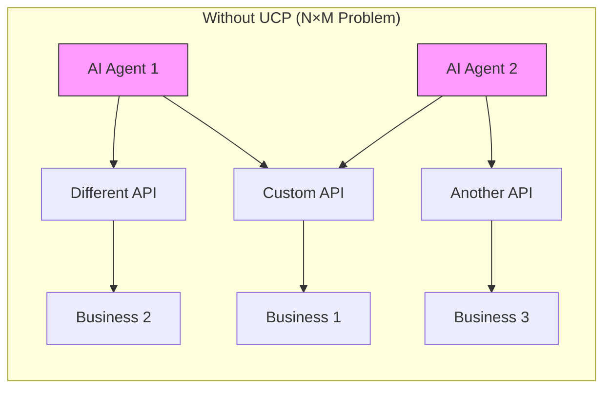
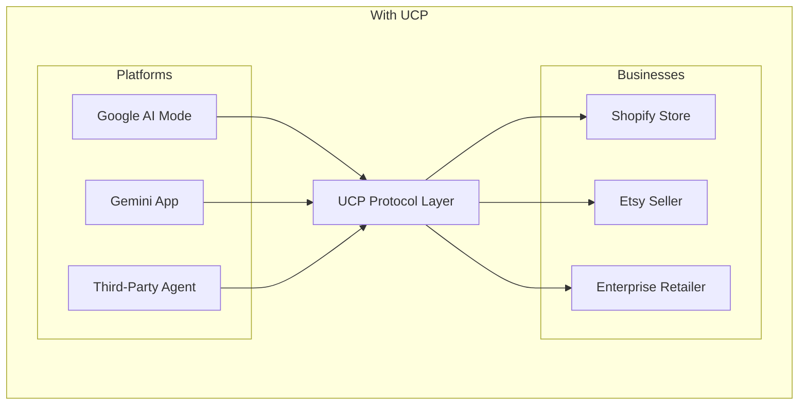
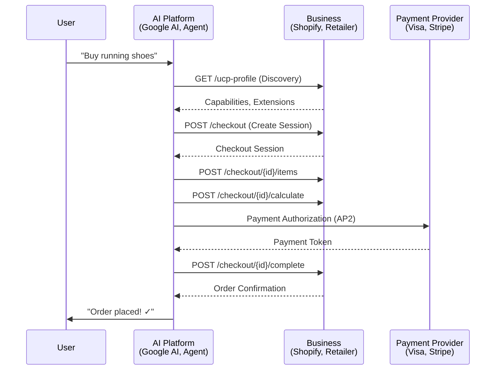
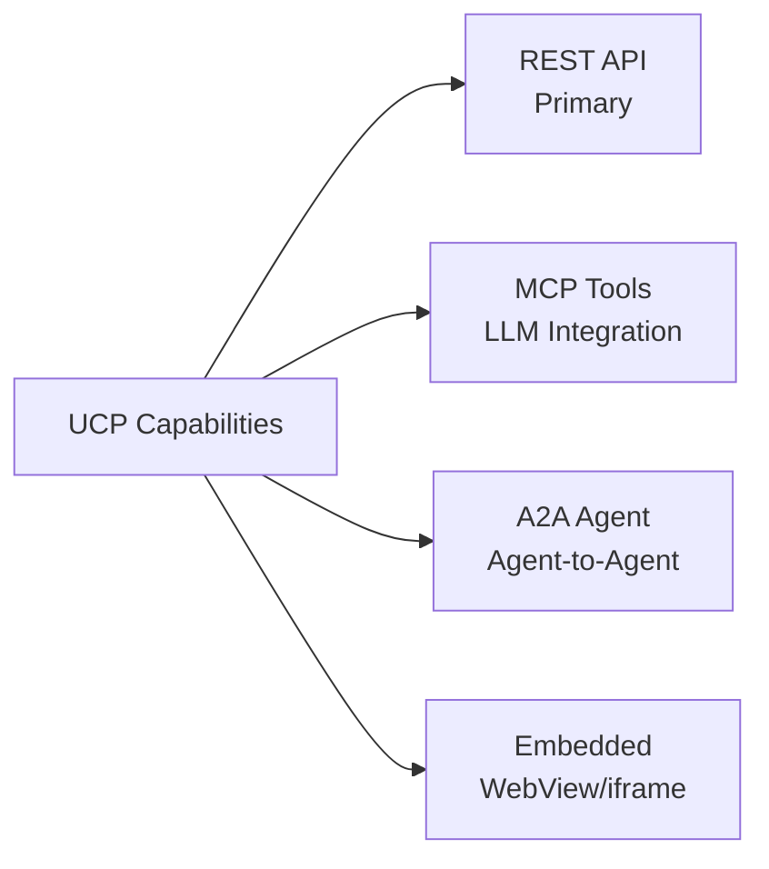
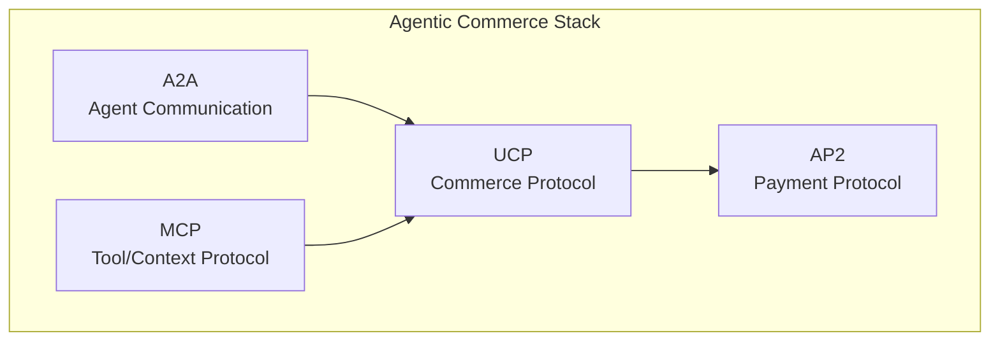

# UCP (Universal Commerce Protocol)

UCP is an open standard that creates a **common language for AI agents, platforms, and businesses** to enable seamless commerce experiences across the web.

> [!NOTE]
> **Status**: UCP v1.0 (January 2026). Created by Google with contributions from Shopify, Etsy, Wayfair, Target, Walmart, and payment providers like Visa and Mastercard.

## The Problem

As commerce becomes increasingly **agentic and distributed**, AI agents need to:

1. **Discover** what businesses offer and their capabilities
2. **Interact** with checkout, payments, and order systems
3. **Complete** purchases on behalf of users securely

Today, this requires **custom integrations for each platform-business pair** — creating an unmaintainable N×M problem.

## The Solution: UCP

UCP provides **standardized functional primitives** that allow any platform to interact with any business using a common protocol.

## Architecture

## Key Characteristics

| Feature | Description |
|---------|-------------|
| **Transport-Agnostic** | Works over REST, MCP, or A2A |
| **Composable** | Capabilities + Extensions architecture |
| **Secure** | OAuth 2.0 for identity, AP2 for payments |
| **Open** | Apache 2.0 license, community-driven |
| **Adopted** | Shopify, Target, Walmart, Visa, Mastercard |

## Core Concepts at a Glance

### Capabilities

Modular features that businesses implement:

| Capability | Description |
|------------|-------------|
| **Checkout** | Cart management, tax calculation, session handling |
| **Identity Linking** | OAuth 2.0 authorization for user actions |
| **Order** | Webhook-based order lifecycle updates |
| **Payment Token Exchange** | Secure payment credential handling |

### Extensions

Optional modules that augment capabilities:

- `dev.ucp.shopping.fulfillment` → extends Checkout
- `dev.ucp.shopping.discounts` → extends Checkout
- `com.example.installments` → vendor extension

## Transport Layers

UCP is designed to work across multiple transports:

| Transport | Use Case |
|-----------|----------|
| **REST** | Primary transport, HTTP/1.1+ |
| **MCP** | LLM tool calling (create_checkout, add_item) |
| **A2A** | Agent-to-agent communication |
| **Embedded** | WebView-based checkout flows |

## When to Use UCP

### ✅ Good Use Cases

- **AI Shopping Agents**: Enable purchase completion in chat
- **Voice Commerce**: Integrate with voice assistants
- **Unified Checkout**: Single integration across retailers
- **Agentic Commerce**: Autonomous buying capabilities

### ❌ Not Ideal For

- Simple product catalog browsing (no transactions)
- B2B complex procurement workflows
- Non-commerce AI interactions

## Protocol Relationships

UCP is designed to be **compatible with MCP, A2A, and A2UI**:

- **MCP**: UCP capabilities map 1:1 to MCP tools
- **A2A**: UCP can be exposed as an A2A extension
- **A2UI**: Commerce UIs can be rendered via A2UI components

## Next Steps

| Document | Description |
|----------|-------------|
| [01_core_concepts.md](./01_core_concepts.md) | Profiles, Capabilities, Discovery |
| [02_capabilities.md](./02_capabilities.md) | Checkout, Identity, Order details |
| [03_transport_layers.md](./03_transport_layers.md) | REST, MCP, A2A integration |
| [04_payment_security.md](./04_payment_security.md) | AP2, OAuth 2.0, security |
| [05_pros_and_cons.md](./05_pros_and_cons.md) | Analysis and decision matrix |
